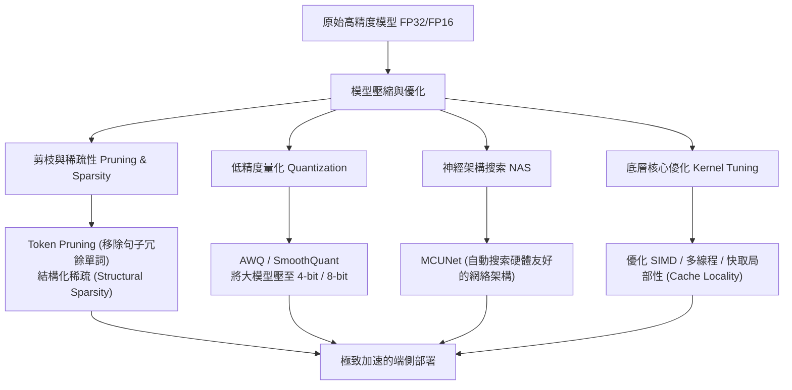

# 智能湧現的最後一哩路：為什麼「邊緣 AI 與模型優化加速」是 AI 時代相對好的職涯賽道？

> [!IMPORTANT]
> **核心觀點**：AI 的未來不僅僅在於「模型有多大」，更在於「如何將模型放進有限的物理世界中」。雲端大模型是「大腦」，而**邊緣 AI (Edge AI) 與硬體優化**則是「眼睛、耳朵與雙手」。誰能打通兩者之間的算力與能耗瓶頸，誰就掌握了 AI 落地時代的核心話語權。

---

## 💡 一、 時代的剛需：為什麼邊緣 AI 與模型優化是重中之重？

我們可以將模型優化與邊緣 AI 的重要性歸納為以下三大硬實力指標：

### 1. 補足算力供需的「天文級鴻溝」
數據清晰顯示，AI 模型的參數量與計算需求呈指數型增長，其速度遠遠超出了半導體硬體算力的增長率（摩爾定律）：
*   **算力供不應求**：大模型（如 Stable Diffusion、LLaMA、Generative AI）參數量以百倍速度狂飆，若不進行模型壓縮，硬體物理限制將直接鎖死 AI 的進化與普及。
*   **高昂的代價**：雲端訓練與推理成本巨大，單次 Stable Diffusion 訓練耗資超過 60 萬美元；AlphaGo 對局一次電費高達 3,000 美元。這在商業落地上面臨著極高昂的邊際成本。

### 2. 突破「記憶體頻寬 (Memory Bandwidth)」的致命瓶頸
> 「計算很便宜，數據傳輸（記憶體移動）極其昂貴。」 —— 韓松教授

在現代處理器架構中，記憶體頻寬的增長速度嚴重落後於算力核心的增長。模型在運行時，大部分的時間與能量都消耗在「將權重數據從記憶體搬運到運算核心」的過程中。**模型壓縮（量化、剪枝）實質上是為了減少數據移動，這是提升實際運行速度（Latency）的唯一底層解法。**

### 3. 物理世界的不可替代性（隱私、時延、帶寬）
雲端 AI 雖強，但無法解決以下物理限制：
*   **超低時延**：自動駕駛（如 BEV Fusion 技術）或工業機器人需要毫秒級的即時響應，無法承受將訊號傳回雲端再回傳的網路延遲。
*   **隱私與安全性**：智慧家居、個人醫療與企業機密代碼（如企業本地運行編程助手）等數據，基於安全合規，絕對不能上傳至第三方雲端。
*   **網路斷聯風險**：太空船、深海探測或離線設備必須具備本地決策能力。

---

## 🛠️ 二、 模型加速與優化技術圖譜

要讓大模型裝入智慧手機、平板甚至幾美元的微控制器（Microcontroller），工程師必須利用系統與演算法協同設計（Algorithm-System Co-design）：

### 核心技術對比表

| 優化技術 | 核心原理 | 實際加速案例 (以影片為例) | 應用場景 |
| :--- | :--- | :--- | :--- |
| **低精度量化 (Quantization)** | 將模型權重從 FP32/FP16 轉換為 4-bit 或 8-bit 整數，極大降低儲存與頻寬消耗。 | **TinyChat / AWQ**：將 LLaMA-7B/13B 大模型量化至 4-bit，在 M1 Mac 本地跑出 30 tokens/s。 | 手機、筆電本地運行大語言模型 (LLM) |
| **模型剪枝與稀疏化 (Pruning & Sparsity)** | 去除神經網路中不重要的權重或句子中的冗餘詞，只計算關鍵核心。 | **Spaced In-painting**：只運算遮罩的 11% 圖像區域，Stable Diffusion 運算量減少 3.6 倍。 | 影像局部修補、語意情感分析、快速推理 |
| **演算法與硬體共設計 (NAS)** | 自動為特定的硬體尋找在精度與資源約束（如記憶體上限）下的最優模型架構。 | **MCUNet**：在僅有 **256KB RAM** 的超低成本單片機上成功運行人臉/口罩檢測。 | IoT 智能家居晶片、智慧工廠感測器 |
| **多模態融合優化 (Fusion)** | 將多種感測器（如相機、LiDAR）的異構稀疏數據進行高效率的統合運算。 | **BEV Fusion**：自駕車鳥瞰圖融合，直接在 NVIDIA Jetson 邊緣端運行 3D 目標檢測。 | 自動駕駛車、機器人感知系統 |

---

## 🚀 三、 為什麼「邊緣 AI 優化工程師」是未來的黃金職涯賽道？

當眾多程式設計師擔心「代碼會被 AI 寫完」而面臨失業風險時，**「模型優化與邊緣 AI 部署」卻是極少數護城河極深、越老越吃香的黃金賽道。**

### 1. 極高的技術護城河（AI 無法輕易替代）
一般的應用層代碼（如編寫常規的網頁後端、UI 介面、簡單的腳本）很容易被大型語言模型（LLM）自動生成。
然而，模型優化與端側部署需要跨領域的硬核知識：
*   **數學與演算法**：深刻理解權重分佈、量化誤差、矩陣運算。
*   **計算機體系結構**：懂得 CPU/GPU/NPU 快取架構（Cache Locality）、記憶體層級、暫存器配置。
*   **系統編程**：精通 C/C++、匯編、SIMD 指令集、多執行緒並行運算優化。
這種**「軟硬體共設計（Hardware-Aware Software）」**的物理直覺與硬核調試能力，是目前 AI 工具最難以複製的盲區。

### 2. 企業極度匱乏的「落地推手」
目前的市場現狀是：**訓練 Demo 很簡單，但將模型安全、即時且低成本地「放進晶片裡」極難。**
各大產業（如自動駕駛車廠、智慧手機大廠、機器人新創、晶片設計公司如 NVIDIA、Qualcomm、聯發科等）都面臨嚴重的工程師缺口。能夠為公司省下百萬美元雲端電費、或者將 AI 模型順利塞進便宜邊緣晶片的優化人才，在市場上具有極高的議價能力與無可替代的商業價值。

### 3. 升級為 AI 時代的「指揮官」
正如影片所言，未來的開發工作流將被重塑。日常繁瑣的驅動代碼編寫、測試腳本生成將由 AI 代勞；**工程師的核心價值將「上移」至系統架構設計、跨模態整合與極致的性能調優**。你將不是被 AI 取代的人，而是利用 AI 輔助來操縱幾百萬行代碼的高級指揮官。

---

## 📈 四、 核心技能養成路徑：如何切入這個賽道？

如果您希望在這個黃金賽道立足，結合兩部影片的建議，您的學習路線圖應該如下：

> [!TIP]
> **第一步：夯實底層基礎**
> *   **C / C++ 進階**：這是系統優化的唯一語言。必須深入掌握指標、記憶體手動管理、位元操作與記憶體對齊。
> *   **計算機結構**：了解快取機制、SIMD (單指令流多數據流)、流水線 (Pipeline) 與分支預測。
>
> **第二步：掌握 AI 與模型基礎**
> *   **PyTorch 框架**：理解神經網路的正向/反向傳播、算子原理。
> *   **模型壓縮理論**：系統學習**剪枝 (Pruning)**、**量化 (Quantization)**、**知識蒸餾 (Distillation)** 的數學原理。
>
> **第三步：系統實踐與硬體 aware 優化**
> *   **邊緣平台實操**：從 STM32 微控制器或樹莓派/Jetson 開始，親自動手將 AI 模型部署到硬體上。
> *   **開源項目學習**：深入研讀韓松實驗室的開源項目（如 `AWQ`、`SmoothQuant`、`TinyChat`），學習如何將輕量化模型量化並部署到端側硬體，累積硬核 Project 經驗。

