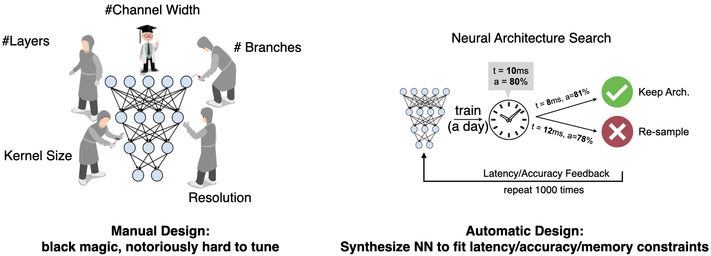
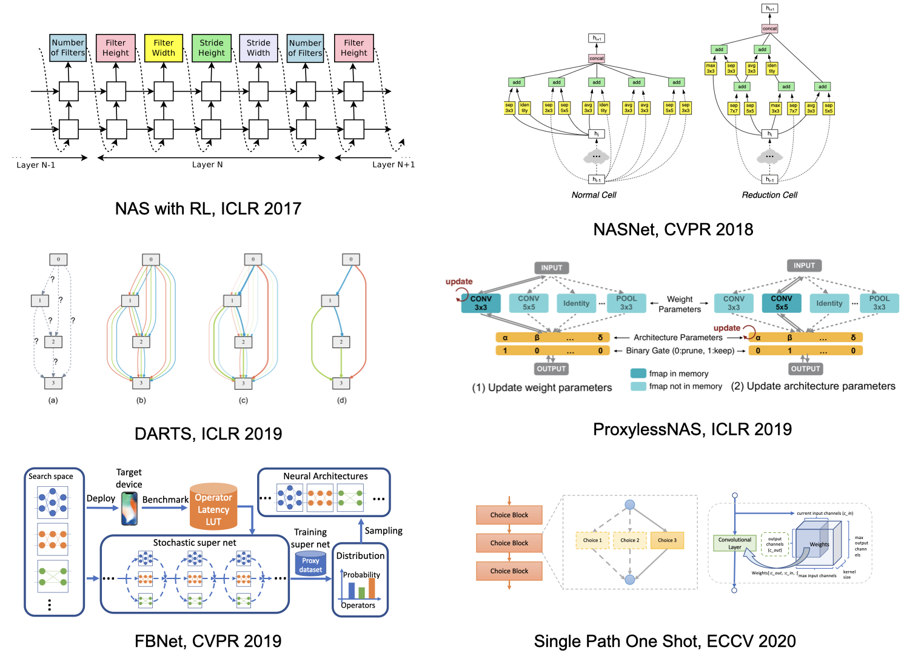
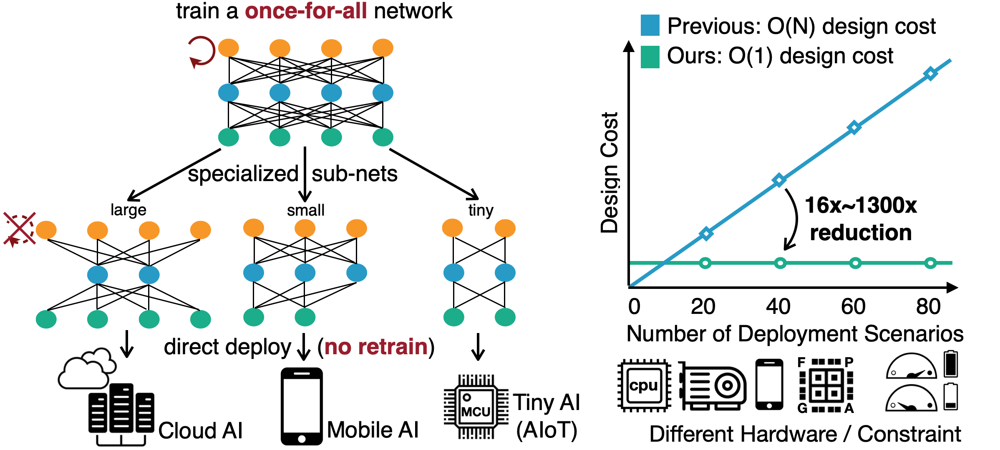
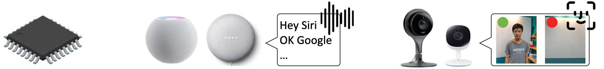
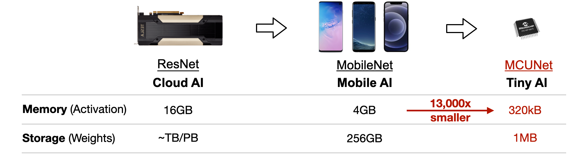
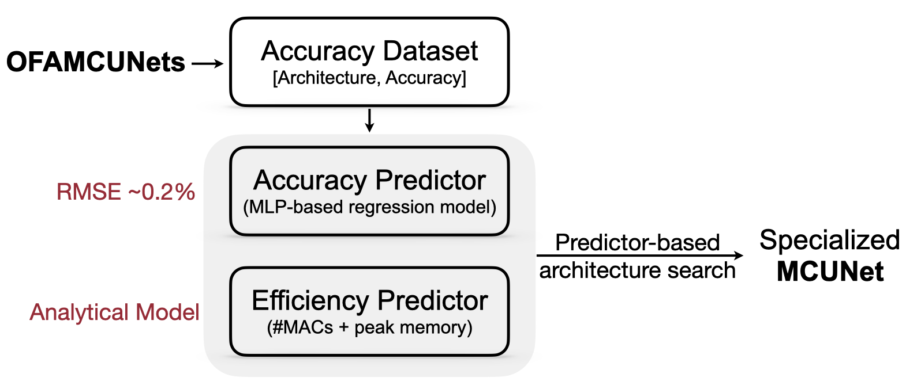
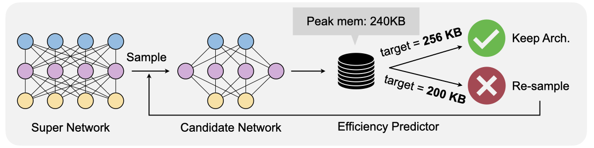
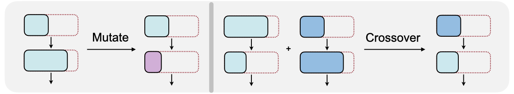

# Jupyter 筆記本：Lab3.ipynb

# **MIT 6.5940 EfficientML.ai Lab 3: Neural Architecture Search (神經網路架構搜尋)**

by MIT HAN Lab

### [Cell 0] (Markdown)

# **MIT 6.5940 EfficientML.ai Lab 3: Neural Architecture Search**
by MIT HAN Lab


### [Cell 1] (Markdown)

## 簡介 (Introduction)

本 Colab 筆記本提供了 Lab 3：神經網路架構搜尋 (Neural Architecture Search, NAS) 的程式碼和框架。在此實驗中，你將學習如何搜尋可以在微控制器 (Microcontroller) 上高效運行的小型神經網路。你可以在這裡完成你的解答。


### [Cell 2] (Markdown)




### [Cell 3] (Markdown)

在很長一段時間裡，研究人員都是手動設計神經網路架構。神經網路架構的設計空間 (Design Space) 非常龐大：包含層數 (#layers)、通道寬度 (#channel width)、分支數 (#branches)、卷積核大小 (kernel sizes) 以及輸入解析度 (input resolutions)。因此，手動微調這些設計選項極其困難。

另一方面，**神經網路架構搜尋 (NAS)** 可以幫助研究人員在各種效率和準確率約束下，自動微調這些設計選項。結果是，它大大節省了神經網路設計的工程成本，並有助於推動 AI 的普及與大眾化。在本次實驗中，我們將從頭開始帶你了解神經網路架構搜尋。


### [Cell 4] (Markdown)




### [Cell 5] (Markdown)

早期的 NAS 方法在設計空間中窮舉訓練候選網路，並使用基於 **RNN 的控制器 (RNN-based controllers)** 結合增強學習 (Reinforcement Learning) 來優化採樣策略。代表性方法包括 [Neural Architecture Search with Reinforcement Learning](https://arxiv.org/abs/1611.01578)、[NASNet](https://arxiv.org/abs/1707.07012) 和 [MNASNet](https://arxiv.org/abs/1807.11626)。這些方法通常計算成本極其昂貴，因為每個候選網路都必須從頭開始訓練，以便基於 RNN 的控制器能夠獲得獎勵訊號 (即候選網路的準確率)。

後來，研究人員開發了**可微分 NAS (Differentiable NAS)** 方法，例如 [DARTS](https://arxiv.org/abs/1806.09055)、[ProxylessNAS](https://arxiv.org/abs/1812.00332) 和 [FBNet](https://arxiv.org/abs/1812.03443)，這些方法大幅降低了訓練候選網路的總成本。DARTS 將每層的輸出建立模型為來自不同候選操作輸出的加權平均值，而 ProxylessNAS 通過在記憶體中僅保留兩條路徑而不是所有路徑，進一步降低了 DARTS 的記憶體成本。後來的 **One-Shot** 方法 (如 [Single Path One Shot](https://arxiv.org/abs/1904.00420)) 進一步發現，在訓練過程中每次僅保留一條路徑也是可行的。

儘管可微分 NAS 和 One-Shot NAS 比基於控制器的做法高效得多，但每次我們設計新神經網路時，仍然需要執行整個訓練、搜尋和微調流程。考慮到大量的邊緣設備 (例如截至 2018 年全球有 [超過 200 億個 IoT 設備](https://www.statista.com/statistics/471264/iot-number-of-connected-devices-worldwide/))，模型客製化 (Model Specialization) 依然會帶來巨大成本 (對於 ImageNet 數據集通常需要 200-300 GPU 小時)。


### [Cell 6] (Markdown)




### [Cell 7] (Markdown)

因此，在本次實驗中，我們參考了 [Once for All](https://arxiv.org/abs/1908.09791) (OFA) 方法，該方法可以大幅降低為不同設備客製化神經網路架構的成本。OFA 訓練一個大型的**超網路 (Super Network)**，其中包含了設計空間內所有的**子網路 (Sub-networks)**。如果我們直接從超網路中擷取子網路，它們無需從頭訓練即可達到與從頭訓練相近的準確率。因此，OFA 支援**無需重新訓練 (No Retrain)** 的直接部署。

此外，OFA 引入了**準率預測器與效率預測器 (Accuracy & Efficiency Predictors)**，以進一步減少子網路評估的成本。在本實驗中，你將學習如何建構這兩種預測器並執行快速的神經網路架構搜尋。


### [Cell 8] (Markdown)

在本實驗中，你將學習如何利用 **OFA** 和**預測器**搜尋可以在極度受限的微控制器資源上高效運行的網路。微控制器是低成本、低功耗的硬體，被廣泛部署且應用極為廣泛。


### [Cell 9] (Markdown)




### [Cell 10] (Markdown)

但是微控制器嚴格的記憶體預算 (比 GPU 小 50,000 倍) 使得深度學習的部署非常困難。


### [Cell 11] (Markdown)




### [Cell 12] (Markdown)

本實驗主要分為兩個部分：**準確率與效率預測器** 以及 **架構搜尋**。

- 對於預測器部分，共有 ***4*** 個問題。其中 **Getting Started** 部分有 1 個問題 (5 分)，其餘 3 個問題 (30 分) 在 **Predictors** 部分。
- 對於架構搜尋部分，共有 ***6*** 個問題。


### [Cell 13] (Markdown)

首先，安裝所需的套件並下載本實驗將使用的 [**Visual Wake Words (VWW)** 數據集](https://arxiv.org/abs/1906.05721)。


### [Cell 14] (Code)

```python
# print("Cleanning up workspace ...")
# !rm -rf *
print("Installing graphviz ...")
!sudo apt-get install graphviz 1>/dev/null
print("Downloading MCUNet codebase ...")
!wget https://www.dropbox.com/s/3y2n2u3mfxczwcb/mcunetv2-dev-main.zip?dl=0 >/dev/null
!unzip mcunetv2-dev-main.zip* 1>/dev/null
!mv mcunetv2-dev-main/* . 1>/dev/null
print("Downloading VWW dataset ...")
!wget https://www.dropbox.com/s/169okcuuv64d4nn/data.zip?dl=0 >/dev/null
print("Unzipping VWW dataset ...")
!unzip data.zip* 1>/dev/null
print("Installing thop and onnx ...")
!pip install thop 1>/dev/null
!pip install onnx 1>/dev/null
```

### [Cell 15] (Code)

```python
import argparse
import json
from PIL import Image
from tqdm import tqdm
import copy
import math
import numpy as np
import os
import random
import torch
from torch import nn
from torchvision import datasets, transforms
from mcunet.tinynas.search.accuracy_predictor import (
    AccuracyDataset,
    MCUNetArchEncoder,
)

from mcunet.tinynas.elastic_nn.networks.ofa_mcunets import OFAMCUNets
from mcunet.utils.mcunet_eval_helper import calib_bn, validate
from mcunet.utils.arch_visualization_helper import draw_arch


%matplotlib inline
from matplotlib import pyplot as plt
import warnings
warnings.filterwarnings('ignore')
```

### [Cell 16] (Markdown)

## **Getting Started：超網路與 VWW 數據集 (1 個問題，5 分)**


### [Cell 17] (Markdown)

在本實驗中，我們將使用以 **Once-for-All (OFA)** 方式訓練的 **[MCUNetV2](https://arxiv.org/abs/2110.15352)** *超網路*。回想一下，*超網路* 是一個隨機化的大型神經網路，包含了設計空間內所有候選子網路。我們可以直接從超網路中提取子網路並評估其準確率。該準確率可以進一步用作指導神經網路設計的反饋訊號。OFA 超網路的優勢在於直接擷取的子網路可以獲得與從頭訓練相當 (甚至更好) 的效能。

MCUNetV2 是專為資源受限微控制器量身定制的高效神經網路家族。它採用基於 Patch 的推論 (Patch-based inference)、感受野重分配 (Receptive field redistribution) 以及系統-NN 聯合設計 (System-NN Co-design)，大幅提升了 [MCUNet](https://arxiv.org/abs/2007.10319) 的準確率與效率權衡。


### [Cell 18] (Markdown)

我們首先在 VWW 數據集中視覺化一些樣本。這是一個從 [Microsoft COCO](https://arxiv.org/abs/1405.0312) 二次採樣得到的二元圖像分類數據集 (判斷圖像中是否存在人)。我們首先定義一個函式來建立驗證集上的數據載入器 (DataLoader)。

注意：函式 `build_val_data_loader` 有一個 `split` 參數。我們使用 `split = 0` (預設值) 表示驗證集 (不能直接用於架構搜尋)，`split = 1` 將用作保留的 minival 數據集 (用於產生準確率數據集並校正 BN 參數)。


### [Cell 19] (Code)

```python
def build_val_data_loader(data_dir, resolution, batch_size=128, split=0):
    # split = 0: real val set, split = 1: holdout validation set
    assert split in [0, 1]
    normalize = transforms.Normalize(mean=[0.5, 0.5, 0.5], std=[0.5, 0.5, 0.5])
    kwargs = {"num_workers": min(8, os.cpu_count()), "pin_memory": False}

    val_transform = transforms.Compose(
        [
            transforms.Resize(
                (resolution, resolution)
            ),  # if center crop, the person might be excluded
            transforms.ToTensor(),
            normalize,
        ]
    )
    val_dataset = datasets.ImageFolder(data_dir, transform=val_transform)

    val_dataset = torch.utils.data.Subset(
        val_dataset, list(range(len(val_dataset)))[split::2]
    )

    val_loader = torch.utils.data.DataLoader(
        val_dataset, batch_size=batch_size, shuffle=False, **kwargs
    )
    return val_loader
```

### [Cell 20] (Markdown)

使用該數據載入器建構器，我們能夠瀏覽 VWW 驗證集。你可以多次運行以下單元格以查看數據集中的不同圖像。


### [Cell 21] (Code)

```python
data_dir = "data/vww-s256/val"

val_data_loader = build_val_data_loader(data_dir, resolution=128, batch_size=1)

vis_x, vis_y = 2, 3
fig, axs = plt.subplots(vis_x, vis_y)

num_images = 0
for data, label in val_data_loader:
    img = np.array((((data + 1) / 2) * 255).numpy(), dtype=np.uint8)
    img = img[0].transpose(1, 2, 0)
    if label.item() == 0:
        label_text = "No person"
    else:
        label_text = "Person"
    axs[num_images // vis_y][num_images % vis_y].imshow(img)
    axs[num_images // vis_y][num_images % vis_y].set_title(f"Label: {label_text}")
    axs[num_images // vis_y][num_images % vis_y].set_xticks([])
    axs[num_images // vis_y][num_images % vis_y].set_yticks([])
    num_images += 1
    if num_images > vis_x * vis_y - 1:
        break

plt.show()
```

### [Cell 22] (Markdown)

太棒了，現在你對數據集有了基本的了解。接下來讓我們構建 OFA 超網路！`OFAMCUNets` 超網路在 MCUNetV2 設計空間中包含了 $>10^{19}$ 個子網路。這些子網路由具有不同卷積核大小 (3, 5, 7) 和擴展比例 (3, 4, 6) 的 [反向 MobileNet 模組 (Inverted MobileNet blocks)](https://arxiv.org/abs/1801.04381) 組成。OFA 超網路還允許所有網路階段具備彈性深度 (基礎深度到 base_depth + 2)。最後，超網路支援 0.5$	imes$、0.75$	imes$ 或 1.0$	imes$ 的全域通道縮放 (由 `width_mult_list` 指定)。


### [Cell 23] (Code)

```python
device = "cuda:0"
ofa_network = OFAMCUNets(
    n_classes=2,
    bn_param=(0.1, 1e-3),
    dropout_rate=0.0,
    base_stage_width="mcunet384",
    width_mult_list=[0.5, 0.75, 1.0],
    ks_list=[3, 5, 7],
    expand_ratio_list=[3, 4, 6],
    depth_list=[0, 1, 2],
    base_depth=[1, 2, 2, 2, 2],
    fuse_blk1=True,
    se_stages=[False, [False, True, True, True], True, True, True, False],
)

ofa_network.load_state_dict(
    torch.load("vww_supernet.pth", map_location="cpu")["state_dict"], strict=True
)

ofa_network = ofa_network.to(device)
```

### [Cell 24] (Markdown)

然後我們驗證檢查點 (Checkpoint) 已正確載入。我們將在 MCUNetV2 設計空間中採樣一些網路，並在 VWW 數據集中評估其準確率。評估過程將花費不到一分鐘的時間，預計你將看到大約 83.6-88.7% 的準確率。正如你所看到的，我們可以直接從設計空間中提取這些子網路，並在**無需訓練**的情況下非常快速地獲得其準確率。這是 Once-for-All (OFA) 超網路帶來的獨特優勢。

我們首先定義一個輔助函式 `evaluate_sub_network`，用於測試直接從超網路提取的子網路的準確率。


### [Cell 25] (Code)

```python
from mcunet.utils.pytorch_utils import count_peak_activation_size, count_net_flops, count_parameters

def evaluate_sub_network(ofa_network, cfg, image_size=None):
    if "image_size" in cfg:
        image_size = cfg["image_size"]
    batch_size = 128
    # step 1. sample the active subnet with the given config.
    ofa_network.set_active_subnet(**cfg)
    # step 2. extract the subnet with corresponding weights.
    subnet = ofa_network.get_active_subnet().to(device)
    # step 3. calculate the efficiency stats of the subnet.
    peak_memory = count_peak_activation_size(subnet, (1, 3, image_size, image_size))
    macs = count_net_flops(subnet, (1, 3, image_size, image_size))
    params = count_parameters(subnet)
    # step 4. perform BN parameter re-calibration.
    calib_bn(subnet, data_dir, batch_size, image_size)
    # step 5. define the validation dataloader.
    val_loader = build_val_data_loader(data_dir, image_size, batch_size)
    # step 6. validate the accuracy.
    acc = validate(subnet, val_loader)
    return acc, peak_memory, macs, params
```

### [Cell 26] (Markdown)

我們還提供了一個便捷的輔助函式來將子網路的架構視覺化。該函式接收子網路的配置並傳回代表該架構的圖像。


### [Cell 27] (Code)

```python
def visualize_subnet(cfg):
    draw_arch(cfg["ks"], cfg["e"], cfg["d"], cfg["image_size"], out_name="viz/subnet")
    im = Image.open("viz/subnet.png")
    im = im.rotate(90, expand=1)
    fig = plt.figure(figsize=(im.size[0] / 250, im.size[1] / 250))
    plt.axis("off")
    plt.imshow(im)
    plt.show()
```

### [Cell 28] (Markdown)

現在，讓我們將一些子網路視覺化並在 VWW 數據集中評估它們！我們提供了一個範例，從設計空間中隨機採樣一個子網路，並獲取其在 VWW 數據集上的準確率、MACs 和參數數量。我們還使用 `visualize_subnet` 將架構視覺化。

在架構視覺化中，每個模組 `MBConv{e}-{k}x{k}` 的圖例表示當前模組是擴展比例為 `e` 且深度可分離卷積層核大小為 `k` 的 Mobile Inverted Block。模組的不同顏色表示不同的卷積核大小，灰色模組是網路階段的分隔符。模組的不同寬度表示不同的擴展比例。我們還在每個模組附近標註了輸出解析度。

請注意，我們假設圖像解析度固定為 96。歡迎在下方添加另一個單元格並嘗試更改輸入解析度。

提示：你可以更改 `sample_active_subnet` 方法的 `sample_function` 參數來控制採樣過程。


### [Cell 29] (Code)

```python
image_size = 96

cfg = ofa_network.sample_active_subnet(sample_function=random.choice, image_size=image_size)
acc, _, _, params = evaluate_sub_network(ofa_network, cfg)
visualize_subnet(cfg)
print(f"The accuracy of the sampled subnet: #params={params/1e6: .1f}M, accuracy={acc: .1f}%.")

largest_cfg = ofa_network.sample_active_subnet(sample_function=max, image_size=image_size)
acc, _, _, params = evaluate_sub_network(ofa_network, largest_cfg)
visualize_subnet(largest_cfg)
print(f"The largest subnet: #params={params/1e6: .1f}M, accuracy={acc: .1f}%.")

smallest_cfg = ofa_network.sample_active_subnet(sample_function=min, image_size=image_size)
acc, peak_memory, macs, params = evaluate_sub_network(ofa_network, smallest_cfg)
visualize_subnet(smallest_cfg)
print(f"The smallest subnet: #params={params/1e6: .1f}M, accuracy={acc: .1f}%.")
```

### [Cell 30] (Markdown)

### 問題 1 (5 分)：設計空間探索 (Design space exploration)

嘗試通過多次運行上面的單元格手動採樣不同的子網路。你也可以改變輸入解析度。談談你的發現。

提示：哪一個維度對準確率起到了最重要的作用？

**回答：** (請填寫)


### [Cell 31] (Markdown)

## **第一部分：預測器 (3 個問題，30 分)**

神經網路架構搜尋需要從 OFA 超網中採樣大量子網路並評估這些子網路的性能。這種性能評估非常耗時。


### [Cell 32] (Markdown)




### [Cell 33] (Markdown)

在本實驗中，我們使用**效率預測器 (Efficiency Predictors)** 和**準確率預測器 (Accuracy Predictors)** 來探索極速的神經網路搜尋。


### [Cell 34] (Markdown)

### 問題 2 (10 分)：實作效率預測器。

對於效率預測器，我們使用基於 Hook 的分析模型來計算給定網路的 #MACs 和峰值記憶體消耗 (Peak Memory Consumption)。讓我們使用提供的 API 從頭開始建立它。

具體來說，我們定義了一個名為 `AnalyticalEfficiencyPredictor` 的類別。該類別有兩個主要的函式：`get_efficiency` 和 `satisfy_constraint`。

函式 `get_efficiency` 傳入子網路配置，並傳回該子網路的 #MACs 和峰值記憶體。這裡我們假設 #MACs 的單位是百萬 (Million)，峰值記憶體消耗的單位是 KB。

提示：參考上面的 `evaluate_sub_network` 函式。使用 `count_net_flops` 獲取網路的 MACs，使用 `count_peak_activation_size` 獲取網路的激活大小 (Activation Size)。


### [Cell 35] (Code)

```python
class AnalyticalEfficiencyPredictor:
    def __init__(self, net):
        self.net = net

    def get_efficiency(self, spec: dict):
        self.net.set_active_subnet(**spec)
        subnet = self.net.get_active_subnet()
        if torch.cuda.is_available():
            subnet = subnet.cuda()
        ############### YOUR CODE STARTS HERE ###############
        # Hint: take a look at the `evaluate_sub_network` function above.
        # Hint: the data shape is (batch_size, input_channel, image_size, image_size)
        data_shape =
        macs =
        peak_memory =
        ################ YOUR CODE ENDS HERE ################

        return dict(millionMACs=macs / 1e6, KBPeakMemory=peak_memory / 1024)

    def satisfy_constraint(self, measured: dict, target: dict):
        for key in measured:
            # if the constraint is not specified, we just continue
            if key not in target:
                continue
            # if we exceed the constraint, just return false.
            if measured[key] > target[key]:
                return False
        # no constraint violated, return true.
        return True
```

### [Cell 36] (Markdown)

讓我們通過檢查不久前我們評估的最小和最大子網路的傳回值，來測試你實作的分析效率預測器。效率預測器的結果應該與之前的結果相匹配。


### [Cell 37] (Code)

```python
efficiency_predictor = AnalyticalEfficiencyPredictor(ofa_network)

image_size = 96
# Print out the efficiency of the smallest subnet.
smallest_cfg = ofa_network.sample_active_subnet(sample_function=min, image_size=image_size)
eff_smallest = efficiency_predictor.get_efficiency(smallest_cfg)

# Print out the efficiency of the largest subnet.
largest_cfg = ofa_network.sample_active_subnet(sample_function=max, image_size=image_size)
eff_largest = efficiency_predictor.get_efficiency(largest_cfg)

print("Efficiency stats of the smallest subnet:", eff_smallest)
print("Efficiency stats of the largest subnet:", eff_largest)
```

### [Cell 38] (Markdown)

### 問題 3 (10 分)：實作準確率預測器。

對於準確率預測器，它預測給定子網路在 VWW 數據集上的分類準確率，這樣我們在架構搜尋過程中遇到新的子網路時就**不需要**每次都執行高成本的推論。這樣的準確率預測器是一個在用 OFA 網路建立的準確率數據集上訓練的 MLP (多層感知機) 模型。MLP 網路的推論僅需幾毫秒，因此準確率預測器可以將搜尋過程加速**幾個數量級**。


### [Cell 39] (Markdown)

準確率預測器接收子網路的架構，並預測其在 VWW 數據集上的準確率。由於它是一個 MLP 網路，子網路必須編碼為一個**向量 (Vector)**。在本實驗中，我們提供了一個類別 `MCUNetArchEncoder` 來執行將**子網路架構**轉換為**二元向量 (Binary Vector)** 的操作。


### [Cell 40] (Code)

```python
image_size_list = [96, 112, 128, 144, 160]
arch_encoder = MCUNetArchEncoder(
    image_size_list=image_size_list,
    base_depth=ofa_network.base_depth,
    depth_list=ofa_network.depth_list,
    expand_list=ofa_network.expand_ratio_list,
    width_mult_list=ofa_network.width_mult_list,
)
```

### [Cell 41] (Markdown)

我們預先生成了一個準確率數據集，它是存儲在 `acc_datasets` 文件夾下的 `[architecture, accuracy]` 對的集合。

利用架構編碼器，你現在需要定義準確率預測器，它是一個多層感知機 (MLP) 網路，每個中間層有 400 個通道。為簡單起見，我們將層數固定為 **3**。請在以下單元格中實作此 MLP 網路。


### [Cell 42] (Code)

```python
class AccuracyPredictor(nn.Module):
    def __init__(
        self,
        arch_encoder,
        hidden_size=400,
        n_layers=3,
        checkpoint_path=None,
        device="cuda:0",
    ):
        super(AccuracyPredictor, self).__init__()
        self.arch_encoder = arch_encoder
        self.hidden_size = hidden_size
        self.n_layers = n_layers
        self.device = device

        layers = []

        ############### YOUR CODE STARTS HERE ###############
        # Let's build an MLP with n_layers layers.
        # Each layer (nn.Linear) has hidden_size channels and
        # uses nn.ReLU as the activation function.
        # Hint: You can assume that n_layers is fixed to be 3, for simplicity.
        # Hint: the input dimension of the first layer is not hidden_size.
        #       use self.arch_encoder.n_dim to get the input dimension
        for i in range(self.n_layers):
            layers.append(

            )
        ################ YOUR CODE ENDS HERE ################
        layers.append(nn.Linear(self.hidden_size, 1, bias=False))
        self.layers = nn.Sequential(*layers)
        self.base_acc = nn.Parameter(
            torch.zeros(1, device=self.device), requires_grad=False
        )

        if checkpoint_path is not None and os.path.exists(checkpoint_path):
            checkpoint = torch.load(checkpoint_path, map_location="cpu")
            if "state_dict" in checkpoint:
                checkpoint = checkpoint["state_dict"]
            self.load_state_dict(checkpoint)
            print("Loaded checkpoint from %s" % checkpoint_path)

        self.layers = self.layers.to(self.device)

    def forward(self, x):
        y = self.layers(x).squeeze()
        return y + self.base_acc

    def predict_acc(self, arch_dict_list):
        X = [self.arch_encoder.arch2feature(arch_dict) for arch_dict in arch_dict_list]
        X = torch.tensor(np.array(X)).float().to(self.device)
        return self.forward(X)
```

### [Cell 43] (Markdown)

讓我們列印出你剛剛定義的 `AccuracyPredictor` 的架構。


### [Cell 44] (Code)

```python
os.makedirs("pretrained", exist_ok=True)
acc_pred_checkpoint_path = (
    f"pretrained/{ofa_network.__class__.__name__}_acc_predictor.pth"
)
acc_predictor = AccuracyPredictor(
    arch_encoder,
    hidden_size=400,
    n_layers=3,
    checkpoint_path=None,
    device=device,
)
print(acc_predictor)
```

### [Cell 45] (Markdown)

讓我們首先在以下單元格中視覺化準確率數據集中的一些樣本。

準確率數據集由 50,000 個 `[architecture, accuracy]` 對組成，其中 40,000 個用作訓練集，其餘 10,000 個用作驗證集。

對於**準確率**，我們計算準確率數據集中所有 `[architecture, accuracy]` 對的平均準確率，並將其定義為 `base_acc`。對於準確率預測器，它的訓練目標不是直接對每個架構的準確率進行回歸，而是 `accuracy - base_acc`。由於 `accuracy - base_acc` 通常比 `accuracy` 本身小得多，這可以使訓練更容易。

對於**架構**，設計空間內的每個子網路都由二元向量唯一表示。二元向量是全域參數 (*例如* 輸入解析度、通道縮放倍率) 和每個反向 MobileNet 模組的參數 (*例如* 卷積核大小和擴展比例) 的 **One-hot 表示 (One-hot representation)** 的拼接。請注意，我們偏好使用 **One-hot** 表示而非**數值**表示，因為所有設計超參數都是**離散 (Discrete)** 值。

例如，我們的設計空間支援：

```python
kernel_size = [3, 5, 7]
expand_ratio = [3, 4, 6]
```

然後，我們將 `kernel_size=3` 表示為 `[1, 0, 0]`，`kernel_size=5` 表示為 `[0, 1, 0]`，`kernel_size=7` 表示為 `[0, 0, 1]`。類似地，對於 `expand_ratio=3`，寫為 `[1, 0, 0]`；`expand_ratio=4` 寫為 `[0, 1, 0]`，`expand_ratio=6` 寫為 `[0, 0, 1]`。每個反向 MobileNet 模組的表示是通過將卷積核大小的嵌入與擴展比例的嵌入拼接得到的。請注意，對於跳過的模組 (Skipped blocks)，我們使用 `[0, 0, 0]` 來表示它們的卷積核大小和擴展比例。運行以下單元格後，你將看到架構嵌入對應關係的詳細說明。


### [Cell 46] (Code)

```python
acc_dataset = AccuracyDataset("acc_datasets")
train_loader, valid_loader, base_acc = acc_dataset.build_acc_data_loader(
    arch_encoder=arch_encoder
)

print(f"The basic accuracy (mean accuracy of all subnets within the dataset is: {(base_acc * 100): .1f}%.")

# Let's print one sample in the training set
sampled = 0
for (data, label) in train_loader:
    data = data.to(device)
    label = label.to(device)
    print("=" * 100)
    # dummy pass to print the divided encoding
    arch_encoding = arch_encoder.feature2arch(data[0].int().cpu().numpy(), verbose=False)
    # print out the architecture encoding process in detail
    arch_encoding = arch_encoder.feature2arch(data[0].int().cpu().numpy(), verbose=True)
    visualize_subnet(arch_encoding)
    print(f"The accuracy of this subnet on the holdout validation set is: {(label[0] * 100): .1f}%.")
    sampled += 1
    if sampled == 1:
        break

```

### [Cell 47] (Markdown)

### 問題 4 (10 分)：完成準確率預測器訓練的程式碼。

現在讓我們使用我們提供的數據集來訓練準確率預測器！在這部分中，你負責實作準確率預測器的訓練和驗證。訓練過程大約需要 1-2 分鐘。

提示：你可以參考 Tutorial 2 中關於如何使用 PyTorch 訓練神經網路的內容。


### [Cell 48] (Code)

```python
criterion = torch.nn.L1Loss().to(device)
optimizer = torch.optim.Adam(acc_predictor.parameters())
# the default value is zero
acc_predictor.base_acc.data += base_acc
for epoch in tqdm(range(10)):
    acc_predictor.train()
    for (data, label) in tqdm(train_loader, desc="Epoch%d" % (epoch + 1), position=0, leave=True):
        # step 1. Move the data and labels to device (cuda:0).
        data = data.to(device)
        label = label.to(device)
        ############### YOUR CODE STARTS HERE ###############
        # step 2. Run forward pass.
        pred =
        # step 3. Calculate the loss.
        loss =
        # step 4. Perform the backward pass.
        ################ YOUR CODE ENDS HERE ################

    acc_predictor.eval()
    with torch.no_grad():
        with tqdm(total=len(valid_loader), desc="Val", position=0, leave=True) as t:
            for (data, label) in valid_loader:
                # step 1. Move the data and labels to device (cuda:0).
                data = data.to(device)
                label = label.to(device)
                ############### YOUR CODE STARTS HERE ###############
                # step 2. Run forward pass.
                pred =
                # step 3. Calculate the loss.
                loss =
                ############### YOUR CODE ENDS HERE ###############
                t.set_postfix({"loss": loss.item()})
                t.update(1)

if not os.path.exists(acc_pred_checkpoint_path):
    torch.save(acc_predictor.cpu().state_dict(), acc_pred_checkpoint_path)
```

### [Cell 49] (Markdown)

現在讓我們繪制預測準確率與真實 Ground Truth 準確率的相關性圖，以確保我們的預測器是可靠的。要獲得滿分，你預計在這部分會看到線性相關性。


### [Cell 50] (Code)

```python
predicted_accuracies = []
ground_truth_accuracies = []
acc_predictor = acc_predictor.to("cuda:0")
acc_predictor.eval()
with torch.no_grad():
    with tqdm(total=len(valid_loader), desc="Val") as t:
        for (data, label) in valid_loader:
            data = data.to(device)
            label = label.to(device)
            pred = acc_predictor(data)
            predicted_accuracies += pred.cpu().numpy().tolist()
            ground_truth_accuracies += label.cpu().numpy().tolist()
            if len(predicted_accuracies) > 200:
                break
plt.scatter(predicted_accuracies, ground_truth_accuracies)
# draw y = x
min_acc, max_acc = min(predicted_accuracies), max(predicted_accuracies)
plt.plot([min_acc, max_acc], [min_acc, max_acc], c="red", linewidth=2)
plt.xlabel("Predicted accuracy")
plt.ylabel("Measured accuracy")
plt.title("Correlation between predicted accuracy and real accuracy")
```

### [Cell 51] (Markdown)

## **第二部分：神經網路架構搜尋 (6 個問題，65 分 + 10 分加分)**


### [Cell 52] (Markdown)

到目前為止，我們已經定義了效率預測器和準確率預測器。讓我們開始使用這兩個強大的預測器進行快速模型客製化！



在這部分中，你需要實作兩種典型的搜尋演算法：**隨機搜尋 (Random Search)** 和 **進化搜尋 (Evolutionary Search)**。搜尋演算法旨在找到在滿足效率約束 (*例如* MACs、峰值記憶體) 的同時提供最佳準確率的模型架構。


### [Cell 53] (Markdown)

### 問題 5 (5 分)：完成以下隨機搜尋代理 (Random Search Agent)。


### [Cell 54] (Code)

```python
class RandomSearcher:
    def __init__(self, efficiency_predictor, accuracy_predictor):
        self.efficiency_predictor = efficiency_predictor
        self.accuracy_predictor = accuracy_predictor

    def random_valid_sample(self, constraint):
        # randomly sample subnets until finding one that satisfies the constraint
        while True:
            sample = self.accuracy_predictor.arch_encoder.random_sample_arch()
            efficiency = self.efficiency_predictor.get_efficiency(sample)
            if self.efficiency_predictor.satisfy_constraint(efficiency, constraint):
                return sample, efficiency

    def run_search(self, constraint, n_subnets=100):
        subnet_pool = []
        # sample subnets
        for _ in tqdm(range(n_subnets)):
            sample, efficiency = self.random_valid_sample(constraint)
            subnet_pool.append(sample)
        # predict the accuracy of subnets
        accs = self.accuracy_predictor.predict_acc(subnet_pool)
        ############### YOUR CODE STARTS HERE ###############
        # hint: one line of code
        # get the index of the best subnet
        best_idx =
        ############### YOUR CODE ENDS HERE #################
        # return the best subnet
        return accs[best_idx], subnet_pool[best_idx]
```

### [Cell 55] (Markdown)

### 問題 6 (5 分)：完成以下函式。


### [Cell 56] (Code)

```python
def search_and_measure_acc(agent, constraint, **kwargs):
    ############### YOUR CODE STARTS HERE ###############
    # hint: call the search function
    best_info =
    ############### YOUR CODE ENDS HERE #################
    # get searched subnet
    ofa_network.set_active_subnet(**best_info[1])
    subnet = ofa_network.get_active_subnet().to(device)
    # calibrate bn
    calib_bn(subnet, data_dir, 128, best_info[1]["image_size"])
    # build val loader
    val_loader = build_val_data_loader(data_dir, best_info[1]["image_size"], 128)
    # measure accuracy
    acc = validate(subnet, val_loader)
    # print best_info
    print(f"Accuracy of the selected subnet: {acc}")
    # visualize model architecture
    visualize_subnet(best_info[1])
    return acc, subnet

```

### [Cell 57] (Code)

```python
random.seed(1)
np.random.seed(1)
nas_agent = RandomSearcher(efficiency_predictor, acc_predictor)
# MACs-constrained search
subnets_rs_macs = {}
for millonMACs in [50, 100]:
    search_constraint = dict(millonMACs=millonMACs)
    print(f"Random search with constraint: MACs <= {millonMACs}M")
    subnets_rs_macs[millonMACs] = search_and_measure_acc(nas_agent, search_constraint, n_subnets=300)

# memory-constrained search
subnets_rs_memory = {}
for KBPeakMemory in [256, 512]:
    search_constraint = dict(KBPeakMemory=KBPeakMemory)
    print(f"Random search with constraint: Peak memory <= {KBPeakMemory}KB")
    subnets_rs_memory[KBPeakMemory] = search_and_measure_acc(nas_agent, search_constraint, n_subnets=300)

```

### [Cell 58] (Markdown)

### 問題 7 (20 分)：完成以下進化搜尋代理 (Evolutionary Search Agent)。


### [Cell 59] (Markdown)



現在你已經成功實作了隨機搜尋演算法。在這部分中，我們將實作一個樣本效率更高的搜尋演算法——進化搜尋 (Evolutionary Search)。進化搜尋靈感來自進化演算法 (或遺傳演算法)。首先從設計空間中採樣一個子網路**種群 (Population)**。然後，在每個**世代 (Generation)** 中，我們執行如上圖所示的隨機變異 (Mutation) 和交叉 (Crossover) 操作。將保留具有最高準確率的子網路，並重複此過程，直到世代數達到 `max_time_budget`。與隨機搜尋類似，在整個搜尋過程中，所有無法滿足效率約束的子網路都將被丟棄。


### [Cell 60] (Code)

```python
class EvolutionSearcher:
    def __init__(self, efficiency_predictor, accuracy_predictor, **kwargs):
        self.efficiency_predictor = efficiency_predictor
        self.accuracy_predictor = accuracy_predictor

        # evolution hyper-parameters
        self.arch_mutate_prob = kwargs.get("arch_mutate_prob", 0.1)
        self.resolution_mutate_prob = kwargs.get("resolution_mutate_prob", 0.5)
        self.population_size = kwargs.get("population_size", 100)
        self.max_time_budget = kwargs.get("max_time_budget", 500)
        self.parent_ratio = kwargs.get("parent_ratio", 0.25)
        self.mutation_ratio = kwargs.get("mutation_ratio", 0.5)

    def update_hyper_params(self, new_param_dict):
        self.__dict__.update(new_param_dict)

    def random_valid_sample(self, constraint):
        # randomly sample subnets until finding one that satisfies the constraint
        while True:
            sample = self.accuracy_predictor.arch_encoder.random_sample_arch()
            efficiency = self.efficiency_predictor.get_efficiency(sample)
            if self.efficiency_predictor.satisfy_constraint(efficiency, constraint):
                return sample, efficiency

    def mutate_sample(self, sample, constraint):
        while True:
            new_sample = copy.deepcopy(sample)

            self.accuracy_predictor.arch_encoder.mutate_resolution(new_sample, self.resolution_mutate_prob)
            self.accuracy_predictor.arch_encoder.mutate_width(new_sample, self.arch_mutate_prob)
            self.accuracy_predictor.arch_encoder.mutate_arch(new_sample, self.arch_mutate_prob)

            efficiency = self.efficiency_predictor.get_efficiency(new_sample)
            if self.efficiency_predictor.satisfy_constraint(efficiency, constraint):
                return new_sample, efficiency

    def crossover_sample(self, sample1, sample2, constraint):
        while True:
            new_sample = copy.deepcopy(sample1)
            for key in new_sample.keys():
                if not isinstance(new_sample[key], list):
                    ############### YOUR CODE STARTS HERE ###############
                    # hint: randomly choose the value from sample1[key] and sample2[key], random.choice
                    new_sample[key] =
                    ############### YOUR CODE ENDS HERE #################
                else:
                    for i in range(len(new_sample[key])):
                        ############### YOUR CODE STARTS HERE ###############
                        new_sample[key][i] =
                        ############### YOUR CODE ENDS HERE #################

            efficiency = self.efficiency_predictor.get_efficiency(new_sample)
            if self.efficiency_predictor.satisfy_constraint(efficiency, constraint):
                return new_sample, efficiency

    def run_search(self, constraint, **kwargs):
        self.update_hyper_params(kwargs)

        mutation_numbers = int(round(self.mutation_ratio * self.population_size))
        parents_size = int(round(self.parent_ratio * self.population_size))

        best_valids = [-100]
        population = []  # (acc, sample) tuples
        child_pool = []
        best_info = None
        # generate random population
        for _ in range(self.population_size):
            sample, efficiency = self.random_valid_sample(constraint)
            child_pool.append(sample)

        accs = self.accuracy_predictor.predict_acc(child_pool)
        for i in range(self.population_size):
            population.append((accs[i].item(), child_pool[i]))

        # evolving the population
        with tqdm(total=self.max_time_budget) as t:
            for i in range(self.max_time_budget):
                ############### YOUR CODE STARTS HERE ###############
                # hint: sort the population according to the acc (descending order)
                population =
                ############### YOUR CODE ENDS HERE #################

                ############### YOUR CODE STARTS HERE ###############
                # hint: keep topK samples in the population, K = parents_size
                # the others are discarded.
                population =
                ############### YOUR CODE ENDS HERE #################

                # update best info
                acc = population[0][0]
                if acc > best_valids[-1]:
                    best_valids.append(acc)
                    best_info = population[0]
                else:
                    best_valids.append(best_valids[-1])

                child_pool = []
                for j in range(mutation_numbers):
                    # randomly choose a sample
                    par_sample = population[np.random.randint(parents_size)][1]
                    # mutate this sample
                    new_sample, efficiency = self.mutate_sample(par_sample, constraint)
                    child_pool.append(new_sample)

                for j in range(self.population_size - mutation_numbers):
                    # randomly choose two samples
                    par_sample1 = population[np.random.randint(parents_size)][1]
                    par_sample2 = population[np.random.randint(parents_size)][1]
                    # crossover
                    new_sample, efficiency = self.crossover_sample(
                        par_sample1, par_sample2, constraint
                    )
                    child_pool.append(new_sample)
                # predict accuracy with the accuracy predictor
                accs = self.accuracy_predictor.predict_acc(child_pool)
                for j in range(self.population_size):
                    population.append((accs[j].item(), child_pool[j]))

                t.update(1)

        return best_info
```

### [Cell 61] (Markdown)

### 問題 8 (10 分)：運行進化搜尋並微調 evo_params 以優化結果。描述你的發現。


### [Cell 62] (Code)

```python
random.seed(1)
np.random.seed(1)

# hint: tune hyper-parameters below
evo_params = {
    'arch_mutate_prob': 0.1, # The probability of architecture mutation in evolutionary search
    'resolution_mutate_prob': 0.1, # The probability of resolution mutation in evolutionary search
    'population_size': 10,  # The size of the population
    'max_time_budget': 10,
    'parent_ratio': 0.1,
    'mutation_ratio': 0.1,
}

nas_agent = EvolutionSearcher(efficiency_predictor, acc_predictor, **evo_params)
# MACs-constrained search
subnets_evo_macs = {}
for millonMACs in [50, 100]:
    search_constraint = dict(millionMACs=millonMACs)
    print(f"Evolutionary search with constraint: MACs <= {millonMACs}M")
    subnets_evo_macs[millonMACs] = search_and_measure_acc(nas_agent, search_constraint)

# memory-constrained search
subnets_evo_memory = {}
for KBPeakMemory in [256, 512]:
    search_constraint = dict(KBPeakMemory=KBPeakMemory)
    print(f"Evolutionary search with constraint: Peak memory <= {KBPeakMemory}KB")
    subnets_evo_memory[KBPeakMemory] = search_and_measure_acc(nas_agent, search_constraint)

```

### [Cell 63] (Markdown)

### 問題 9 (15 分 + 10 分加分)：在真實世界約束下運行進化搜尋。

在真實世界的應用中，我們可能有多個效率約束：https://blog.tensorflow.org/2019/10/visual-wake-words-with-tensorflow-lite_30.html。
使用進化搜尋來找到滿足以下約束的模型：
- [15 分] 250 KB，60M MACs (準確率 >= 92.5% 可獲得滿分)
- [10 分，**加分**] 200KB，30M MACs (準確率 >= 90% 可獲得滿分)

提示：這兩個任務你不必使用相同的 `evo_params`。


### [Cell 64] (Code)

```python
random.seed(1)
np.random.seed(1)
# hint: tune hyper-parameters below
evo_params = {
    'arch_mutate_prob': 0.1, # The probability of architecture mutation in evolutionary search
    'resolution_mutate_prob': 0.1, # The probability of resolution mutation in evolutionary search
    'population_size': 10,  # The size of the population
    'max_time_budget': 10,
    'parent_ratio': 0.1,
    'mutation_ratio': 0.1,
}

nas_agent = EvolutionSearcher(efficiency_predictor, acc_predictor, **evo_params)

(millionMACs, KBPeakMemory) = [60, 250]
print(f"Evolution search with constraint: MACs <= {millionMACs}M, peak memory <= {KBPeakMemory}KB")
search_and_measure_acc(nas_agent, dict(millionMACs=millionMACs, KBPeakMemory=KBPeakMemory))
print("Evolution search finished!")
```

### [Cell 65] (Code)

```python
random.seed(1)
np.random.seed(1)
# hint: tune hyper-parameters below
evo_params = {
    'arch_mutate_prob': 0.1, # The probability of architecture mutation in evolutionary search
    'resolution_mutate_prob': 0.1, # The probability of resolution mutation in evolutionary search
    'population_size': 10,  # The size of the population
    'max_time_budget': 10,
    'parent_ratio': 0.1,
    'mutation_ratio': 0.1,
}

nas_agent = EvolutionSearcher(efficiency_predictor, acc_predictor, **evo_params)

(millionMACs, KBPeakMemory) = [30, 200]
print(f"Evolution search with constraint: MACs <= {millionMACs}M, peak memory <= {KBPeakMemory}KB")
search_and_measure_acc(nas_agent, dict(millionMACs=millionMACs, KBPeakMemory=KBPeakMemory))
print("Evolution search finished!")
```

### [Cell 66] (Markdown)

### 問題 10 (10 分)：在目前的設計空間中，是否有可能找到滿足以下效率約束的子網路？
- A: 子網路的激活大小 **最多 256KB** 且子網路的 MACs **最多 15M**。
- B: 子網路的激活大小 **最多 64 KB**。

