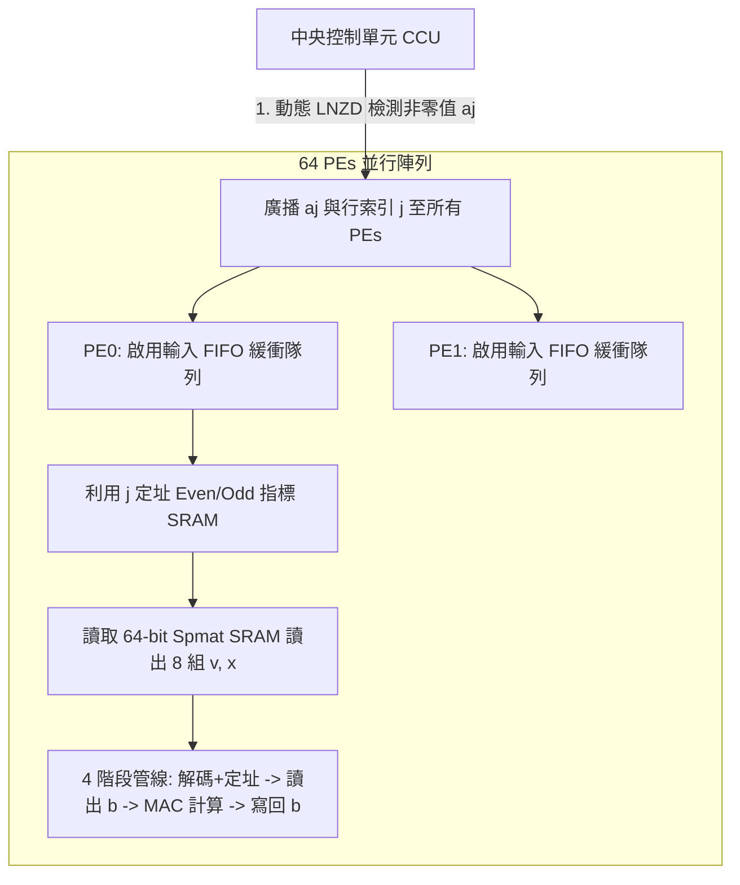

# 論文閱讀筆記：《EIE: Efficient Inference Engine on Compressed Deep Neural Network》

> **論文元數據 (Paper Metadata)**
> * **標題**：EIE: Efficient Inference Engine on Compressed Deep Neural Network
> * **作者**：Song Han, Xingyu Liu, Huizi Mao, Jing Pu, Ardavan Pedram, Mark A. Horowitz, William J. Dally (Stanford University / NVIDIA)
> * **發表地**：ISCA 2016 (計算機體系結構頂會，軟硬體協同設計奠基之作)
> * **論文鏈接**：[arXiv:1602.01528](https://arxiv.org/abs/1602.01528)
> * **PDF 本地路徑**：[eie_efficient_inference_engine.pdf](file:///home/awe/disk/deep_learning/efficient_ml/eie_efficient_inference_engine.pdf)

---

## 📌 核心研究背景與硬體痛點

深度神經網絡 (DNNs) 的主要瓶頸在於**記憶體頻寬與能耗**，而非純粹的計算能力。
特別是在實時推論 (Real-time Inference) 場景中：
1. **無法採用批次處理 (Batching)**：如自動駕駛行人檢測、語音識別等低延遲任務，批次大小 (Batch Size) 只能為 1，此時全連接層 (`FC`) **沒有任何權重重用性 (No parameter reuse)**，計算完全受限於記憶體存取頻寬 (Memory-bandwidth bound)。
2. **記憶體存取能耗極高**：在 45nm CMOS 工藝下，從片外 DRAM 讀取 32-bit 權重需要 **640 pJ**，而進行一次 32-bit 浮點數加法僅需 **0.9 pJ**。記憶體存取能耗高出計算能耗 **3 個數量級**！

### 🚀 EIE 核心設計理念與成果
雖然 Song Han 先前提出的「深層壓縮 (Deep Compression)」能將網絡模型壓縮 35 到 49 倍，使其得以完全放進片上 SRAM。然而，**通用處理器 (CPU/GPU) 卻無法高效處理壓縮後的稀疏與編碼格式**（會帶來大量的非規則定址與查表開銷）。

**EIE (Efficient Inference Engine)** 是第一款專門為**稀疏與權重共享神經網路**設計的 ASIC 晶片加速器，直接在壓縮格式上進行運算。

#### 📊 令人驚豔的節能與效能表現：
* **能耗節省來源（28,800 倍理論極限，實際約為千倍級）**：
  * **SRAM 規避 DRAM**：儲存體積壓縮後放進片上 SRAM $\rightarrow$ **$120\times$** 能耗節省。
  * **利用靜態權重稀疏**：僅對非零權重進行計算 $\rightarrow$ **$10\times$** 節省。
  * **權重共享 (Weight Sharing)**：使用 4-bit 權重索引 $\rightarrow$ **$8\times$** 節省。
  * **動態跳過零激活值 (ReLU)**：動態規避乘 0 計算 $\rightarrow$ **$3\times$** 節省。
* **對比通用硬體 (Batch Size = 1)**：
  * **效能提升 (Speedup)**：比 CPU 快 **$189\times$**，比桌面 GPU (Titan X) 快 **$13\times$**，比行動端 GPU (Tegra K1) 快 **$307\times$**。
  * **能效比 (Energy Efficiency)**：比 CPU 節能 **$24,000\times$**，比桌面 GPU 節能 **$3,400\times$**，比行動端 GPU 節能 **$2,700\times$**。
  * **物理規格 (64 PEs)**：在 45nm 工藝下，面積僅 **40.8 mm²**，功耗僅 **590 mW** (約 0.6W)，處理 AlexNet FC 層可達 1.88 x 10⁴ frames/sec。

---

## 🛠️ 架構與並行化設計 (Architecture & Parallelization)

EIE 採用了**並行分佈式儲存與計算**的架構，由中央控制單元 (CCU) 與可擴展的處理元件 (Processing Element, PE) 陣列組成。

### 1. 工作負載並行化 (Row Interleaving)
為了最大化局部性並規避 PE 之間的跨節點歸約 (Reduction) 開銷：
* **矩陣行交錯分佈**：將權重矩陣 $W$ 的**行 (Rows)** 交錯分配給 $N$ 個 PEs。即第 $i$ 行、輸出 $b_i$、以及輸入 $a_i$，凡滿足 $i \pmod N = k$ 的全部儲存於 $\text{PE}_k$ 本地。
* **優點**：輸出向量 $b_i$ 的更新完全在 PE 本地完成，具備完美的**空間局部性 (Local Reduction)**。唯一的通信開銷僅是將非零輸入激活值 $a_j$ 廣播給所有 PEs。

### 2. 交錯式稀疏壓縮格式 (Interleaved CSC Format)
每個 PE 單獨維護其分配到的子矩陣，並以修改版的壓縮稀疏列 (CSC) 格式儲存：
* `v`：4-bit 虛擬權重索引（對應到包含 16 個共享權重的 codebook 碼本）。
* `x`：4-bit 相對行索引差（即兩個非零元素之間的行距）。若行距超過 15，則人工插入一個 0（Zero Padding）來重置行距。
* `p`：16-bit 列指針，標示每列在 `v` 和 `x` 陣列中的起止地址。

---

## 🔬 處理元件 (PE) 硬體流水線設計

每個 PE 的內部設計非常精妙，主要包含以下幾個功能模組：

### 1. 激活值緩衝隊列 (Activation Queue & FIFO)
* **消除負載不均**：由於每列在不同 PE 中的非零權重個數不同，會產生天然的負載不均 (Load Imbalance)。
* **緩衝解耦**：PE 輸入端設有 FIFO 佇列。當 CCU 廣播 $a_j$ 與 $j$ 時，各 PE 將其存入 FIFO。計算較慢的 PE 可以積壓工作，從而拉平負載波動。

> [!NOTE]
> **設計空間探索**：論文發現 FIFO 深度為 **8** 是最優的平衡點。當深度為 1 時，ALU 因飢餓產生的空泡 (Bubble) 會導致 50% 效能損失；而深度大於 8 後，負載均衡效率提升邊際效應遞減。

### 2. 雙指針讀取單元 (Pointer Read Unit)
* 用於查找列指針 $p_j$ 與 $p_{j+1}$。為了能在一周期內完成兩個指針的讀取，EIE 將指針陣列分開儲存於 **Even (偶數) 與 Odd (奇數)** 兩個單端口 SRAM Bank 中，利用地址的最低有效位 (LSB) 進行 Bank 選擇，實現單周期雙讀取。

### 3. 稀疏矩陣讀取單元 (Sparse Matrix Read)
* 為了降低 SRAM 存取能耗，EIE 採用寬度為 **64-bit** 的 Spmat SRAM，一次讀取可取出 8 組連續的 $(v, x)$ (每個 8-bit)。
* **64-bit 的設計考量**：在 64 個 PEs 且矩陣密度約為 10% 的情況下，每列平均有 6.4 個非零元素。64-bit 一次取出 8 個元素恰好完美匹配，能將 SRAM 讀取頻率降至每 8 周期一次，最大化節能且無數據浪費。

### 4. 4 階段算術流水線 (Arithmetic Pipeline)
EIE 的核心計算單元包含一個 4 階段流水線：
1. **解碼與定址 (Codebook Lookup & Address Accum)**：
   * 將 4-bit 權重索引 $v$ 透過一個 16 項的靜態 SRAM 查找表 (Codebook) 還原為 16-bit 定點數。
   * 同步將 4-bit 相對行索引 $x$ 與累加器累加，算出絕對行地址。
2. **暫存器讀取與乘法 (Register Read & Multiply)**：
   * 從本地的輸出暫存器堆讀出舊的 $b_x$。
   * 將解碼後的 16-bit 權重與暫存於 FIFO 頭部的輸入激活值 $a_j$ 進行乘法運算。
3. **移位與加法 (Shift & Add)**：
   * 進行累加運算：$b_x = b_x + v \times a_j$。
4. **暫存器寫回 (Register Write)**：
   * 將更新後的 $b_x$ 寫回輸出暫存器堆。

> [!TIP]
> **旁路技術 (Bypassing)**：若相鄰兩個週期存取了同一個暫存器地址（例如矩陣連續非零元素在同一行），流水線會啟用旁路，直接將加法器輸出導回輸入端，規避暫存器寫入/讀取衝突。

---

## 🎯 關鍵設計決策探討

### 1. 16-bit 定點數精密度的選擇 (Arithmetic Precision)
* **能耗節省**：16-bit 定點數乘法器的能耗比 32-bit 浮點數低 **$6.2\times$**，且面積顯著縮小。
* **精度無損**：在 ImageNet/AlexNet 測試下，使用 16-bit 定點數僅帶來 **0.5%** 的精度下降 (79.8% vs. 32-bit 浮點數的 80.3%)。若降到 8-bit 定點數，精確度會崩塌至 53%（不可接受）。

### 2. 行動端 Leading Non-Zero Detection (LNZD) 網絡
* 為了動態利用輸入激活值的稀疏性（ReLU 處理後，約有 70% 的 $a_j$ 為 0），EIE 採用了四叉樹 (Quadtree) 架構的 LNZD 硬體電路。
* 它能以極小的硬體面積（小於 PE 的 0.3%），在每個週期中快速篩選出下一個非零的輸入激活值並廣播，從而**完全跳過所有乘 0 的無效計算**。

---

## 📊 對比先進神經網路加速器 (DaDianNao)

在將 EIE 投影至與 DaDianNao 相同的 **28nm** 工藝下進行橫向對比 (FC7 layer of AlexNet)：

| 項目 | DaDianNao (ASIC) | EIE (256 PEs, 28nm) | EIE 對比優勢 |
| :--- | :---: | :---: | :---: |
| **工藝節點** | 28nm | 28nm | - |
| **記憶體類型** | 片上 eDRAM (密集無壓縮) | 片上 SRAM (直接操作壓縮稀疏) | **更低的靜態功耗與延遲** |
| **最大參數量** | 18 Million | **336 Million** | **$18.6\times$ 容量優勢** |
| **FC7 吞吐量** | 147,938 Frames/s | **426,230 Frames/s** | **$2.9\times$ 吞吐量** |
| **功耗** | 15.97 W | **2.36 W** | **$6.7\times$ 超低功耗** |
| **能效比** | 9,263 Frames/J | **180,606 Frames/J** | **$19\times$ 能效提升** |
| **面積效率** | 2,185 Frames/s/mm² | **6,681 Frames/s/mm²** | **$3\times$ 面積效率** |

* **關鍵差異**：DaDianNao 必須在計算前將權重展開為稠密格式，因而完全浪費了稀疏度與權重共享帶來的紅利。而 EIE 通過客製化解碼與跳過零值，釋放了演算法層面壓縮的全部硬體潛能。

---

## 💡 總結與軟硬體協同思考

EIE 證實了**軟硬體協同設計 (Algorithm-Hardware Co-design)** 的巨大威力：
* 單純在演算法端進行「深層壓縮」，若只在通用 CPU/GPU 上執行，因為稀疏不規則定址開銷，只能獲得約 $3\times$ 的實際加速。
* 但當設計了與壓縮格式完美契合的 EIE 晶片後，實際能效比被推向了令人震驚的 **$3000\times$** 級別。
* EIE 為現代領域專用架構 (Domain-Specific Architecture, DSA) 樹立了典範：**將模型壓縮算法與稀疏數據流硬體深度融合，是邊緣端晶片突破記憶體牆 (Memory Wall) 的最優解**。
