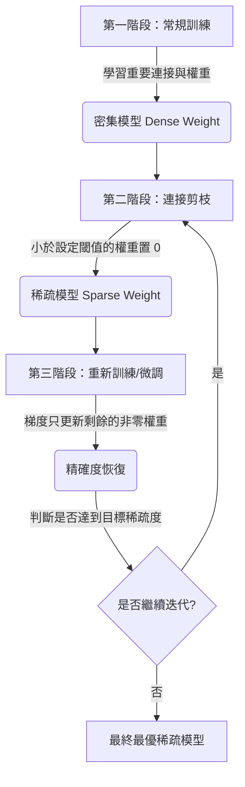

# 論文閱讀筆記：《Learning both Weights and Connections for Efficient Neural Networks》

> **論文元數據 (Paper Metadata)**
> * **標題**：Learning both Weights and Connections for Efficient Neural Networks
> * **作者**：Song Han, Jeff Pool, John Tran, William J. Dally (Stanford University / NVIDIA)
> * **發表地**：NIPS 2015 (模型剪枝領域奠基之作)
> * **論文鏈接**：[arXiv:1506.02626](https://arxiv.org/abs/1506.02626)
> * **PDF 本地路徑**：[learning_both_weights_and_connections.pdf](file:///home/awe/disk/deep_learning/efficient_ml/learning_both_weights_and_connections.pdf)


---

## 📌 核心摘要與痛點 (TL;DR)

深度神經網絡 (DNNs) 的巨大成功伴隨著極高的**計算與記憶體開銷**，限制了其在嵌入式及移動端設備上的部署。
傳統網路在訓練前就固定了架構，無法在訓練中優化網路拓撲。

### 🚀 本文核心貢獻
提出了一種**三階段非結構化細粒度剪枝算法**，在**完全不損失模型 Top-1 / Top-5 準確率**的前提下大幅度壓縮模型：
* **AlexNet**：參數壓縮 **$9\times$** (從 6,100 萬壓縮至 670 萬)。
* **VGG-16**：參數壓縮 **$13\times$** (從 1.38 億壓縮至 1,030 萬)。
* **計算量 (FLOPs) 削減**：AlexNet 削減 3 倍，VGG-16 削減 5 倍。
* **能耗優化**：將大模型壓縮至能放進片上 (On-chip) SRAM，規避了高能耗的片外 DRAM 記憶體讀寫。

---

## 🛠️ 三階段剪枝管線 (Three-Step Pipeline)

論文的核心方法是一個迭代的三階段管線：



### 1. 常規訓練 (Regular Training)
* 透過傳統的梯度下降訓練密集網絡，學習哪些連接和突觸是真正重要的。
* 此階段的目的是建立最優的基線精確度。

### 2. 連接剪枝 (Pruning Connections)
* 設定一個基於幅度的閾值 (Magnitude-based threshold)。如果某個權重的絕對值小於該閾值，則將該連接移除（權重置 0）。
* **動態閾值確定**：每一層的閾值是與該層權重的標準差 $\sigma$ 相關。各層剪枝閾值表示為：
  $$\text{Threshold} = q \cdot \sigma(W)$$
  其中 $q$ 是品質敏感度係數，$\sigma(W)$ 是該層權重的標準差。

### 3. 重新微調 (Retraining / Fine-tuning)
* **關鍵性**：直接剪枝會造成顯著的準確率下降，必須進行微調來讓剩餘的非零權重「適應並補償」被剪除部分的貢獻。
* **梯度更新限制**：在微調反向傳播時，**只更新未被剪枝的連接**。已被剪除的權重梯度直接置為 0（不參與更新）：
  $$\Delta W = \Delta W \cdot M$$
  （其中 $M$ 是二進制遮罩 Mask，保留的連接為 1，剪除的為 0）。

---

## 🧠 關鍵理論發現與工程實踐 (Insights)

### 💡 L1 vs L2 正則化對比 (The Regularization Insight)
作者探討了 L1 與 L2 正則化在剪枝管線中的不同表現：
* **剪枝前（L1 佔優）**：L1 正則化會將更多權重壓向 0，所以在**直接剪枝完、尚未微調**時，使用 L1 正則化的模型準確率優於 L2。
* **微調後（L2 佔優）**：**在 retraining 微調階段，L2 的效果顯著優於 L1**。因為微調階段目標是讓剩餘的重要權重適應局部最優解，不需再將其壓向 0。因此論文推薦使用 L2 正則化。

> [!TIP]
> 這種 L2 優勢也是許多深度學習剪枝實務（如 PyTorch 微調）中指定 `weight_decay` 的理論基礎。

### 💡 Dropout 比例動態調整 (Dropout Ratio Adjustment)
Dropout 用於防止過擬合。但在微調時，由於剪枝已經減少了模型容量 (Capacity)，若維持原有的 Dropout 比例會導致過度正則化。
論文提出一個公式來根據剩餘連接比例動態降低 Dropout 率：
$$D_r = D_o \sqrt{\frac{C_r}{C_o}}$$
其中 $D_o$ 為原始 Dropout 率，$D_r$ 為微調時的 Dropout 率，$C_o$ 和 $C_r$ 分別為剪枝前與剪枝後的連接數。

### 💡 局部剪枝與參數共適應 (Parameter Co-adaptation)
* **保留權重而非重新初始化**：神經網絡存在脆弱的共適應特徵 (Fragile Co-adapted Features)。微調時必須保留存活的權重，若重置權重並重新訓練，模型很難恢復精度。
* **分層交替微調**：為了防止深層網絡中的梯度消失問題，在微調時建議交替進行：例如固定卷積層 (`CONV`) 只微調全連接層 (`FC`)，反之亦然。

### 💡 迭代剪枝 (Iterative Pruning)
* 相比於單次暴力剪除，**「剪枝 -> 微調 -> 再剪枝 -> 再微調」**的迭代過程是尋找最優稀疏結構的貪心搜索。
* 在 AlexNet 上，單次暴力剪枝只能實現 $5\times$ 的無損壓縮，而迭代剪枝能將壓縮率提升至 **$9\times$**。

### 💡 神經元剪枝 (Pruning Neurons)
* 在連接剪枝後，若某個神經元的所有輸入或輸出連接皆被剪除（權重皆為 0），該神經元便成為「死神經元」，可被安全剪除。
* 微調階段配合正則化， gradient descent 會自動促使無貢獻的神經元走向 dead 狀態並被自動淘汰。

---

## 💾 稀疏權重存儲優化 (Index Representation)

為了在硬碟與記憶體中實現物理壓縮，必須對稀疏矩陣進行編碼，否則直接儲存 0 仍然會佔用空間。
論文設計了一套緊湊的**相對索引編碼 (Relative Index Difference Representation)**：

```
 dense 權重:   [ 1.2,  0.0,  0.0,  0.4,  0.0, -0.9 ]
非零 weights:  [ 1.2,        0.4,       -0.9 ]
絕對索引 (abs): [  0,          3,          5  ]
相對索引 (diff):[  0,          3,          2  ] (即 3-0=3, 5-3=2)
```

1. **資料壓縮**：
   * **卷積層**：權重值和相對索引均用 **8-bit** 表示。
   * **全連接層**：權重值用 **8-bit** 表示，相對索引僅用 **4-bit** (VGG) 或 **5-bit** (AlexNet) 表示。
2. **溢出處理 (Zero Padding)**：
   若兩個非零權重之間的距離超過了編碼上限（例如 4-bit 相對索引上限為 15），則在其間人工插入一個 "0" 權重（佔位符），將距離差重置，從而保證索引位數不超過上限。

---

## 📊 實驗結果數據比對

| 網絡模型 (Network) | 原始參數大小 (Dense Params) | 剪枝後參數大小 (Sparse Params) | 剪枝比例 (Pruned Ratio) | Top-1 誤差變化 | Top-5 誤差變化 |
| :--- | :---: | :---: | :---: | :---: | :---: |
| **LeNet-300-100** | 267 K | 22 K | **$12\times$ (92%)** | -0.05% (小幅恢復) | - |
| **LeNet-5** | 431 K | 36 K | **$12\times$ (92%)** | -0.03% (小幅恢復) | - |
| **AlexNet** | 61.0 M | 6.7 M | **$9\times$ (89%)** | -0.01% (不降反升) | -0.06% |
| **VGG-16** | 138.0 M | 10.3 M | **$13\times$ (92%)** | -0.16% (小幅恢復) | -0.24% |

### 💡 關鍵發現：
* **「免費午餐」**：甚至在不重新訓練的情況下，我們可以直接減去 $2\times$ 的連接而不降低準確率。而加上微調與迭代後，能實現高達 $9\times$ 到 $13\times$ 的壓縮。
* **各層敏感度差異 (Figure 6)**：
  * **第一層卷積層 (`conv1`) 極其敏感**：因為輸入只有 3 個通道 (RGB)，參數極少且負責底層特徵提取，剪枝率超過 50% 會使精確度快速崩塌。
  * **全連接層 (`FC`) 極度抗剪**：FC 層的參數佔了整個 AlexNet 的 90% 以上，冗餘空間極大（例如 VGG-16 的 `fc6` 和 `fc7` 可剪至原來的 4% 以下）。

---

## 🧠 權重分佈變化：雙峰化 (Bimodal Distribution)

論文揭示了剪枝與重訓前後權重分佈 (Figure 7) 的顯著變化：
* **剪枝前**：權重分佈呈現單峰高斯分佈，中心集中在 0 附近。
* **剪枝後與微調後**：由於閾值之內的權重被移去，分佈中間出現寬闊的空洞。重訓後，其餘非零權重向外擴散，分佈轉化為**雙峰分佈 (Bimodal Distribution)**。

---

## ⚠️ 非結構化剪枝的局限性與後續演進

> [!WARNING]
> 本文提出的方法屬於**非結構化剪枝 (Unstructured Pruning)** / 細粒度剪枝 (Fine-grained Pruning)：
> 雖然它成功將硬碟儲存與記憶體頻寬開銷降低了 90% 以上，但由於稀疏矩陣是不規則的，**在傳統的 CPU/GPU 硬件上無法直接利用高度優化的稠密矩陣乘法 (GEMM) 實現端到端加速**。若無專門的稀疏計算硬體（如作者後續研發的 EIE 晶片），在常規硬件上甚至可能因為稀疏索引查表開銷而變慢。

### 🔄 後續演進：結構化剪枝 (Structured/Channel Pruning)
為了解決非結構化剪枝的缺點，學術界與工業界後續發展出了**結構化通道剪枝**：
* 直接裁剪整個濾波器 (Filter) 或通道 (Channel)。
* 剪枝後的模型仍然保持稠密的矩陣格式，**不需要特殊的稀疏矩陣晶片**即可在常規的 CPU/GPU 上獲得 $1.5\times$ 至 $2\times$ 的物理推理速度提升。
