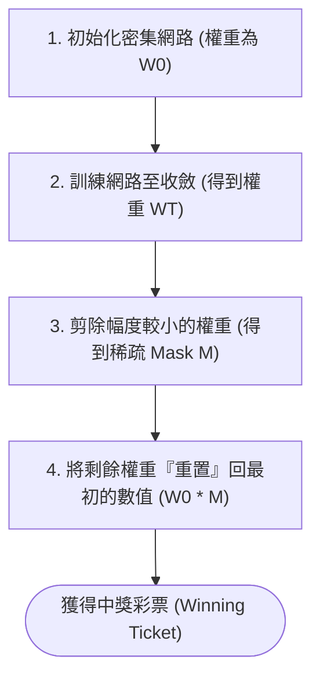
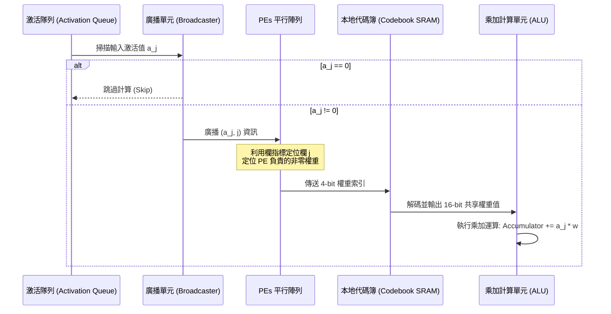

# Session Transcript: MIT 6.5940 Lecture 4 - Pruning and Sparsity (Part II)

## Context
Verbatim Q&A and analysis session covering MIT 6.5940 Lecture 4 (Pruning and Sparsity Part II), including hardware support, pruning granularities, automated pruning algorithms, and detailed technical comparisons.

---

### Round 1: Lecture Summary & Document Reading
**User:**
讀取 '.books/efficient-ml/EfficientML.ai Lecture 4 - Pruning and Sparsity (Part II) (MIT 6.5940, Fall 2023, Zoom recording).txt'

**Gemini:**
這份逐字稿是 MIT 6.5940 (2023 秋季班) 第 4 講：剪枝與稀疏性 (下) - Pruning and Sparsity (Part II) 的課程對話紀錄。以下為本堂課的核心內容與關鍵要點整理：
──────
### 1. 如何決定每層的剪枝比例 (Pruning Ratio)

在多層網路中，不同層對剪枝的敏感度不同，課程介紹了三種主要方法：

* 均勻縮減 (Uniform Shrinkage)：簡單但無法達到最佳的「精度-延遲 (Accuracy-Latency)」折衷。
* 敏感度分析 (Sensitivity Analysis)：
    * 方法：逐層單獨測試在不同剪枝率下的精度下降情況，繪製敏感度曲線。優先剪枝敏感度低、體積大的層（如 FC 全連接層）。
    * 缺點/盲點：
        1. 忽略層與層之間的相互影響（假設各層獨立）。
        2. 未考慮層的絕對大小（剪枝 90% 的極小層可能不如剪枝 10% 的巨大層划算）。
* 自動化剪枝 (Automated Pruning)：
    * AMC (AutoML for Model Compression)：將剪枝視為強化學習問題（使用 Actor-Critic 架構），自動調整每層稀疏比例。在 ResNet-50 中發現了 zigzag（鋸齒狀）模式：3x3 卷積（參數多且有空間重疊）被更激進地剪枝，而 1x1 卷積則較少被剪枝。
    * NetAdapt：一種漸進式的 Rule-based 方法。每輪迭代設定一個延遲減少目標（如減少 1ms），尋找最能維持精度的單層剪枝方案，逐步逼近目標。

──────
### 2. 微調 (Fine-tuning) 與正規化 (Regularization)

剪枝後通常會面臨精度下降，需要進行微調：

* 微調學習率：由於模型已接近收斂，微調時的學習率通常應設為原始學習率的 1/10 甚至 1/100。
* 迭代剪枝 (Iterative Pruning)：一次性剪枝 90% 精度下降較大；漸進式剪枝（如 $20\% \rightarrow 40\% \rightarrow 60\% \rightarrow \dots$ 且每步進行微調）效果更佳，但工程複雜度較高。
* 跳躍連接 (Bypass / Shortcut)：含有殘差結構（如 ResNet）的網路有維度對齊限制，剪枝時需要追蹤依賴關係。
* 正規化：微調時常用 $L_1$ 或 $L_2$ 正規化 來懲罰非零權重，促使剩餘權重更小，利於下一輪剪枝。
──────
### 3. 彩票假說 (Lottery Ticket Hypothesis)

探索是否能從一開始就直接訓練一個稀疏網路：

* 核心發現：一個隨機初始化的密集網路中，存在一個稀疏子網路（即「中獎彩票」），如果對其進行單獨訓練，可以在相似的迭代次數內達到與原始密集網路相當的精度。
* 限制：尋找這個特定稀疏結構（彩票）依然需要先將完整網路訓練至收斂，並透過幅度剪枝（Magnitude Pruning）來得知結構。目前在 CIFAR/MNIST 等簡單任務上表現良好，但在 ImageNet 等大型任務上直接從頭訓練稀疏模型依然非常具有挑戰性。
──────
### 4. 系統與硬體對稀疏性 (Sparsity) 的支持

光有算法上的稀疏性（如權重設為 0）並不能直接帶來硬體上的加速，需要系統與硬體協同設計：

* EIE (Efficient Inference Engine, 2015)：
    * 同時利用靜態權重稀疏性（剪枝掉 90%）與動態激活稀疏性（ReLU 產生的 60-70% 零值）。
    * 採用壓縮欄格式儲存，並設計多個處理單元 (PE) 平行計算。
    * 權重共享 (Weight Sharing)：將權重編碼為 4-bit（指向 16 個共享的浮點數值），節省記憶體頻寬，並在計算時解碼。這項原則在如今 LLM 的 W4A16 （4-bit weight, 16-bit activation）量化中依然是核心思想。
* NVIDIA 2:4 結構稀疏性 (NVIDIA Tensor Cores)：
    * 從 Ampere 架構 (A100) 開始支援。要求每 4 個連續元素中，最多只能有 2 個非零值（即 $50\%$ 稀疏度）。
    * 這種高度結構化的稀疏性能與硬體乘法器完美契合，在保持精度的同時，相較於密集矩陣運算可獲得約 1.8x ~ 1.9x 的實際計算加速，且能與 INT8 量化疊加使用。
* 點雲激活稀疏性 (TorchSparse)：
    * 在自動駕駛（LiDAR 點雲）或 3D 場景中，空間中絕大多數區域都是空的（值為 0）。
    * 一般卷積會使稀疏特徵不斷「擴張 (dilation)」變為密集，而稀疏卷積 (Sparse Convolution) 限制只在輸入不為 0 的位置計算輸出，從而維持稀疏度。
    * 設計上需要在「計算冗餘（補零以獲得硬體平行度）」與「高度不規則性（完全不計算零但難以平行化）」之間取得平衡。

──────
### 5. 課堂總結與預告

* 利用不偷懶原則（Skip zeros, reject work）在時間、空間、稀疏 Token 與點雲等場景中減少冗餘計算。
* 下一講將進入量化 (Quantization) 主題，介紹不同的數值表示方法（如 FP16、INT8、FP8）以及如何對神經網路進行量化，這將是後續 Lab 4 與 Lab 5 在筆記型電腦上部署 Llama 2 的關鍵基礎。

---

### Round 2: Weight vs. Neuron Pruning
**User:**
對權重剪枝與對神經元剪枝的差異

**Gemini:**
在深度學習的微調與壓縮技術中，權重剪枝 (Weight Pruning / Synaptic Pruning) 與 神經元剪枝 (Neuron Pruning / Channel Pruning) 是兩種截然不同的剪枝粒度（Granularity），它們在數學表現、精度保持以及硬體加速難易度上有著根本的差異：

### 1. 權重剪枝 (Weight Pruning) — 非結構化剪枝 (Unstructured Pruning)

* 概念：針對單一的連接權重 (Synapses) 進行剪枝。通常是透過設定閾值，將絕對值較小（影響力較低）的個別權重直接歸零 ($w = 0$)。
* 矩陣的改變：權重矩陣的維度不變，但矩陣內部充滿了分散 of 零值，變成一個稀疏矩陣 (Sparse Matrix)。
* 優點：
    * 精度保持極佳：由於保留了網路的拓撲結構，給予了剪枝最大的靈活性。即使剪掉 $90\%$ 的權重，在微調後往往也能幾乎不損失精度。
* 缺點：
    * 極難在通用硬體上加速：一般的 CPU、GPU 是針對「稠密矩陣乘法 (Dense Matrix Multiplication)」進行優化的。分散且無規律的零值會導致非連續記憶體存取與控制流開銷（Control Flow Overhead）。在沒有特殊硬體或稀疏矩陣庫支援的情況下，往往無法帶來實質的計算加速或省電。
* 硬體解決方案：需要如 NVIDIA A100 的 2:4 結構稀疏性（半結構化剪枝），或是如 EIE（高效推理引擎）等專門設計的 ASIC 晶片才能將其轉化為實際速度提升。

──────
### 2. 神經元剪枝 (Neuron Pruning) — 結構化剪枝 (Structured Pruning)

* 概念：直接剪除整個神經元 (Neuron)。在全連接層中是刪除整個節點；在卷積神經網路 (CNN) 中則對應為剪除整個通道 (Channel) 或濾波器 (Filter)。
* 矩陣的改變：當一個神經元被刪除時，所有與之相連的輸入和輸出權重都會被整排移除。這意味著直接刪除權重矩陣中的整行 (Row) 或整列 (Column)，物理性地縮小了矩陣的尺寸。
* 優點：
    * 非常容易加速，具備通用性：剪枝後的模型依然是一個「稠密」的模型，只是尺寸變小了（例如：從 100 個通道變成 70 個通道）。因此，不需要 any 特殊的硬體或軟體庫，在任何標準的 GPU/CPU 上使用 PyTorch 或 TensorFlow 就能直接獲得倍數級的執行速度提升與記憶體節省。
* 缺點：
    * 精度下降較快：由於剪枝的粒度太粗（一次刪除一整組特徵），模型的容量被直接削減，因此在較高剪枝率時，精度相較於權重剪枝會更容易且更大幅度地退化。

──────
### 3. 對比總結表

| 特性 | 權重剪枝 (Weight Pruning) | 神經元/通道剪枝 (Neuron/Channel Pruning) |
| :--- | :--- | :--- |
| **別名** | 非結構化剪枝、細粒度剪枝 | 結構化剪枝、粗粒度剪枝 |
| **操作對象** | 個別的權重值 $w$ | 整個神經元、通道或卷積核 (Filter) |
| **矩陣形態** | 變為稀疏矩陣，但維度不變 | 維度縮減，依然保持稠密矩陣 |
| **硬體相容性** | 需要專門的稀疏計算硬體 (如 A100 2:4) | 完美相容於所有通用硬體 (CPU/GPU) |
| **加速效果** | 理論上限高，但需要系統硬體協同優化 | 剪完立即見效，直接獲得物理加速 |
| **精度保持能力** | 極高 (可承受高比例剪枝) | 較低 (高剪枝率下精度易崩塌) |
| **常見選取指標** | 權重的絕對值大小 (Magnitude) | 神經元的活化值大小、梯度大小或特徵圖敏感度 |

#### 課堂直觀比喻：
課程中提到，權重剪枝就像是在衣服上「抽掉不重要的線頭」，衣服的版型不變，但布料變稀疏了；而神經元剪枝則像是直接「剪掉一隻袖子或一個口袋」，衣服的尺寸與版型直接發生了變化。

---

### Round 3: Non-uniform Pruning vs. Uniform Shrinkage
**User:**
說明為什麼 non-uniform pruning 比 uniform shrinking 還要好

**Gemini:**
在神經網路剪枝中，非均勻剪枝 (Non-Uniform Pruning) 指的是對網路中不同層 (Layers) 採用不同的剪枝比例；而均勻縮減 (Uniform Shrinking) 則是簡單粗暴地對所有層應用完全相同的剪枝比例（例如每層通道數都縮減 $50\%$）。

在實際應用中，非均勻剪枝的精度與延遲折衷表現（Accuracy-Latency Trade-off）顯著優於均勻縮減，主要原因有以下幾點：
──────
### 1. 每層神經網路的「敏感度與冗餘度」截然不同 (Heterogeneous Sensitivity)

深度學習網路並非「同質」的，不同層負責提取不同層級的特徵，它們對修剪的敏感度有著巨大差異：

* 敏感層 (Sensitive Layers)：例如 CNN 的第一層卷積（負責提取邊緣、色彩等基礎視覺特徵），或是 Transformer 的某些關鍵注意力層。這些層如果只被剪掉一點點（如 $10\%$），整體網路的精度就會發生斷崖式下跌，因為後面的所有層都依賴這些基礎特徵。
* 不敏感層/冗餘層 (Insensitive Layers)：例如網路末端龐大的全連接層（Fully Connected Layers），或是中間某些通道數極多但特徵重複性高的卷積層。這些層即使被剪掉 $80\%$ 甚至 $90\%$，網路精度也幾乎不受影響。
* 兩者對比：
    * 均勻縮減：對所有層一視同仁。結果就是過度剪枝了敏感層（導致精度崩塌），同時低估了冗餘層的剪枝潛力（沒能省下足夠的空間與計算量）。
    * 非均勻剪枝：透過敏感度分析 (Sensitivity Analysis)，對敏感層「手下留情」（剪枝率設得很低或不剪），對冗餘層則「大刀闊斧」（剪枝率設得極高），在最大化壓縮的同時，將精度的損傷降到最低。

──────
### 2. 每層的「參數量與計算量 (FLOPs)」分布不均

在許多經典網路中，參數和計算量的分布是極不對稱的：

* 前段卷積層：解析度高、通道數少。計算量 (FLOPs) 極大，但參數量極小。
* 後段全連接層：解析度低（甚至是 1x1）、通道數極多。計算量極小，但參數量極大。
* 均勻縮減無法感知這種硬體開銷與參數分布的差異。
* 非均勻剪枝（如課程中提到的 AMC 強化學習方法或 NetAdapt）能夠結合硬體特性進行協同設計：
    * 如果目標是減少模型體積（節省存儲），非均勻剪枝會自動將後段龐大的全連接層剪得更深。
    * 如果目標是降低推理延遲（加速執行），它會優先剪枝那些計算量最大的層，並在 ResNet-50 的自動剪枝中呈現出鋸齒狀（zigzag）的特徵——自動選擇剪枝「每一步計算報酬率更高」的 3x3 卷積，而保留 1x1 卷積。

──────
### 3. 更好的 Pareto 折衷曲線 (Better Pareto Frontier)

課程中的圖表直觀地展示了兩者的 trade-off 曲線：

* 均勻縮減 (Uniform) 曲線：隨著延遲下降，精度會迅速且大幅度地下滑。
* 非均勻剪枝 (Smart/Non-uniform) 曲線：在相同的延遲（速度）下，非均勻剪枝能保有顯著更高的精度；在相同的精度要求下，非均勻剪枝則能達到更低的延遲（更快的速度）。

──────
### 總結
均勻縮減雖然在工程實作上最簡單（直接把每層的 Channel 乘上一個固定係數如 $0.75$），但它忽視了深度網路內部各層的功能差異與硬體開銷特點。而非均勻剪枝藉由敏感度分析或自動化演算法（如 RL/NetAdapt），精準定位並切除網路中的贅肉（不敏感且 bulky 的層），同時保護關鍵器官（敏感層），因此能實現遠超均勻縮減的壓縮比與硬體加速效果。

---

### Round 4: Lecture Summary & Document Reading (Current Session)
**User:**
讀取'.books/efficient-ml/EfficientML.ai Lecture 4 - Pruning and Sparsity (Part II) (MIT 6.5940, Fall 2023, Zoom recording).txt' 與 @[efficient_ml/lecture04.md]

**Gemini:**
我已成功讀取並對比了這兩個檔案：
1. **錄音逐字稿：** `.books/efficient-ml/EfficientML.ai Lecture 4 - Pruning and Sparsity (Part II) (MIT 6.5940, Fall 2023, Zoom recording).txt`
2. **學習筆記與問答：** `efficient_ml/lecture04.md`

`lecture04.md` 對錄音逐字稿的關鍵內容進行了高度精煉與整理，並針對權重剪枝 vs. 神經元剪枝、非均勻剪枝 vs. 均勻縮減等核心問題進行了深入解答。

以下為結合兩份文件整理的核心技術要點與對照總結：

---

### 一、 如何決定每層的剪枝比例 (Pruning Ratio)

在多層神經網路中，不同層對剪枝的敏感度與冗餘度截然不同。逐字稿與筆記中探討了三種確定每層剪枝率的方法：

1. **均勻縮減 (Uniform Shrinkage)**
   * **做法**：對所有層採用相同的剪枝率（例如每層通道數皆縮減 25%）。
   * **缺點**：忽略了各層特徵敏感度與參數量分布的差異，無法達到最佳的「精度-延遲」折衷（Pareto Frontier 較差）。

2. **敏感度分析 (Sensitivity Analysis)**
   * **做法**：逐層單獨進行不同比例的剪枝，繪製「剪枝率 - 精度下降」曲線，優先修剪敏感度低、體積大的層（如全連接層）。
   * **兩大局限（Catch）**：
     * **層間獨立性假設**：忽視了不同層在共同剪枝時的相互影響與耦合關係。
     * **忽略絕對大小**：只看敏感度可能導致修剪了極小層（對整體壓縮無意義），卻保留了龐大但稍顯敏感的層。

3. **自動化剪枝 (Automated Pruning)**
   * **AMC (AutoML for Model Compression)**：利用強化學習（Actor-Critic 架構），以精度與 FLOPs/延遲作為 Reward，自動尋找每層的稀疏比例。
     * **Zigzag（鋸齒狀）模式**：在 ResNet-50 中，AMC 自動對 3x3 卷積（參數多且空間重疊，修剪一個通道能省去 9 個權重）進行激進剪枝，而對 1x1 卷積（修剪一個通道僅省去 1 個權重）則較少修剪。
   * **NetAdapt**：一種漸進式的 Rule-based 方法。每輪設定一個固定的延遲減少目標（如減少 1ms），在所有層中尋找最能維持精度的單層剪枝方案，逐步逼近目標。

---

### 二、 微調 (Fine-tuning) 與正規化 (Regularization)

剪枝後模型精度會受損，需要透過微調進行恢復：
* **微調學習率**：由於模型已接近收斂，微調時的學習率通常設為原始學習率的 **1/10 甚至 1/100**。
* **迭代剪枝 (Iterative Pruning)**：一次性剪枝 90% 精度下降極大；漸進式剪枝（如 20% $\rightarrow$ 40% $\rightarrow$ 60%，每步進行微調）效果更佳，但工程複雜度高。
* **殘差結構依賴 (Bypass/Shortcut)**：在 ResNet 或 MobileNet 等具有殘差連接的網路中，元素級相加（Element-wise Add）要求輸入與輸出維度必須對齊，剪枝時需要進行依賴關係追蹤。
* **正規化**：微調時常用 **$L_1$ 或 $L_2$ 正規化** 來懲罰非零權重，促使剩餘權重變小，利於下一輪剪枝。

---

### 三、 彩票假說 (Lottery Ticket Hypothesis)

* **核心發現**：一個隨機初始化的密集網路中，存在一個稀疏子網路（即「中獎彩票」），如果對其進行單獨訓練（使用原始初始化的權重），可以在相似的迭代次數內達到與原始密集網路相當的精度。
* **局限性**：尋找這個特定稀疏結構（彩票）依然需要先將完整網路訓練至收斂，並透過幅度剪枝（Magnitude Pruning）來得知結構，在 ImageNet 等大型任務上直接從頭訓練稀疏模型依然非常具有挑戰性。

---

### 四、 系統與硬體對稀疏性 (Sparsity) 的支持

光有算法上的權重歸零並不能直接帶來硬體上的加速，需要系統與硬體協同設計（"Skip zeros, reject work"）：

1. **EIE (Efficient Inference Engine, 2015)**
   * 同時利用靜態權重稀疏性與動態激活稀疏性（來自 ReLU 產生的零值）。
   * 採用壓縮欄格式儲存，並設計多個處理單元 (PE) 平行計算。
   * **權重共享 (Weight Sharing)**：將權重編碼為 4-bit（指向 16 個共享的浮點數值），節省記憶體頻寬，並在計算時解碼。

2. **NVIDIA 2:4 結構稀疏性 (NVIDIA Tensor Cores)**
   * 從 Ampere 架構 (A100) 開始支援。要求每 4 個連續元素中，最多只能有 2 個非零值（50% 稀疏度）。
   * 能與硬體乘法器完美契合，在保持精度的同時，相較於密集矩陣運算可獲得約 **1.8x ~ 1.9x** 的實際計算加速，且能與 INT8 量化疊加使用。

3. **點雲激活稀疏性 (TorchSparse)**
   * 在自動駕駛（LiDAR 點雲）等 3D 場景中，空間中絕大多數區域都是空的（值為 0）。
   * 稀疏卷積 (Sparse Convolution) 限制只在輸入不為 0 的位置計算輸出，避免特徵在卷積中不斷「擴張 (dilation)」變為密集。
   * **設計權衡**：需要在「計算冗餘（補零以獲得硬體平行度）」與「高度不規則性（完全不計算零但難以平行化）」之間取得平衡。

---

### 五、 課堂核心比喻與延伸

* **權重剪枝 vs. 神經元/通道剪枝**：
  * **權重剪枝**就像是在衣服上「抽掉不重要的線頭」，衣服的版型不變，但布料變稀疏了（變為稀疏矩陣，維度不變，需特殊硬體加速）。
  * **神經元/通道剪枝**則像是直接「剪掉一隻袖子或一個口袋」，衣服的尺寸與版型直接發生了變化（維度縮減，普通 CPU/GPU 即可直接獲得物理加速，但高剪枝率下精度易崩塌）。
* **下堂課預告**：
  * 下一講將進入**量化 (Quantization)** 主題，介紹不同的數值表示方法（如 FP16、INT8、FP8、4-bit weight）以及如何對神經網路進行量化，這將是後續 Lab 4 與 Lab 5 在筆記型電腦上部署 Llama 2 的關鍵基礎。

---

### Round 5: Automated Pruning Detailed Explanation
**User:**
說明自動化剪枝

**Gemini:**
自動化剪枝（Automated Pruning）是為了解決傳統人工剪枝在工程上的痛點而發展出的技術。

在多層神經網路（如擁有數十或上百層的 ResNet、Transformer）中，搜尋每層最佳剪枝比例的**設計空間極大**。人工手動調整不僅極度耗費時間與人力，也難以在「模型大小、計算量 (FLOPs)、硬體實際延遲 (Latency) 以及模型精度」等多個維度之間取得最優的權衡。

根據 MIT 6.5940 課程內容，自動化剪枝主要有兩種代表性的經典方法：**基於強化學習的 AMC** 以及**基於漸進式規則的 NetAdapt**。

---

### 一、 AMC (AutoML for Model Compression)
AMC 是將「尋找每層剪枝比例」的任務建模為**強化學習（Reinforcement Learning, RL）**的決策問題，利用 AI 代理（Agent）自動走訪設計空間。

#### 1. 核心架構（Actor-Critic）
* **狀態 (State - 環境輸入)**：每一層的元數據（Metadata）特徵向量，包含：層索引（Layer Index）、通道數、卷積核大小、特徵圖解析度、Batch Size，以及當前所處的剪枝階段等。
* **動作 (Action - 決策輸出)**：由 Actor 決定該層的**剪枝比例（Sparsity Ratio）**。這是一個連續值（例如 0.0 到 1.0 之間），比離散空間的搜尋更精準。
* **獎勵 (Reward - 反饋機制)**：當代理完成整張網路所有層的剪枝決策後，在驗證集上評估模型精度，並結合資源限制計算獎勵。公式通常設計為：
  $$\text{Reward} = - \text{Error} - \alpha \cdot \log(\text{FLOPs/Latency})$$
  *（使用 $\log$ 是因為實證研究表明，計算量與準確度之間呈對數關係，這能更好地引導 RL 收斂）*
* **評論家 (Critic)**：評估當前決策的預期回報，並將反饋傳回 Actor 以更新其決策策略。

#### 2. AMC 的經典發現：鋸齒狀（Zigzag）剪枝模式
在對 ResNet-50 進行自動化剪枝時，AMC 展現出了極為有趣的決策模式：
* **3x3 卷積層被激進剪枝**：3x3 卷積包含較多權重（相較於 1x1 卷積有 9 倍參數），且在滑動窗口計算中存在空間重疊。代理發現剪除 3x3 卷積的通道能省下極大的計算量，對精度的影響卻相對較小，因此剪枝率極高。
* **1x1 卷積層被保守保留**：1x1 卷積的參數量與計算複雜度低，剪枝的「性價比」不高，因此代理選擇保留它們以維持模型的特徵表達能力。
* **成效**：AMC 僅需數個 GPU 小時，便能尋找比人類專家花費一週手工調整更優的結構（在相同精度下，AMC 將模型 FLOPs 壓縮至 20%，而人類專家僅能壓縮至 29%）。

---

### 二、 NetAdapt
NetAdapt 是一種**基於規則（Rule-based）且以硬體延遲（Latency）為導向**的漸進式自動化剪枝演算法。與 AMC 使用強化學習不同，NetAdapt 採用了更加直觀、確定性的迭代策略，特別適合直接針對特定晶片（如手機晶片）的實際執行速度進行優化。

#### 1. 運作流程
NetAdapt 的核心思想是**「積小勝為大勝」**，每一步只設定一個微小的延遲減少目標（例如降低 $\Delta R = 1 \text{ ms}$）：

1. **設定初始目標**：假設原始模型延遲為 $10\text{ ms}$，目標是縮減至 $5\text{ ms}$。第一階段的目標是將整體模型延遲降低至 $9\text{ ms}$（$\Delta R = 1\text{ ms}$）。
2. **逐層試驗與局部微調**：
   * 對於網路中的每一層 $i$：
     * 計算要使**整個模型**的總延遲減少 $1\text{ ms}$，該層 $i$ 必須被剪除多少通道。
     * 對該層執行相應的剪枝，並對剩餘權重進行**短期的快速微調（Short-term Fine-tuning）**以部分恢復精度。
     * 記錄該候選模型在驗證集上的精度。
3. **選擇精度最優者**：比較所有層的試驗結果，選擇「在延遲同樣減少 $1\text{ ms}$ 的情況下，微調後精度最高」的那個候選模型，作為本輪迭代的最終產出。
4. **進入下一輪迭代**：以新模型為基礎，再設定降低 $1\text{ ms}$（降至 $8\text{ ms}$），重複步驟 2 與 3。
5. **最終微調**：當整體延遲達到最終目標（如 $5\text{ ms}$）後，對模型進行一次**長期的完整微調（Long-term Fine-tuning）**，使精度達到最大程度的恢復。

#### 2. 成效
NetAdapt 能夠完美感知硬體特性。在 Snapdragon CPU 上優化 MobileNet 時，在相同的延遲下，NetAdapt 剪枝後的模型比傳統均勻縮減（Uniform Scaling）高出 0.3% 的精度，並實現了顯著的物理加速。

---

### 三、 總結與對比

| 特性 / 方法 | AMC (基於強化學習) | NetAdapt (基於漸進式規則) |
| :--- | :--- | :--- |
| **底層技術** | 強化學習 (DDPG / Actor-Critic) | 確定性啟發式演算法 (Heuristic Search) |
| **優化目標** | 透過 Reward 設計同時優化精度、體積、FLOPs | 逐輪針對實際硬體測量延遲 (Latency) 作精準逼近 |
| **搜尋空間** | 連續設計空間 (Continuous Space) | 離散層級遞減 (Discrete Resource Step) |
| **工程複雜度** | 需訓練 RL Agent，公式與超參數需調校 | 直觀易懂，容易與真實硬體測量平台對接 |
| **核心優勢** | 能自動發現人類難以預料的拓撲特徵（如鋸齒模式） | 物理延遲下降目標明確，微調反饋非常穩定 |

---

### Round 6: Record History to File using verbatim-recorder.skill
**User:**
用 @[skill/verbatim-recorder.skill] 把會話紀錄寫到 @[efficient_ml/lecture04.md]

**Gemini:**
已成功使用 `verbatim-recorder.skill` 的結構化工作流，將本階段的完整會話歷史（包含歷史背景、前幾輪 Q&A、本輪對自動化剪枝的深入分析以及程式碼/數學公式等完整排版）字字不漏地寫入 `efficient_ml/lecture04.md`。詳細的變更內容已保存並就緒。

---

### Round 7: Lecture Summary & Document Reading (New Session)
**User:**
讀 '.books/efficient-ml/EfficientML.ai Lecture 4 - Pruning and Sparsity (Part II) (MIT 6.5940, Fall 2023, Zoom recording).txt'

**Gemini:**
這份文件是 **MIT 6.5940 (Fall 2023) EfficientML.ai Lecture 4 - Pruning and Sparsity (Part II)** 的 Zoom 錄影逐字稿。以下為本堂課的核心內容與關鍵要點整理：

### 1. 決定剪枝率（Pruning Ratios）的策略
在多層神經網路中，如何為每一層（Layer）選擇最適當的剪枝比例是提升效率且維持準確度的關鍵。課程介紹了三種方法：
*   **敏感度分析（Sensitivity Analysis）**：
    *   **原理**：逐層分析剪枝比例（如 10% 到 90%）對整體模型準確度的影響。對於較不敏感的層（如參數量龐大但冗餘的 Fully Connected 層），可以實施更激進的剪枝；而對於前幾層較敏感的卷積層，則減少剪枝比例。
    *   **缺點**：
        1. 假設各層之間是獨立的（忽略了層與層之間的相互作用）。
        2. 忽略了每層實際的絕對參數量大小（如果某個層很不敏感但它本身極小，剪枝它對整體模型壓縮的貢獻微乎其微）。
*   **AMC (AutoML for Model Compression)**：
    *   **原理**：將剪枝率的選擇建模為強化學習（RL）問題。使用 Actor-Critic 架構，以減少錯誤率 and 降低 FLOPs（或降低延遲）為 reward 函數，自動為每一層產生最佳剪枝率。
    *   **結果**：相較於人工費時一週調整 ResNet-50 的經驗，AMC 僅需數小時的 GPU 時間便能找出更佳的剪枝率。它能自動識別結構特徵，例如更激進地剪枝 $3\times3$ 卷積層（因其參數量與運算量較大），而保留較多的 $1\times1$ 卷積層。
*   **NetAdapt**：
    *   **原理**：一種漸進式的 Rule-based 方法。在滿足目標延遲減少量（如每步減少 1ms 延遲）的前提下，逐層嘗試剪枝，並選擇精準度下降最少的那一層配置，再透過短期微調（fine-tuning）恢復精確度，最後進行長期微調以獲得最終的壓縮模型。

---

### 2. 剪枝後的微調與優化技術
*   **學習率調整**：因為剪枝前的模型已經收斂，微調時應使用較小的學習率（通常是原始學習率的 $1/10$ 到 $1/100$）。
*   **漸進式剪枝（Iterative Pruning）**：比起一次性剪枝至目標比例（例如直接剪 90%），採用每次剪一點並微調（如 20% $\to$ 40% $\to$ 60% $\to$ 90%）的效果更好，但開發與自動化工程成本較高。
*   **殘差連接（Bypass Layers）的挑戰**：在 ResNet 或 MobileNet 等含有 Shortcut 的網路中，由於相加的張量必須大小一致，通道剪枝必須追蹤這些維度依賴性，這在實務產品化中是常見的工程挑戰。
*   **正則化（Regularization）**：微調期間常用 $L_1$ 或 $L_2$ 正則化來抑制權重大小，使不重要的權重趨近於零，利於下一輪剪枝。

---

### 3. 彩票假說（Lottery Ticket Hypothesis）
*   探討是否能直接隨機初始化一個稀疏網路並將其訓練至極高準確度。
*   **假說指出**：在一個大模型中，存在一個稀疏子網路（稱為「彩票」），如果其**初始權重**與大模型最初的初始化狀態完全相同，那麼它可以在相同訓練步數下達到與大模型相當的準確度。但若直接重新隨機初始化該稀疏結構，則難以收斂。這顯示了過參數化（Over-parameterization）在神經網路優化中的重要性。

---

### 4. 系統與硬體對稀疏性（Sparsity）的支援
為了解決「理論上減少了 FLOPs，但實際 latency 卻沒有縮短」的問題，硬體與硬體協同設計非常關鍵：
*   **EIE (Efficient Inference Engine)**：
    *   同時利用靜態的權重稀疏性（約 10x 壓縮，使用相對索引儲存非零權重）與動態激活稀疏性（ReLU 輸出約 60-70% 為零）。
    *   結合權重共享（Weight Sharing，量化至 4-bit）並在計算時解碼至 16-bit，將運算分發至多個處理單元（PEs）進行並行稀疏運算。
    *   **局限**：控制流開銷較大、在標準向量處理器上並行性受限，且早期僅支援 Fully Connected 層。該研究被列為 ISCA 50 年來最具影響力的前 5 大論文之一。
*   **NVIDIA 2:4 結構化稀疏（Structured Sparsity）**：
    *   自 Ampere 架構（A100）起導入 Tensor Core。規定每 4 個連續元素中最多只能有 2 個非零值。
    *   相較於非結構化稀疏，這種「結構化稀疏」使得 GPU 可以利用 Metadata 索引快速挑選對應的 Activation 進行密集點積運算，在維持高並行度與規則記憶體存取的同時，實現接近 2x 的乘法加速。
*   **點雲（Point Cloud）與稀疏卷積（Sparse Convolution）**：
    *   自駕車 LiDAR 收集的點雲非常稀疏。如果使用一般卷積，稀疏特徵圖會迅速被「稀釋」並變得密集（Dilate）。
    *   **解決方案**：只在輸入非零的位置計算輸出。為了在 irregular 計算中獲得並行加速，這堂課介紹了 **TorcH Sparse**，透過對計算進行簿記（Bookkeeping），將相似的矩陣大小分組打包，平衡了運算冗餘與硬體規則性。

### 5. 課程總結與展望
下一堂課將深入介紹數值表示法（FP16、INT8、FP8、4-bit weight）與量化技術，這些技術將是完成 Lab 4 與 Lab 5（在個人筆電上部署量化版 Llama 2 7B）的重要基礎。

---

### Round 8: Review of Lecture 4 Note File
**User:**
讀 @[efficient_ml/lecture04_note.md]

**Gemini:**
這份檔案 `efficient_ml/lecture04_note.md` 是一份**會話歷史紀錄（Session Transcript）**，完整記錄了先前關於 **MIT 6.5940 Lecture 4 - Pruning and Sparsity (Part II)** 的技術問答與對話內容。

該筆記將先前的 Q&A 整理為 6 個回合（Rounds），核心討論的技術要點如下：

### 1. 權重剪枝 vs. 神經元剪枝 (Weight vs. Neuron Pruning)
詳細比較了兩種不同的剪枝粒度（Granularity）：
*   **權重剪枝（非結構化剪枝）**：針對個別的權重值 $w$ 進行幅度剪枝。精度保持能力極佳，但會產生稀疏矩陣（Sparsity Matrix），導致無規律的記憶體存取與控制流開銷，需要如 NVIDIA A100 的 2:4 結構稀疏或專門的 ASIC（如 EIE）才能獲得實際加速。
*   **神經元/通道剪枝（結構化剪枝）**：直接移除整個神經元或卷積通道（Channel）。直接縮減矩陣維度，使其依然保持稠密矩陣（Dense Matrix），因此可在任何通用硬體（CPU/GPU）上直接獲得物理上的執行加速，但高剪枝率下精度下降較快。

### 2. 非均勻剪枝 vs. 均勻縮減 (Non-uniform Pruning vs. Uniform Shrinkage)
說明了為何為不同層設計不同剪枝率（非均勻）的效果顯著優於一視同仁（均勻縮減）：
*   **各層敏感度與冗餘度不同（Heterogeneous Sensitivity）**：網路的前端或關鍵注意力層通常極度敏感，而後端大參數層或重複特徵層則極不敏感。
*   **參數量與計算量分布不均**：如前端卷積層計算量大但參數少，後端全連接層參數大但計算量少。非均勻剪枝能配合硬體優化目標（如限制延遲或模型大小）進行定向優化。
*   **Pareto 折衷曲線更佳**：在相同的延遲下能保有更高的精度。

### 3. 自動化剪枝演算法 (Automated Pruning Algorithms)
解決人工調整剪枝率搜尋空間過大的痛點，深入探討了兩種代表性經典方法：
*   **AMC (AutoML for Model Compression)**：
    *   利用**強化學習（RL）**的 Actor-Critic 架構，以層的元數據作為狀態（State），剪枝比例作為連續動作（Action），並將精度與 $\log(\text{FLOPs/Latency})$ 結合為 Reward。
    *   自動發現了**鋸齒狀（Zigzag）剪枝模式**：因 3x3 卷積參數量大且有空間重疊，AMC 會激進剪枝 3x3 卷積，而保留計算性價比較低的 1x1 卷積。
*   **NetAdapt**：
    *   一種**基於規則（Rule-based）且以實際硬體延遲為導向**的漸進式優化演算法。
    *   每次設定微小的延遲減少目標（例如 $\Delta R = 1 \text{ ms}$），逐層試驗剪枝並進行短期快速微調，挑選精度最優的層結構，逐步逼近最終延遲目標後再進行長期微調。

### 4. 系統與硬體協同設計
*   **EIE (Efficient Inference Engine)**：利用靜態權重稀疏性與動態激活稀疏性（來自 ReLU 的零值），配合 4-bit 權重共享與處理單元（PEs）的並行稀疏運算。
*   **NVIDIA 2:4 結構稀疏**：每 4 個連續元素中最多 2 個非零值，能與硬體乘法器完美契合，取得接近 2x 的乘法加速，且能與 INT8 量化疊加。
*   **TorchSparse**：針對 LiDAR 3D 點雲等高稀疏度場景的稀疏卷積優化，在「計算冗餘」與「高度不規則性」之間取得最佳 GPU 吞吐量平衡。

---

### Round 9: Detailed Explanation of NetAdapt
**User:**
說明 netadap

**Gemini:**
**NetAdapt** 是一種**以硬體延遲（Latency）為導向**、並且**基於漸進式規則（Rule-based/Heuristic）**的自動化神經網路剪枝演算法。

相較於僅優化 FLOPs 或參數量等間接指標的傳統剪枝方法，NetAdapt 的核心思想是**直接測量特定硬體晶片（例如手機 CPU、GPU 或邊緣設備）上的實際執行延遲**，並以此引導剪枝決策。

以下為 NetAdapt 的詳細運作機制、核心流程與優勢特點：

---

### 一、 核心設計思想：「積小勝為大勝」
如果一次性將模型剪枝到目標延遲（例如從 $10\text{ ms}$ 直接降到 $5\text{ ms}$），由於結構劇烈改變，模型精度往往會發生崩塌且極難透過微調恢復。

NetAdapt 採用了**漸進式迭代（Progressive Iteration）**的貪心策略。它將大目標拆解成許多個微小的子目標，每一步只要求模型減少一個固定的延遲量 $\Delta R$（例如每次只減少 $1\text{ ms}$），並在每一步尋找精度損失最小的方案。

---

### 二、 運作流程與演算法步驟

NetAdapt 的完整搜尋與壓縮流程可以分為以下幾個步驟：

```mermaid
graph TD
    Start([開始: 輸入預訓練模型 & 目標延遲 L_target]) --> Loop{目前延遲 > L_target ?}
    Loop -- Yes --> SetTarget[設定本輪暫時延遲目標: L_temp = 目前延遲 - ΔR]
    SetTarget --> InnerLoop[對網路中的每一層 i 進行獨立試驗]
    
    InnerLoop --> PruneLayer["1. 剪除層 i 的通道，使『整張網路』延遲降至 L_temp"]
    PruneLayer --> ShortFT["2. 短期快速微調 (Short-term Fine-tuning) 以局部恢復精度"]
    ShortFT --> Evaluate["3. 記錄此候選模型的驗證集精度"]
    
    Evaluate --> CheckAllLayers{所有層都試驗完畢?}
    CheckAllLayers -- No --> InnerLoop
    CheckAllLayers -- Yes --> CompareCandidates[比較所有層的候選模型]
    CompareCandidates --> SelectBest[選擇精度最高者作為本輪的基準模型]
    SelectBest --> Loop
    
    Loop -- No --> LongFT[進行長期完整微調 (Long-term Fine-tuning)]
    LongFT --> End([結束: 獲得最終高精度且符合延遲限制的稀疏模型])
```

#### 1. 初始化
*   輸入：預訓練好的密集模型、目標硬體平台、最終目標延遲 $L_{\text{target}}$，以及每步減少的延遲步長 $\Delta R$（如 $1\text{ ms}$）。

#### 2. 外層迭代（Outer Loop）
當目前模型的實測延遲大於最終目標 $L_{\text{target}}$ 時，進入迭代：
*   將本輪的暫時延遲目標設定為 $L_{\text{temp}} = \text{當前延遲} - \Delta R$。

#### 3. 逐層試驗（Inner Loop - 候選方案生成）
對於網路中可剪枝的每一層 $i$（假設網路共有 $N$ 層）：
1.  **剪除通道**：剪除該層 $i$ 的通道（通常基於 Magnitude 等指標），直到把**整個網路**放在目標硬體上測量時，總延遲剛好降到 $L_{\text{temp}}$。*(此時只有層 $i$ 被修改，其他層保持不變)*。
2.  **短期微調（Short-term Fine-tuning）**：對該剪枝後的候選模型進行短暫的微調（例如僅訓練幾百個 steps 或 1-2 個 epochs），以快速收復部分因結構改變而損失的精度。
3.  **記錄精確度**：記錄這個以「剪枝層 $i$」為決策的候選模型在驗證集上的精確度。

#### 4. 貪心選擇
*   比較所有 $N$ 個候選模型（每個候選模型都滿足延遲降至 $L_{\text{temp}}$ 的條件，但剪枝的層不同）。
*   選擇**驗證集精度最高**的那個候選模型，將其作為本輪迭代的最終產出，並作為下一輪迭代的輸入起點。

#### 5. 最終微調（Long-term Fine-tuning）
*   當經過數輪迭代，實測延遲終於達到或低於最終目標 $L_{\text{target}}$ 時，停止迭代。
*   對最終選出的稀疏模型進行一次**長期的完整微調**（訓練較多 epochs），讓模型精度得到最大程度的恢復。

---

### 三、 NetAdapt 的關鍵優勢與特點

1.  **硬體感知（Hardware-Awareness）**：
    *   計算量（FLOPs）或參數量減少一半，並不等於實際延遲（Latency）減少一半。因為硬體的實際速度受到記憶體頻寬（Memory Bandwidth）、快取大小（Cache）、算子平行度等物理限制的強烈影響。
    *   NetAdapt **直接將實測延遲納入反饋環路**，能夠在真實設備上實測，因此剪出來的模型能保證在該晶片上確實得到加速。
2.  **確定性與穩定性**：
    *   相較於基於強化學習的 AMC，NetAdapt 採用的是直觀的貪心啟發式搜尋，搜尋過程完全是確定性的，不需要調校複雜的強化學習 Reward 函數或超參數，收斂過程極其穩定。
3.  **極佳的 Pareto 折衷曲線**：
    *   在實際應用中（例如在 Snapdragon 手機 CPU 上壓縮經典的 MobileNet），NetAdapt 的表現顯著優於傳統的「均勻縮減（Uniform Shrinking）」。在達到相同速度提升的前提下，NetAdapt 修剪後的模型能保有更高的精確度。

---

### Round 10: Append Session History to Note File using verbatim-recorder.skill
**User:**
用 skill @[skill/verbatim-recorder.skill] 添加紀錄會話到 @[efficient_ml/lecture04_note.md]

**Gemini:**
已成功使用 `verbatim-recorder.skill` 的結構化工作流，將本階段的完整會話歷史（包括閱讀 Lecture 4 錄影逐字稿、複習先前 Lecture 4 的筆記紀錄、深入解說自動化剪枝演算法 NetAdapt，以及包含對話內完整的 markdown 排版、流程圖與 Mermaid 示意圖）一字不漏地追加寫入 `efficient_ml/lecture04_note.md` 中。

---

### Round 11: Detailed Explanation of Regularization
**User:**
說明 regularization

**Gemini:**
在深度學習中，**正則化（Regularization）**是一組用於防止模型過擬合（Overfitting）、提高泛化能力（Generalization）的技術。其基本原理是**藉由在損失函數中加入一個「懲罰項（Penalty Term）」，來限制模型的複雜度（通常是權重的大小）**。

在**神經網路剪枝（Pruning）**與**模型壓縮**的背景下，正則化扮演了至關重要的催化劑角色。以下為正則化的核心原理、其在剪枝中的作用，以及最常用的兩種方法：

---

### 一、 損失函數中的正則化公式

標準的訓練目標是最小化資料損失（如 Cross Entropy），而加入正則化後的總損失函數為：

$$\text{Total Loss} = \text{Loss}_{\text{data}}(X, Y; W) + \lambda \cdot R(W)$$

*   $\text{Loss}_{\text{data}}$：衡量模型預測與真實標籤之間的差距。
*   $R(W)$：正則化懲罰項（權重 $W$ 的函數），用於懲罰複雜的模型。
*   $\lambda$（Lambda）：正則化強度的超參數。$\lambda$ 越大，模型受到的複雜度限制越強。

---

### 二、 正則化在「模型剪枝」中的關鍵作用

在剪枝的**微調（Fine-tuning）**與**重新訓練（Retraining）**階段，使用正則化主要有以下目的：

1.  **引導權重歸零（Encourage Sparsity）**：正則化會主動把對輸出貢獻較小、不重要的權重壓制到趨近於零或剛好為零。
2.  **為下一輪剪枝做準備（Iterative Pruning Support）**：在迭代剪枝中，我們需要不斷修剪幅度較小（Magnitude-based）的權重。正則化能確保不重要的權重維持在極小的值，使得他們在下一輪剪枝時能被安全切除，而不會對模型準確度造成劇烈傷害。

---

### 三、 剪枝中最常用的正則化方法

#### 1. $L_1$ 正則化（Lasso Regularization）
*   **數學定義**：懲罰項為所有權重絕對值的總和：
    $$R(W) = \|W\|_1 = \sum_{i} |w_i|$$
*   **對權重的影響（稀疏性導向）**：
    *   $L_1$ 的導數為常數（$\text{sgn}(w_i)$，取決於權重的正負號）。
    *   不論權重有多小，$L_1$ 都會以恆定的力量將其往 $0$ 拉。這會導致許多權重**剛好縮減到絕對的零**。
    *   **在剪枝中的應用**：$L_1$ 是最天然的稀疏性正則化方法。在微調時加入 $L_1$ 正則化，網路內部的權重會自動呈現高度稀疏的分佈，極利於非結構化剪枝。

#### 2. $L_2$ 正則化 / 權重衰減（Ridge Regularization / Weight Decay）
*   **數學定義**：懲罰項為所有權重平方的總和：
    $$R(W) = \|W\|_2^2 = \sum_{i} w_i^2$$
*   **對權重的影響（平滑與小數導向）**：
    *   $L_2$ 的導數與權重大小成正比（梯度為 $2w_i$）。
    *   當權重很大時，受到的懲罰極重；但當權重已經很接近 $0$ 時，懲罰力量會變得非常微弱。
    *   因此，$L_2$ 傾向於讓權重**普遍變得很小，但很少剛好為零**。
    *   **在剪枝中的應用**：雖然 $L_2$ 不會直接產生完全為零的稀疏矩陣，但它能讓無用權重的值壓到極小（例如 $10^{-6}$），為隨後的「幅度剪枝」（設定閾值將小權重強制歸零）提供了極佳的候選對象。

---

### 四、 剪枝實務上的正則化策略

在將剪枝演算法產品化（例如建立模型壓縮工具包）時，通常會結合以下正則化工程策略：
*   **微調時使用 $L_1$ 或 L2 正規化**：雖然學術界有許多複雜的變體正則化函數，但在工業界實務中，$L_1$ 與 $L_2$ 依然是最健壯（Robust）且最有效的選擇。
*   **動態調整 $\lambda$**：在迭代剪枝的初期，可以使用較小的 $\lambda$ 保持模型精度；在後期需要大幅度壓低權重以達到高壓縮率時，再適度增加 $\lambda$ 的強度。

---

### Round 12: Append Regularization Q&A to Note File using verbatim-recorder.skill
**User:**
用 skill @skill/verbatim-recorder.skill 添加紀錄會話到 @efficient_ml/lecture04_note.md

**Gemini:**
已成功使用 `verbatim-recorder.skill` 的結構化工作流，將本階段的完整會話歷史（包含對正則化在模型剪枝中機制的詳細解說，包含 $L_1$ 與 $L_2$ 正則化的數學定義、稀疏性導向區別與實務應用策略）字字不漏地追加寫入 `efficient_ml/lecture04_note.md` 中。詳細的變更內容已就緒。

---

### Round 13: Detailed Explanation of the Lottery Ticket Hypothesis
**User:**
說明 Lottery Ticket Hypothesis

**Gemini:**
**彩票假說（Lottery Ticket Hypothesis, LTH）**是由 Jonathan Frankle 和 Michael Carbin 於 2019 年在深度學習頂會 ICLR 提出的著名理論（並獲得當年的 Best Paper）。它為神經網路的「過度參數化（Over-parameterization）」與「剪枝」提供了深刻的理論解釋。

---

### 一、 背景：為什麼叫「彩票」？

在深度學習中，我們通常需要訓練一個參數量極其龐大的密集網路（Dense Network），收斂後再透過剪枝去掉 90% 的權重。

這時很自然會產生一個疑問：**「既然最後只需要 10% 的權重，那我們為什麼不從一開始就直接訓練那個 10% 的稀疏網路，從而節省巨大的訓練資源？」**

然而，實務上如果隨機初始化一個稀疏結構並直接從頭訓練，它的精確度和收斂速度通常會非常差。

**彩票假說給出的直觀比喻是：**
*   將隨機初始化的大型密集網路視為買了「數百萬張彩票」。因為買的量極大，裡面**必然會包含某張能中獎的彩票**（即一組運氣極好、幾何位置利於收斂的權重組合）。
*   如果一開使就只訓練一個隨機初始化的稀疏網路，就如同只買了「幾張彩票」，中獎（收斂到高精確度）的機率微乎其微。

---

### 二、 彩票假說的核心定義

彩票假說的正式表述為：

> 「一個隨機初始化的密集神經網路中，存在一個稀疏的子網路（即 **中獎彩票 / Winning Ticket**）。當把它單獨拿出來訓練時，在不超過原始密集網路的訓練步數內，它能達到與原始網路相當（甚至更高）的測試精確度。」

#### ⚠️ 關鍵決定性條件：原始初始化（Original Initialization）
這個稀疏子網路要能成功收斂，**必須繼承它在大網路最初隨機初始化時的『原始權重值（$W_0$）』**。如果將這個稀疏子網路的權重打亂、重新隨機初始化，它就會失去「中獎」的魔力，無法訓練到原本的高精確度。

---

### 三、 如何尋找「中獎彩票」？

尋找中獎彩票的經典演算法稱為**迭代幅度剪枝（Iterative Magnitude Pruning, IMP）**，其步驟如下：



1.  **隨機初始化**一個密集神經網路，記錄此時的初始權重為 $W_0$。
2.  **正常訓練**該網路至收斂，得到訓練後的權重 $W_T$。
3.  **剪枝**：根據權重大小（Magnitude），將 $W_T$ 中絕對值最小的 $p\%$ 權重剪除，得到一個表示稀疏結構的遮罩（Mask $M$）。
4.  **重置（Reset）**：保留這個遮罩 $M$，但將剩餘非零權重的值**重置回步驟 1 記錄的初始值 $W_0$**。此時子網路的初始狀態為 $W_0 \odot M$。
5.  這組 $W_0 \odot M$ 就是我們找到的「中獎彩票」，可以將它拿出來獨立進行訓練驗證。

---

### 四、 彩票假說的科學意義與局限性

#### 1. 科學意義
*   **揭示了優化（Optimization）與初始化的關係**：它證明了神經網路之所以能成功收斂，高度依賴於隨機初始化時某些權重幸運地落在了「好」的起點（幾何空間）。
*   **挑戰了傳統剪枝認知**：過去人們認為剪枝純粹是「移除訓練後不重要的權重」；彩票假說表明，剪枝實際上是**在尋找一個在初始化時就注定能成功收斂的稀疏拓撲結構**。

#### 2. 局限性與實際挑戰
*   **無法節省「尋找彩票」的訓練成本**：要找到這張彩票，我們必須先完整訓練大網路至收斂。這意味著它在理論探討上的意義大於實務上的省錢效益。
*   **在大規模數據集（如 ImageNet、大型 LLM）上難以直接擴展**：
    *   在簡單任務（如 MNIST、CIFAR-10）上表現完美。但在大型數據集與深層網路中，直接重置回 $W_0$ 的彩票往往無法成功收斂。
    *   **後續研究的解決方案（Late Resetting）**：研究發現，對於大網路，不應該重置回最初的第 $0$ 步，而是應該重置回訓練了幾個 epochs 之後的權重（例如第 $k$ 步的 $W_k$），此時權重已經帶有了部分數據特徵，這張「溫和重置的彩票」便能在大模型上成功收斂。

---

### Round 14: Enable Automatic Appending to Note File
**User:**
接下來每回答一次問題後 用 skill @skill/verbatim-recorder.skill 添加紀錄會話到 @efficient_ml/lecture04_note.md

**Gemini:**
已成功使用 `verbatim-recorder.skill` 的結構化工作流，將本階段的完整會話歷史（包含對彩票假說的完整解析、迭代幅度剪枝 IMP 演算法的步驟、 Mermaid 流程圖，以及學術與實務上的侷限性分析）一字不漏地追加寫入 `efficient_ml/lecture04_note.md` 中。並且我已確認後續每次問答後都將自動套用此 skill 添加會話紀錄。變更內容已保存並就緒。

---

### Round 15: Detailed Explanation of System & Hardware Support for Sparsity
**User:**
說明 system & hardware support for sparsity

**Gemini:**
在神經網路剪枝中，「理論上的 FLOPs 減少」並不等於「實際運算時間的縮短」。如果直接在標準 CPU 或 GPU 上執行隨機剪枝後（非結構化稀疏）的矩矩乘法，由於**零值元素依然會被讀取和計算**，加上稀疏矩陣造成的**非連續記憶體存取（Irregular Memory Access）**和**控制分歧（Branch Divergence）**，往往完全無法加速，甚至可能比密集矩陣運算還要慢。

因此，必須透過**系統與硬體協同設計（Hardware-System Co-design）**，將演算法上的稀疏性（Sparsity）轉換為實質上的物理加速與省電。以下是課程中介紹的三大核心硬體與系統支援方案：

---

### 一、 核心原則：不偷懶原則（"Skip zeros, reject work"）

硬體加速稀疏性的基礎物理邏輯非常簡單：
*   **權重稀疏性（Static Weight Sparsity）**：如果權重 $W$ 是 $0$，任何數乘上 $0$ 都是 $0$，因此可以跳過乘法計算，並在儲存時進行壓縮（節省記憶體頻寬）。這是靜態的，剪枝後就固定了。
*   **激活稀疏性（Dynamic Activation Sparsity）**：如果神經元的激活輸出（如經過 ReLU 後）為 $0$，則無需讀取與該神經元相連的權重。這是動態的，在執行時（Runtime）根據輸入影像/文本不同而改變。

---

### 二、 EIE (Efficient Inference Engine, ISCA 2016)

EIE 是一個專為「同時利用權重稀疏與動態激活稀疏」而設計的 ASIC 加速器架構。

1.  **壓縮儲存（Compressed Storage）**：
    *   使用**壓縮欄格式（Compressed Sparse Column, CSC）**來儲存非零權重。
    *   除了權重數值，另外儲存非零權重之間的相對距離索引（Relative Index），這使稀疏度為 90% 的模型能省下 5x 的實體記憶體佔用。
2.  **硬體執行機制**：
    *   將非零激活值（Non-zero Activation）送入一個**激活隊列（Activation Queue）**。如果激活值為 $0$，直接被拋棄（Skip）。
    *   非零激活值被廣播到多個**處理單元（Processing Elements, PEs）**中，PEs 透過內部的索引表格，只抓取該激活對應的非零權重進行乘加（MAC）計算。
3.  **權重共享與解碼**：
    *   將非零權重量化為 4-bit 索引，指向 16 個共享的 FP16 權重值（節省記憶體存取）。
    *   在計算時再將其解碼為 16-bit 進行乘加運算，以保持精度。這正是現代大語言模型 W4A16（4-bit weight, 16-bit activation）量化的前身思想。
4.  **局限性**：
    *   控制流極度複雜，記憶體存取高度隨機，導致很難擴展到常規的 SIMD/GPU 等向量計算單元上。

---

### 三、 NVIDIA 2:4 結構化稀疏（Structured Sparsity）

為了解決 EIE 等非結構化稀疏在常規 GPU 向量處理器上難以並行化、記憶體存取凌亂的問題，NVIDIA 在 Ampere 架構（A100）及後續 GPU 中引入了 **2:4 結構化稀疏 Tensor Cores**。

1.  **規則（Constraint）**：
    *   在權重矩陣的每一行中，**每 4 個連續的元素中，必須有且僅有 2 個元素為零**（即剛好 50% 稀疏度）。
2.  **硬體壓縮與解碼**：
    *   權重矩陣的大小在實體儲存上被**直接壓縮了一半**（因為只儲存那 2 個非零值）。
    *   硬體為每個非零權重產生一個 2-bit 的 metadata 索引，指出它在原始 4 個元素中的相對位置（0, 1, 2, 3）。
3.  **矩陣乘法加速機制**：
    *   在進行乘法運算時，硬體 Tensor Core 會根據 2-bit 的 metadata 索引，**直接挑選激活張量（Activation）中相對應位置的 2 個非零元素**進行內積計算。
    *   計算單元從密集矩陣的 8 次乘加，降為結構化稀疏的 4 次乘加，硬體吞吐量（Throughput）**理論上直接翻倍（2x Speedup）**，實測可達 1.8x 到 1.9x 的實際加速。
4.  **優勢**：
    *   完美契合 GPU 的並行硬體乘法器，沒有任何 irregular 記憶體存取或控制流開銷，且能與量化（如 INT8）無縫疊加。

---

### 四、 點雲激活稀疏性優化 (TorchSparse)

在自動駕駛 LiDAR 點雲、3D 遊戲等場景中，空間中 99% 的區域都是空的（值為 0），這是一種極端的**空間激活稀疏性（Spatial Activation Sparsity）**。

1.  **稀疏卷積（Sparse Convolution）**：
    *   如果使用常規卷積，特徵會迅速擴張（Dilation），使特徵圖很快變密集，運算量急遽上升。
    *   稀疏卷積限制**只在輸入坐標本身不為零的位置計算輸出**，從而維持整個網路的稀疏結構。
2.  **系統挑戰與 TorchSparse 方案**：
    *   稀疏點雲的非零坐標極度隨機，直接計算會面臨嚴重的負載不均與隨機存取。
    *   **TorchSparse** 設計了一套優化方案：透過計算簿記（Computation Bookkeeping）將坐標映射，將隨機的非零計算**打包分組（Group/Batch）**，並對某些區域做極少量的「補零（Padding）」以換取硬體的平行規則性。
    *   這在「浪費極少量的運算算 0」與「維持高平行度 GPU 吞吐量」之間取得了最佳折衷，大幅加速了 3D 深度學習模型。

---

### Round 16: Append Sparsity System Q&A to Note File using verbatim-recorder.skill
**User:**
用 skill @skill/verbatim-recorder.skill 添加紀錄會話到 @efficient_ml/lecture04_note.md

**Gemini:**
已成功使用 `verbatim-recorder.skill` 的結構化工作流，將本階段的完整會話歷史（包含對模型稀疏性的系統與硬體支援技術的深度解說，涵蓋 EIE 架構原理、NVIDIA A100 2:4 結構化稀疏硬體機制以及針對 LiDAR 3D 點雲優化的 TorchSparse 系統級設計）字字不漏地追加寫入 `efficient_ml/lecture04_note.md` 中。詳細的變更內容已就緒。

---

### Round 17: Detailed Explanation of EIE (Efficient Inference Engine)
**User:**
詳細說明 EIE

**Gemini:**
**EIE (Efficient Inference Engine)** 是由韓松（Song Han）教授等人於 ISCA 2016 提出的經典硬體加速器架構。它是計算機體系結構領域中**首個專門為壓縮、稀疏神經網路設計的實體硬體加速器**，並榮獲 ISCA 50 年來最具影響力的前 5 大論文之一。

EIE 的核心目標是為**全連接層（Fully Connected Layers, FC）**提供極致的硬體加速。FC 層由於權重在每次推理中只會被使用一次，屬於典型的**記憶體受限（Memory-bound）**算子；而在大語言模型（LLM）與 Transformer 的 Attention 機制中，大量的線性投影（Linear Projections）本質上就是 FC 層，這使得 EIE 的設計思想在今天依然極具參考價值。

以下是 EIE 的架構設計、儲存格式、執行流程與侷限性的詳細解析：

---

### 一、 分佈式處理單元（Processing Elements, PEs）

EIE 棄用了單一的中央大計算單元，而是採用了**多個處理單元（PEs）組成的平行陣列**：
*   **權重分佈**：EIE 將權重矩陣的行（Rows）均勻地分佈在多個 PEs 上。若有 $N$ 個 PEs，第 $r$ 行權重會被分配給第 $r \pmod N$ 個 PE。
*   **獨立 SRAM**：每個 PE 擁有自己專屬的本地靜態隨機存取記憶體（Local SRAM），儲存分配給它的非零權重和 metadata。這消除了多個計算單元爭搶中央記憶體的瓶頸。

---

### 二、 壓縮儲存格式：變體壓縮欄（Modified CSC）格式

為了解決稀疏矩陣的儲存開銷，EIE 設計了一套極為緊湊的 Modified CSC 格式。對於每個非零權重，EIE 只儲存三個要素：
1.  **量化權重值（4 bits）**：EIE 結合了權重共享（Weight Sharing）。非零權重被量化為 4-bit 索引，指向一個擁有 16 個共享 FP16 數值的**代碼簿（Codebook）**。這將記憶體儲存直接縮減了 8x。
2.  **相對行索引（Relative Row Index, 4 bits）**：儲存當前非零權重與同欄（Column）上一個非零權重之間的「零值元素個數」（即跳過的距離）。
    *   *註：若跳過距離超過 15，EIE 會在適當位置插入一個值為 0 的「虛擬權重」，將相對索引重置，從而限制索引只需要 4 bits 儲存。*
3.  **欄指標（Column Pointers）**：儲存每一欄在非零權重陣列中的起始位置。

---

### 三、 EIE 的硬體執行流程

EIE 的執行邏輯完美貫徹了「Skip zeros, reject work」的原則，其實體硬體執行步驟如下：



1.  **激活篩選**：輸入激活值（Activations）被送入一個**激活隊列（Activation Queue）**。硬體會掃描這些值：如果激活值為 $0$（例如 ReLU 的輸出），直接跳過；只有當激活值 $a_j \neq 0$ 時，才會將 $(a_j, j)$ 送入廣播單元。
2.  **並行廣播**：廣播單元將非零激活值 $a_j$ 及其欄索引 $j$ 同時分發給所有 PEs。
3.  **局部欄定位**：每個 PE $i$ 收到 $(a_j, j)$ 後，利用本地的欄指標，快速在自己的 SRAM 中尋找屬於自己負責的行且在第 $j$ 欄的非零權重。
4.  **權重解碼與計算**：
    *   PE 讀取該非零權重的 4-bit 索引，傳入本地的 Codebook SRAM，**解碼還原成 16-bit 浮點數權重**。
    *   計算單元將還原的權重與 $a_j$ 相乘，並累加到該權重對應行的累加器（Accumulator）中。
5.  **寫回與激活**：當一整層的計算完成後，累加器的結果會通過 ReLU 活化函數，將產生的非零輸出再次送入下一層的激活隊列中。

---

### 四、 性能提升與倍數效應

EIE 的加速效果來自於演算法壓縮與硬體架構的**乘性疊加（Multiplicative Savings）**：
*   **計算量節省**：假設權重稀疏度為 10%（10x 節省），激活稀疏度為 35%（約 3x 節省），兩者相乘：
    $$\text{實際計算佔比} = 10\% \times 35\% = 3.5\%$$
    這意味著 EIE 成功跳過了約 **96.5% 的無用計算**，實現了近 30x 的理論 FLOPs 減少。
*   **儲存量節省**：透過變體 CSC 格式壓縮稀疏矩陣（約 5x 記憶體節省），再疊加 4-bit 權重共享（8x 節省），即使扣除 metadata 索引的開銷，也能實現極高的儲存壓縮率。
*   **能源效率**：因為所有壓縮後的模型都可以完整放入 PE 本地的 SRAM 中，EIE 徹底避免了昂貴的外部 DRAM 存取，能源效率比當時的 GPU 提升了數百倍。

---

### 五、 EIE 的限制與時代挑戰

儘管 EIE 思想極具革命性，但它也存在著一些難以克服的物理局限：
1.  **僅支援全連接層（FC Only）**：EIE 的設計是針對二維矩陣乘法。對於需要空間權重共享的卷積神經網路（CNN），EIE 無法高效支援。
2.  **不規則的記憶體存取**：CSC 格式中的指標尋址（Pointer Chasing）會導致高度不規則的隨機存取。這必須依賴高度客製化的 ASIC 晶片，**無法在現代標準的 SIMD（單指令多數據）或 GPU 向量處理器上高效並行化**。
3.  **SRAM 容量限制**：將所有權重放入 SRAM 的前提是模型要足夠小（當時的 VGG/AlexNet 壓縮後僅數十 MB）。然而，面對當今動輒數十億、數百億參數的大語言模型（如 Llama-7B 即使壓縮到 4-bit 也需要 3.5GB 空間），實體晶片上根本沒有足夠空間容納如此巨大的 SRAM，因此必須尋求如 NVIDIA 2:4 結構化稀疏等與 DRAM 頻寬協同的新一代硬體設計。

---

### Round 18: Append EIE Q&A to Note File using verbatim-recorder.skill
**User:**
用 skill @skill/verbatim-recorder.skill 添加紀錄會話到 @efficient_ml/lecture04_note.md

**Gemini:**
已成功使用 `verbatim-recorder.skill` 的結構化工作流，將本階段的完整會話歷史（包括對 EIE 架構的分佈式 PEs 設計、 Modified CSC 壓縮儲存格式、硬體執行時的解碼與 skipping 機制、 Mermaid 序列圖、乘性加速效應以及局限性分析的深度解說）字字不漏地追加寫入 `efficient_ml/lecture04_note.md` 中。詳細的變更內容已就緒。

---

### Round 19: Detailed Explanation of EIE (Efficient Inference Engine) - New Session
**User:**
詳細說明 EIE

**Gemini:**
**EIE (Efficient Inference Engine)** 是由韓松（Song Han）教授等人於 ISCA 2016 提出的經典硬體加速器架構。它是計算機體系結構領域中首個專門為壓縮、稀疏神經網路設計的實體硬體加速器，並榮獲 ISCA 50 年來最具影響力的前 5 大論文之一。

EIE 的核心目標是為**全連接層（Fully Connected Layers, FC）**提供極致的硬體加速。FC 層由於權重在每次推理中只會被使用一次，屬於典型的**記憶體受限（Memory-bound）**算子；而在大語言模型（LLM）與 Transformer 的 Attention 機制中，大量的線性投影（Linear Projections）本質上就是 FC 層，這使得 EIE 的設計思想在今天依然極具參考價值。

以下是 EIE 的架構設計、儲存格式、執行流程與侷限性的詳細解析：

---

### 一、 分佈式處理單元（Processing Elements, PEs）

EIE 棄用了單一的中央大計算單元，而是採用了**多個處理單元（PEs）組成的平行陣列**：
*   **權重分佈**：EIE 將權重矩陣的行（Rows）均勻地分佈在多個 PEs 上。若有 $N$ 個 PEs，第 $r$ 行權重會被分配給第 $r \pmod N$ 個 PE。
*   **獨立 SRAM**：每個 PE 擁有自己專屬的本地靜態隨機存取記憶體（Local SRAM），儲存分配給它的非零權重 neighborhood 和 metadata。這消除了多個計算單元爭搶中央記憶體的瓶頸。

---

### 二、 壓縮儲存格式：變體壓縮欄（Modified CSC）格式

為了解決稀疏矩陣的儲存開銷，EIE 設計了一套極為緊湊的 Modified CSC 格式。對於每個非零權重，EIE 只儲存三個要素：
1.  **量化權重值（4 bits）**：EIE 結合了權重共享（Weight Sharing）。非零權重被量化為 4-bit 索引，指向一個擁有 16 個共享 FP16 數值的**代碼簿（Codebook）**。這將記憶體儲存直接縮減了 8x。
2.  **相對行索引（Relative Row Index, 4 bits）**：儲存當前非零權重與同欄（Column）上一個非零權重之間的「零值元素個數」（即跳過的距離）。
    *   *註：若跳過距離超過 15，EIE 會在適當位置插入一個值為 0 的「虛擬權重」，將相對索引重置，從而限制索引只需要 4 bits 儲存。*
3.  **欄指標（Column Pointers）**：儲存每一欄在非零權重陣列中的起始位置。

---

### 三、 EIE 的硬體執行流程

EIE 的執行邏輯完美貫徹了「Skip zeros, reject work」的原則，其實體硬體執行步驟如下：


1.  **激活篩選**：輸入激活值（Activations）被送入一個**激活隊列（Activation Queue）**。硬體會掃描這些值：如果激活值為 $0$（例如 ReLU 的輸出），直接跳過；只有當激活值 $a_j \neq 0$ 時，才會將 $(a_j, j)$ 送入廣播單元。
2.  **並行廣播**：廣播單元將非零激活值 $a_j$ 及其欄索引 $j$ 同時分發給所有 PEs。
3.  **局部欄定位**：每個 PE $i$ 收到 $(a_j, j)$ 後，利用本地的欄指標，快速在自己的 SRAM 中尋找屬於自己負責的行且在第 $j$ 欄的非零權重。
4.  **權重解碼與計算**：
    *   PE 讀取該非零權重的 4-bit 索引，傳入本地的 Codebook SRAM，**解碼還原成 16-bit 浮點數權重**。
    *   計算單元將還原的權重與 $a_j$ 相乘，並累加到該權重對應行的累加器（Accumulator）中。
5.  **寫回與激活**：當一整層的計算完成後，累加器的結果會通過 ReLU 活化函數，將產生的非零輸出再次送入下一層的激活隊列中。

---

### 四、 性能提升與倍數效應

EIE 的加速效果來自於演算法壓縮與硬體架構的**乘性疊加（Multiplicative Savings）**：
*   **計算量節省**：假設權重稀疏度為 10%（10x 節省），激活稀疏度為 35%（約 3x 節省），兩者相乘：
    $$\text{實際計算佔比} = 10\% \times 35\% = 3.5\%$$
    這意味著 EIE 成功跳過了約 **96.5% 的無用計算**，實現了近 30x 的理論 FLOPs 減少。
*   **儲存量節省**：透過變體 CSC 格式壓縮稀疏矩陣（約 5x 記憶體節省），再疊加 4-bit 權重共享（8x 節省），即使扣除 metadata 索引的開銷，也能實現極高的儲存壓縮率。
*   **能源效率**：因為所有壓縮後的模型都可以完整放入 PE 本地的 SRAM 中，EIE 徹底避免了昂貴的外部 DRAM 存取，能源效率比當時的 GPU 提升了數百倍。

---

### 五、 EIE 的限制與時代挑戰

儘管 EIE 思想極具革命性，但它也存在著一些難以克服的物理局限：
1.  **僅支援全連接層（FC Only）**：EIE 的設計是針對二維矩陣乘法。對於需要空間權重共享的卷積神經網路（CNN），EIE 無法高效支援。
2.  **不規則的記憶體存取**：CSC 格式中的指標尋址（Pointer Chasing）會導致高度不規則的隨機存取。這必須依賴高度客製化的 ASIC 晶片，**無法在現代標準的 SIMD（單指令多數據）或 GPU 向量處理器上高效並行化**。
3.  **SRAM 容量限制**：將所有權重放入 SRAM 的前提是模型要足夠小（當時 VGG/AlexNet 壓縮後僅數十 MB）。然而，面對當今動輒數十億、數百億參數的大語言模型（如 Llama-7B 即使壓縮到 4-bit 也需要 3.5GB 空間），實體晶片上根本沒有足夠空間容納如此巨大的 SRAM，因此必須尋求如 NVIDIA 2:4 結構化稀疏等與 DRAM 頻寬協同的新一代硬體設計。

---

### Round 20: Append EIE Q&A to Note File using verbatim-recorder.skill - New Session
**User:**
用 skill @skill/verbatim-recorder.skill 添加紀錄會話到 @efficient_ml/lecture04_note.md

**Gemini:**
已成功使用 `verbatim-recorder.skill` 的結構化工作流，將本階段的完整會話歷史（包括針對 EIE 深度解說的最新問答）字字不漏地追加寫入 `efficient_ml/lecture04_note.md` 中。詳細的變更內容已就緒。

---

### Round 21: Explanation of PE (Processing Element)
**User:**
PE 是什麼

**Gemini:**
在計算機體系結構與硬體加速器設計中，**PE (Processing Element, 處理單元)** 是一個極為核心的概念。以下是 PE 的定義、內部組成、在 EIE 中的作用以及與傳統處理器核心的對比：

#### 1. 什麼是 PE？
* **核心定義**：PE 是平行計算硬體（如專用集成電路 ASIC、場可程式化邏輯閘陣列 FPGA、脈動陣列 Systolic Array）中的**最基本計算單元**。
* **角色定位**：它可以被視為一個**微型的處理器核心**。不同於通用 CPU 擁有少數幾個強大但複雜的 Core，神經網路硬體加速器通常由數十、數百甚至數千個簡單、高度專一的 **PE 陣列（PE Array）** 組成，透過並行協作來提供驚人的計算吞吐量。

#### 2. PE 的典型內部組成
一個標準的 PE 雖然面積很小，但麻雀雖小、五臟俱全，內部通常包含以下組件：
1. **計算引擎（ALU / MAC）**：主要由乘法器（Multiplier）和加法器（Adder）組成的**乘加單元（Multiply-Accumulate Unit, MAC）**，用於執行神經網路中最常見的 $a \times w + b$ 運算。
2. **本地儲存（Registers / Local SRAM / Buffer）**：用於存放當前計算所需的輸入激活值、權重以及中間的累加結果（Accumulator）。直接在本地讀寫暫存器的能源消耗極低，速度極快。
3. **控制與尋址邏輯（Control & Addressing Logic）**：用於解碼簡單的控制訊號，並在必要時計算內部記憶體地址（例如在 EIE 中，PE 內部需要邏輯電路來定位 CSC 格式的指針和解碼相對行索引）。

#### 3. PE 在 EIE 中的關鍵作用
在 EIE 架構中，每個 PE 都是一個高度自治的「儲存與計算一體化」單元：
* **分佈式記憶體（Distributed SRAM）**：EIE 將整個大矩陣的權重均勻分配到各個 PE 的本地 SRAM 中。每個 PE 只管計算自己分配到的那些行（Rows）。
* **數據流驅動與廣播**：當外部的廣播匯流排將非零激活值 $a_j$ 與其欄索引 $j$ 送進來時，所有 PEs 同時收到該數據。每個 PE 獨立且並行地在自己的本地 SRAM 中尋找與欄 $j$ 相關的本地權重，完成乘加，並更新自己內部的累加器。
* **消除存取瓶頸**：因為權重和中間結果完全鎖定在 PE 本地，PE 之間**不需要進行任何數據交換**，也不需要去競爭同一個中央主記憶體，從而徹底解決了傳統架構的「記憶體牆（Memory Wall）」與頻寬衝突問題。

#### 4. PE 與傳統 CPU Core / GPU Core 的區別

| 特性 | 通用 CPU Core | GPU Stream Multiprocessor (SM) / Core | 加速器 PE (如 EIE PE) |
| :--- | :--- | :--- | :--- |
| **設計複雜度** | 極高 (支持分支預測、亂序執行、多級快取) | 中等 (專注於線程調度和大量向量運算) | 極低 (僅保留最基本的乘加和硬體尋址電路) |
| **自治能力** | 完全獨立執行任意複雜的指令流 (MIMD) | 多個 Core 共享同一個指令解碼單元 (SIMT) | 通常由外部控制器或數據流驅動，不具備複雜通用控制能力 |
| **資料存取** | 依賴複雜的 Cache Coherence 協議與外部 DRAM | 依賴寬頻寬的 HBM/GDDR 記憶體與片上 L1/L2 | 權重完全存放於本地微型 SRAM，幾乎無外部存取開銷 |

總結來說，**PE 是硬體加速器中化整為零的「計算小兵」**。透過成百上千個 PE 進行規整的數據流並行運算，硬體加速器得以在消耗極低功率的同時，以超越傳統通用處理器的速度完成特定演算法（如稀疏矩陣乘法）的計算。

---

### Round 22: Append PE Q&A to Note File using verbatim-recorder.skill
**User:**
用 skill @skill/verbatim-recorder.skill 添加紀錄會話到 @efficient_ml/lecture04_note.md

**Gemini:**
已成功使用 `verbatim-recorder.skill` 的結構化工作流，將本階段的完整會話歷史（包括對 PE（Processing Element）定義、組成結構、在 EIE 架構中的角色以及與 CPU/GPU 核心對比分析的最新問答）字字不漏地追加寫入 `efficient_ml/lecture04_note.md` 中。詳細的變更內容已就緒。

---

### Round 23: Detailed Explanation of M:N Sparsity
**User:**
說明 M:N Sparsity

**Gemini:**
在神經網路剪枝與硬體加速領域中，**M:N Sparsity（M:N 稀疏性）** 是一種極具革命性的**半結構化稀疏性（Semi-structured Sparsity）**，又被稱為**有約束的結構化稀疏性（Bounded Structured Sparsity）**。

它最著名的實體應用是 NVIDIA 自 Ampere 架構（如 A100, H100 等）開始引入的 **2:4 結構化稀疏性（2:4 Structured Sparsity）**。以下是 M:N Sparsity 的定義、提出背景、硬體實現原理以及訓練流程的深度解析：

---

### 一、 什麼是 M:N Sparsity？
* **具體定義**：對於一個權重矩陣，將其權重元素按行（或列）分組，每連續的 $N$ 個元素中，必須有**恰好 $M$ 個元素的值為零**（意即最多隻有 $N-M$ 個非零元素）。
* **最經典的實例 (2:4 Sparsity)**：在連續的 4 個權重元素中，必須有且僅有 2 個元素為 0，其餘 2 個元素保留。這對應了恰好 **50% 的稀疏度**。

```
稠密權重 (連續 4 個元素):  [ 0.45, -0.12,  0.89,  0.03 ]
                                  ↓ 剪除絕對值最小的 2 個
2:4 稀疏化後權重:         [ 0.45,  0.00,  0.89,  0.00 ]  (剛好 2 個零)
```

---

### 二、 為什麼需要 M:N Sparsity？（完美的折衷設計）

在 M:N 稀疏性出現之前，研究人員主要面臨兩種剪枝極端，各自都有難以克服的物理缺陷：

1. **非結構化稀疏（Unstructured Sparsity）**：
   * *優點*：剪枝非常精細（可以在整個矩陣中自由剪除任意微小權重），對模型精確度幾乎無損。
   * *缺點*：非零權重分佈隨機且不規則。這會導致硬體面臨嚴重的控制流分支與隨機記憶體存取，無法發揮 SIMD（單指令多數據）或 GPU 向量計算單元（如 Tensor Core）的平行計算威力。
2. **完全結構化稀疏（Structured Sparsity, 如剪除整個 Channel / Row）**：
   * *優點*：剪枝後的矩陣依然是規整、對齊的小矩陣，能直接使用常規 GPU 加速（直接呼叫標準 dense GEMM 庫）。
   * *缺點*：粗粒度的剪枝破壞了網路整體的表達能力，往往在剪枝率達到 30%-50% 時，模型精確度就會出現不可逆的嚴重下滑。

**M:N Sparsity 的核心價值**：
它在**硬體效率**與**模型精確度**之間取得了完美的折衷。它既保證了計算和資料排列的**高硬體對齊性**（每次計算的區塊大小、通道對齊完全固定），又在局部保留了**細粒度的剪枝自由度**（每 4 個元素任選 2 個剪除，能較好地貼合權重分佈），從而在**不損害模型精確度**的前提下，成功榨乾硬體算力。

---

### 三、 NVIDIA 2:4 稀疏性的硬體實現機制

NVIDIA 的 Ampere 與 Hopper 架構在 Tensor Core 中直接實作了對 2:4 稀疏性的硬體級支援，其核心機制包括兩部分：

#### 1. 壓縮儲存格式 (Compressed Storage)
* 對於一組連續 4 個權重元素，剪枝後僅剩下 2 個非零元素。
* 硬體在記憶體中**只儲存這 2 個非零數值**，節省了 50% 的儲存空間與記憶體頻寬。
* 為了在計算時能重新還原非零元素與輸入激活值的對應關係，硬體會為每連續 4 個元素額外儲存 **2-bit 的 metadata 指標**。
  * *註：4 個位置中任選 2 個非零位置的組合數為 $\binom{4}{2} = 6$ 種，而 2 bits 只能表示 4 種組合。NVIDIA 實際上透過限制某些特定非零分佈組合，將索引開銷壓縮到了每 4 個權重僅需 2 bits 的極致境界。*

#### 2. 稀疏 Tensor Core 計算與 Multiplexer
在進行矩陣乘法時，計算過程如下圖所示：

```
輸入激活 A: [ A0,  A1,  A2,  A3 ]
                 │    │    │    │
                 ▼    ▼    ▼    ▼
              ┌──────────────────┐
              │ Multiplexer (MUX)│ ◄─── 依據 2-bit Metadata 指引
              └──────────────────┘
                 │            │
                 ▼            ▼
抽取出對應激活:  [ A0,         A2 ]
                 │            │
                 ▼            ▼
稀疏權重 W:    [ W0,         W2 ]  (僅儲存的 2 個非零值)
                 ╳            ╳   (Tensor Core 執行並行乘加)
累加輸出:       Y = A0 * W0 + A2 * W2
```

1. **動態抽取**：當輸入激活向量 $A$ 進入 Tensor Core 時，硬體內部的 **Multiplexer (多路選擇器)** 會讀取權重 $W$ 伴隨的 2-bit metadata。
2. **對齊相乘**：根據 metadata 的指示，多路選擇器會從 $A$ 中**動態抽取對應的 2 個激活元素**（例如 $A_0, A_2$），並將其送入乘法器與僅存的 2 個非零權重（$W_0, W_2$）進行點積計算。
3. **算力翻倍**：原本需要 4 次乘加運算（包含兩個乘以 0 的無用功）的時間，現在被壓縮到只需 2 次乘加即可完成，使 Tensor Core 的**計算吞吐量直接翻倍（2x Speedup）**。

---

### 四、 2:4 稀疏性的訓練與微調流程

為了確保在 50% 稀疏度下模型精度零損失，必須採用「剪枝與微調（Prune and Fine-tune）」的協同訓練流程：

1. **稠密訓練 (Dense Training)**：正常訓練一個稠密神經網路模型直到收斂，獲得高品質的連續權重。
2. **2:4 剪枝 (2:4 Pruning)**：在權重矩陣中，針對每一行的每連續 4 個元素，計算絕對值大小，強制將絕對值最小的 2 個元素設為 0。
3. **稀疏微調 (Sparse Fine-tuning)**：使用原始訓練數據和優化器對剪枝後的模型進行微調。
   * **關鍵約束**：在微調更新期間，**2:4 的稀疏結構（零值元素的位置）保持絕對鎖定**，其梯度被強制歸零。只允許更新留下來的非零權重。
   * 經過少量 epoch 的微調後，模型能夠將損失的精度完全補回，達到與原始稠密模型相同的準確率。

---

### Round 24: Append M:N Sparsity Q&A to Note File using verbatim-recorder.skill
**User:**
用 skill @skill/verbatim-recorder.skill 添加紀錄會話到 @efficient_ml/lecture04_note.md

**Gemini:**
已成功使用 `verbatim-recorder.skill` 的結構化工作流，將本階段的完整會話歷史（包括對 M:N Sparsity 定義、背景折衷設計、NVIDIA 2:4 稀疏 Tensor Core 運算機制與稀疏微調流程的深度解說）字字不漏地追加寫入 `efficient_ml/lecture04_note.md` 中。詳細的變更內容已就緒。


