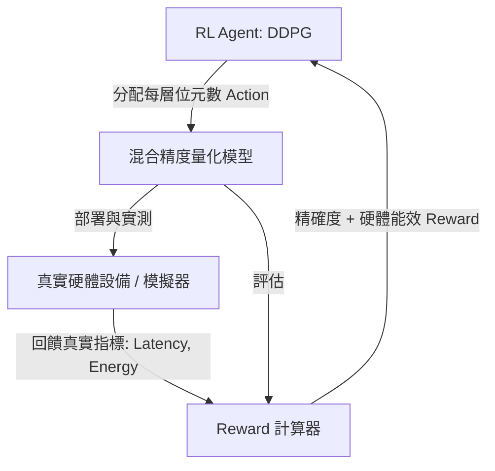

# Session Transcript: MIT 6.5940 Lecture 6 Quantization (Part II) Q&A

## Context
Deep dive into MIT 6.5940 (EfficientML.ai) Lecture 6 (Quantization Part II) text transcript and core Q&A.

---

### Round 1: 讀取 'EfficientML.ai Lecture 6 - Quantization (Part II) (MIT 6.5940, Fall 2023, Zoom recording).txt'
**User:**
讀取 'EfficientML.ai Lecture 6 - Quantization (Part II) (MIT 6.5940, Fall 2023, Zoom recording).txt'

**Gemini:**
我已經成功讀取了 **`EfficientML.ai Lecture 6 - Quantization (Part II) (MIT 6.5940, Fall 2023, Zoom recording).txt`** 的完整逐字稿。

本堂課程由麻省理工學院（MIT）的宋森教授（Song Han）講授，深入探討了深度學習模型量化（Quantization）的進階技術。以下是該堂課程的核心內容與技術重點整理：

---

### 一、 量化粒度 (Quantization Granularity)
在將模型量化（如 8-bit 或 4-bit）時，選擇多細緻的範圍來共享縮放因子（Scaling Factor）和零點（Zero Point）至關重要：
1. **張量級量化 (Per-tensor Quantization)**：
   - 整個張量（Tensor）共用同一個縮放因子。
   - **優點**：硬體最友好、儲存開銷極低。
   - **缺點**：不同通道（Channel）的數值分佈範圍差異極大，統一量化容易導致精確度顯著下降。
2. **通道級量化 (Per-channel Quantization)**：
   - 每個通道擁有自己獨立的縮放因子。
   - 在視覺模型（Vision Models）中效果極佳，能有效解決通道間分佈不均的問題。
3. **向量/組群級量化 (Per-vector / Group-wise Quantization)**：
   - 通道在大型語言模型（LLM）中可能極大（如 10,000 維），此時 Per-channel 仍不夠。因此將通道進一步切分為更小的子向量（如每 16, 32 或 64 個元素為一組），共享一個縮放因子。
   - 介紹了微軟提出的 **MX 資料格式 (Shared Micro Exponents, 如 MX4, MX9)**，在低位元（如 4-bit）LLM量化中十分流行，在精確度與硬體效率之間取得極佳平衡。

---

### 二、 動態範圍裁剪 (Dynamic Range Clipping)
由於權重（Weights）是靜態的，但激活值（Activations）會隨著輸入動態變化，因此激活值的量化範圍需要更精細的策略：
- **範圍收集方法**：
  1. **訓練中移動平均 (EMA)**：在訓練（QAT）期間，跨多個 Batch 追蹤並更新激活值的最大與最小值。
  2. **校準集法 (Calibration Set)**：使用小規模且獨立的資料集進行前向傳播，收集激活值的統計數據。
- **裁剪點優化**：
  - **KL 散度 (KL Divergence)**：TensorRT 所採用的方法。透過最小化量化前後機率分佈的 KL 散度，來尋找資訊流失最少的最佳裁剪位置。
  - **MSE (均方誤差) 裁剪**：隨裁剪幅度變大，MSE 會先降後升，存在最佳裁剪點 (Optimal point)。

---

### 三、 量化感知訓練 (Quantization-Aware Training, QAT)
當後訓練量化（PTQ, Post-Training Quantization）無法有效恢復模型精度時（特別是低於 8-bit 時），局需要使用 QAT 來進行微調（Fine-tuning）：
1. **FP32 權重備份 (Floating Point Copy)**：
   - 在訓練的過程中，背景必須維持一份完整精度的 FP32 權重。
   - **原因**：每次反向傳播的梯度更新值（例如 $gradient \times lr = 0.1$）非常小，如果直接作用在量化後的整數空間（如 2），這個更新會因為四捨五入被直接捨棄（變回 2）。因此必須將微小的變化累積在 FP32 備份中，當累積到一定程度（如 2.5 以上）時，量化後的值才會正式跳變到下一個整數（如 3）。
2. **模擬量化 (Fake / Simulated Quantization)**：
   - 前向傳播時，利用量化公式將 FP32 權重轉換為量化後的值，模擬推理時的整數誤差並計算 Loss。
   - 反向傳播時，由於量化函數（如階梯函數）在大部分區間的導數均為 0，會導致梯度無法傳播。課程介紹了**直通估計器 (Straight-Through Estimator, STE)**，假設量化節點的梯度可以直接「流過去」（導數視為 1），從而解決無法求導的問題。

---

### 四、 二值與三值量化 (Binary & Ternary Quantization)
將數值壓縮至極致的量化技術：
1. **二值量化 (Binary Neural Networks, BNN)**：
   - 權重與激活值僅佔用 1-bit（數值為 -1 或 +1）。
   - **硬體加速**：乘法與加法運算可以完全簡化為極為高效的位元運算 **XNOR（同或）** 與 **Popcount（計算 1 的個數）**，不需要 any 傳統乘法器。
2. **三值量化 (Ternary Weight Networks, TWN)**：
   - 數值包含三種狀態 {-1, 0, 1}，佔用 2-bits。
   - 透過設定閾值（通常為 $0.7 \times$ 平均絕對值）來將較小的值判定為 0（保留稀疏性）。
3. **邊際效益遞減 (Diminishing Return)**：
   - 雖然將精度從 8-bit 降至 2-bit 可以節省 4 倍的記憶體，但計算量的節省效益並非線性。
   - 由於在現代硬體中「計算」通常比「記憶體讀取」便宜得多，因此過於激進地降低至 1-bit/2-bit 雖然省了記憶體，但帶來的精度損失與實際硬體加速比並不算劃算。**4-bit 目前被公稱為工業界的「甜蜜點 (Sweet Spot)」**。

---

### 五、 混合精度量化 (Mixed Precision Quantization)
1. **概念**：神經網路中不同的層對量化的敏感度不同。不敏感的層可以使用更激進的低位元（如 4-bit），而關鍵敏感層則保留高位元（如 8-bit）。
2. **搜尋方法**：由於每層的 Bit 選擇組合呈指數級增長，通常利用強化學習（RL，如 Actor-Critic 架構）並結合硬體端實際的延遲（Latency）與能耗（Energy）反饋，自動尋找最佳的精度配置。
3. **工業界實踐**：為了避免複雜編譯器與工具鏈的實作難度，工業界通常會採取「分組統一精度」的妥協方案（例如：注意力機制層統一用一種精度，全連接層統一用另一種精度）。

---

### 課堂總結 (Summary)
宋韓教授在課堂結尾強調，**PTQ (後訓練量化)** 和 **QAT (量化感知訓練)** 是目前工業界最核心的量化手段。低於 4-bit 時必須採用 **Group Quantization**。極低位元的 BNN 雖然學術上很有趣（可利用 XNOR / Popcount），但由於邊際效益遞減與精度崩塌，實用價值較低。在追求極致硬體效能時，**混合精度量化 (Mixed Precision)** 則是能榨乾硬體潛力的關鍵技術。

---

### Round 2: 2-bit linear quantization 的範例
**User:**
2-bit linear quantization 的範例

**Gemini:**
基於您剛才讀取的課程逐字稿，課程中特別以一個具體的數值例子來解釋 **2-bit 對稱線性量化 (Symmetric Linear Quantization)** 的運作方式。以下為您詳細拆解這個範例的數學步驟與計算過程。

---

### 1. 2-bit 量化的基本設定
在 2-bit 的有號整數（Signed Integer）空間中，共有 $2^2 = 4$ 個可表示的整數狀態。
* **量化範圍**：
  $$q \in [q_{min}, q_{max}] = [-2, 1]$$
  這 4 個狀態分別是：$-2, -1, 0, 1$。
* **量化公式 (Quantization)**：
  $$Q = \text{clamp}\left(\text{round}\left(\frac{W}{S}\right), q_{min}, q_{max}\right)$$
* **反量化/重建公式 (De-quantization)**：
  $$\hat{W} = Q \times S$$
  其中 $W$ 是原始 FP32 權重，$\hat{W}$ 是重建後的權重，$S$ 是縮放因子（Scaling Factor），因為是對稱量化，零點 $Z = 0$。

---

### 2. 課堂範例：Per-tensor（整張量量化）vs. Per-channel（每通道量化）

假設我們有一個矩陣，其中包含了一個權重值為 **$-1.03$** 的元素。

#### 方案 A：Per-tensor Quantization (整張量量化)
在此方案中，整個矩陣共享一個縮放因子 $S$.

1. **尋找最大絕對值 ($R_{max}$)**：
   課堂中找出整個矩陣的最大絕對值為 **$2.12$**。
2. **計算縮放因子 $S$**：
   $$S = \frac{R_{max}}{q_{max}} = \frac{2.12}{1} = 2.12$$
3. **對權重值 $-1.03$ 進行量化**：
   * 計算縮放後的浮點數：
     $$\frac{W}{S} = \frac{-1.03}{2.12} \approx -0.4858$$
   * 四捨五入至最接近的整數：
     $$Q = \text{round}(-0.4858) = 0$$
4. **重建權重值 $\hat{W}$**：
   $$\hat{W} = Q \times S = 0 \times 2.12 = 0$$
   * **結果**：原本的 $-1.03$ 因為縮放後絕對值小於 $0.5$，被四捨五入歸零（**資訊完全流失**）。

---

#### 方案 B：Per-channel Quantization (每通道獨立量化)
在此方案中，矩陣的每一列（Row/Channel）有自己專屬的縮放因子 $S_{channel}$。假設包含 $-1.03$ 的那一列：

1. **尋找該通道的最大絕對值 ($R_{max, channel}$)**：
   課堂中找出該通道的最大絕對值為 **$1.92$**。
2. **計算該通道的縮放因子 $S_{channel}$**：
   $$S_{channel} = \frac{1.92}{1} = 1.92$$
3. **對同一權重值 $-1.03$ 進行量化**：
   * 計算縮放後的浮點數：
     $$\frac{W}{S_{channel}} = \frac{-1.03}{1.92} \approx -0.5365$$
   * 四捨五入至最接近的整數：
     $$Q = \text{round}(-0.5365) = -1$$
     *(因為絕對值大於 0.5，成功保留了負號狀態，被判定為 $-1$)*
4. **重建權重值 $\hat{W}$**：
   $$\hat{W} = Q \times S_{channel} = -1 \times 1.92 = -1.92$$
   * **誤差比較**：
     * **Per-tensor 重建誤差**：$|-1.03 - 0| = 1.03$
     * **Per-channel 重建誤差**：$|-1.03 - (-1.92)| = 0.89$
   * **結果**：改用 Per-channel 量化後，重建誤差從 $1.03$ 降到了 $0.89$。整個矩陣的平均重建誤差也從 $2.10$ 降低到了 $2.08$。

---

### 總結課堂啟示
這個 2-bit 範例展示了：
* **為什麼低位元量化極具挑戰性**：邊為 2-bit 只有 4 個狀態，四捨五入的顆粒度極粗，非常容易把有用的數值（如 $-1.03$）直接「抹平」成 $0$。
* **Per-channel 的優勢**：藉由為每個通道量身打造專屬的尺規（$S_{channel}$），能更精準地捕捉數值變化，避免較小分佈通道的數值被大通道的極值（Outliers）淹沒。

---

### Round 3: Per-vector Scaled Quantization 是
**User:**
Per-vector Scaled Quantization 是

**Gemini:**
**Per-vector Scaled Quantization**（每向量縮放量化，在工業界也常被稱為 **Group-wise Quantization** 或 **Sub-channel Quantization**）是近年來為了解決大型語言模型（LLMs）在極低位元（如 4-bit 或更低）量化時，精度容易崩塌而開發的**細粒度（Fine-grained）量化技術**。

以下為您詳細說明其定義、運作機制、核心優勢以及課堂中給出的經典範例：

---

### 1. 動機與背景
在大型語言模型中，神經網路的通道維度（Channel Dimension）非常巨大（通常為 4096、8192 甚至高達 10,000 以上）。
* 如果使用 **Per-tensor**，精度損失太大。
* If 使用 **Per-channel**，雖然比 Per-tensor 好，但在高達上萬維度的通道中，只要出現一個**離群值（Outlier）**，整個通道的縮放因子就會被拉得極大，導致通道內其他正常數值的精度被嚴重壓縮。
* **解決方案**：將一個長通道切成許多小段（即 **Sub-vector / Group**），每一小段獨立擁有自己的縮放因子。

---

### 2. 運作機制 (Core Mechanism)
1. **子向量切分 (Vector/Group Split)**：
   將一個通道內的權重進一步切分成多個長度固定的子向量。常見的向量長度（Group Size）為 **16、32、64 或 128**。
2. **多層級縮放架構 (Multi-level Scaling Scheme)**：
   為了同時享有細粒度的高精度，又不想讓縮放因子佔用太多儲存空間，通常會採用**分層縮放**：
   * **第一層（細粒度，Level 1）**：每 16 或 32 個元素共享一個**低位元**（例如 4-bit）的局部縮放因子。
   - **第二層（粗粒度，Level 0）**：整個通道（數千個元素）共享一個**高精度**（例如 FP16 或 FP32）的全局縮放因子。
   - **最終縮放效果**：每一個元素的實際縮放值等於這兩層縮放因子的乘積。

---

### 3. 課堂記憶體開銷計算（經典面試/考試題）
課堂逐字稿中提供了一個非常直觀的均攤開銷（Amortized Overhead）計算範例：

* **設定條件**：
  * 權重本身採用 **4-bit** 量化。
  * 每 **16** 個元素（Group Size = 16）共享一個 **4-bit** 的局部縮放因子。
* **等效位元寬度 (Effective Bit-width) 計算**：
  $$\text{等效位元數} = \text{元素基本位元數} + \frac{\text{縮放因子位元數}}{\text{群組大小}}$$
  $$\text{等效位元數} = 4 \text{ bits} + \frac{4 \text{ bits}}{16} = 4 + 0.25 = 4.25 \text{ bits}$$
* **結論**：我們僅僅多付出了 **0.25-bit** 的極小空間代價，就讓量化的解析度粒度提升了數百倍，這在 LLM 壓縮中是非常劃算的權衡。

---

### 4. 進階應用：微軟 MX 資料格式 (Shared Micro Exponents)
這是 Per-vector 概念在硬體層面的最新演進。微軟與業界合作推廣的 **MX4, MX9** 等格式，核心邏輯就是：
* 讓相鄰的 2 個元素共用 1 個指數位元（Exponent bit）。
* 每 16 個元素再共享一個 8-bit 的高精度指數（Scale Factor）來擴展動態範圍。
* 這在最新的 AI 晶片編譯器中得到了廣泛支持，是降低 LLM 運算開銷的關鍵技術。

---

### Round 4: Dynamic range for activation quantization
**User:**
Dynamic range for activation quantization

**Gemini:**
在模型量化中，**激活值（Activations）的動態範圍確定**是一大關鍵挑戰。

與權重（Weights，靜態且固定）不同，**激活值是動態的**——不同的輸入（例如不同的圖片或不同的 Prompt）會使模型各層產生截然不同的激活值範圍。如果量化範圍設得太寬，會浪費大量量化區間在極少出現的值上；若設得太窄，大數值則會被截斷（Clipping）產生嚴重失真。

逐字稿中詳細介紹了兩種在不同階段收集與優化激活值動態範圍的核心方法：

---

### 方法一：在訓練期間追蹤 (During Training - QAT)
當我們進行**量化感知訓練 (Quantization-Aware Training, QAT)** 時，模型仍在訓練，激活值的範圍會隨著權重更新而不斷飄移。此時會使用**指數移動平均 (Exponential Moving Average, EMA)** 來平滑追蹤動態範圍：

1. **計算當前 Batch 的極值**：
   在每個訓練步驟中，計算當前 Batch 激活值的最大值 $R_{\text{max}}^{(t)}$ 與最小值 $R_{\text{min}}^{(t)}$。
2. **使用 EMA 公式更新全局範圍**：
   $$R_{\text{global}}^{(t)} = \alpha \cdot R_{\text{global}}^{(t-1)} + (1 - \alpha) \cdot R_{\text{batch}}^{(t)}$$
   * $\alpha$ 為平滑係數（通常設為 $0.99$ 或 $0.999$）。
   * 這種方法能確保動態範圍在成千上萬步的訓練中**平滑過渡**，避免因為單一 Batch 的極端輸入導致量化範圍劇烈震盪。

---

### 方法二：在後訓練階段校準 (Post-Training Calibration - PTQ)
當模型已經訓練完成，我們不想重新訓練模型，而是直接進行**後訓練量化 (Post-Training Quantization, PTQ)** 時，我們會使用一個小型且具代表性的**校準資料集 (Calibration Dataset)**（例如從訓練集抽取的 100~1000 個樣本，與測試集獨立分開）：

通過前向傳播這些校準樣本，我們可以收集激活值的統計分佈，並採用以下策略來決定最優量化範圍：

#### 1. 簡單啟發式統計 (Simple Heuristics)
* **Max of Max (最大值中的最大值)**：在所有校準樣本中，直接取出現過的絕對值最大值。缺點是極易受到少數離群值（Outliers）干擾，導致量化解析度下降。
* **Average of Max (最大值的平均)**：計算所有校準樣本最大值的平均數，能過濾極端異常值。

#### 2. 動態範圍裁剪與優化 (Dynamic Range Clipping)
為了消除離群值的干擾，我們必須主動「裁剪（Clip）」掉少數極大的激活值，在「裁剪帶來的截斷誤差」與「保留更多量化解析度」之間取得最佳平衡：

* **KL 散度最小化 (KL Divergence / Entropy Method - NVIDIA TensorRT 採用)**：
  * **原理**：將裁剪前的原始 FP32 激活值分佈視為機率分佈 $P$，量化重建後的激活值分佈視為 $Q$。
  * **優化目標**：透過滑動裁剪邊界，計算量化前後的 **Kullback-Leibler 散度 (KL Divergence)**：
    $$D_{\text{KL}}(P \parallel Q) = \sum_{i} P(i) \log \frac{P(i)}{Q(i)}$$
  * **結果**：尋找能讓 $D_{\text{KL}}$ 達到最小值的裁剪臨界點（Clipping Threshold）。這是目前工業界（如 TensorRT 工具箱）最廣泛採用的方案。

* **MSE (均方誤差) 裁剪**：
  * **原理**：直接計算原始激活值 $A$ 與裁剪量化後重建的 $\hat{A}$ 之間的均方誤差 $\text{MSE}(A, \hat{A})$。
  * **特性**：隨著裁剪範圍縮小，MSE 會先下降（因為除去了離群值，整體量化精度提升），接著會再次上升（因為裁剪太過激進，把大量有用的大數值都截斷了）。
  * **結果**：在這個 U型曲線中，可以解析地求解出最佳的裁剪臨界點。在 ResNet 和 BERT 等模型中，即使將激活值進攻地量化至 4-bit，透過 MSE 裁剪也能保持不錯的精確度。

---

### Round 5: KL divergence 是什麼
**User:**
KL divergence 是什麼

**Gemini:**
**KL 散度（Kullback-Leibler Divergence，簡稱相對熵 Relative Entropy）**是資訊理論（Information Theory）與機器學習中，用來**衡量兩個機率分佈之間差異**的指標。

簡單來說，它回答了這個問題：**「如果我用一個不完美的分佈 $Q$ 去近似（代替）真實的分佈 $P$，我會損失多少資訊？」**

以下為您從直覺、數學公式、重要性質，以及它在模型量化中的實際應用來詳細拆解：

---

### 1. 直覺理解
想像你在玩一個「猜單字」的遊戲。
* **真實分佈 $P$**：英語中每個字母出現的真實機率（例如 'e' 最常出現，'z' 最少出現）。
* **近似分佈 $Q$**：你以為的字母出現機率（例如你以為所有字母出現的機率都是平等的 $1/26$）。

如果你根據錯誤的認知 $Q$ 來設計你的猜字策略，你每次猜字需要花費的「多餘力氣」，就是 **KL 散度**。散度值越小，代表你的認知 $Q$ 越接近真實狀況 $P$。

---

### 2. 數學公式
對於離散型隨機變數，真實分佈為 $P(x)$，近似分佈為 $Q(x)$，它們之間的 KL 散度公式為：

$$D_{\text{KL}}(P \parallel Q) = \sum_{x} P(x) \log \frac{P(x)}{Q(x)}$$

這個公式可以被拆解成兩個熟悉的概念：

$$D_{\text{KL}}(P \parallel Q) = \sum_{x} P(x) \log P(x) - \sum_{x} P(x) \log Q(x)$$
$$D_{\text{KL}}(P \parallel Q) = H(P, Q) - H(P)$$

* **$H(P, Q)$ 交叉熵（Cross-Entropy）**：使用分佈 $Q$ 來表達分佈 $P$ 時，所需的 average 資訊量。
* **$H(P)$ 香農熵（Entropy）**：真實分佈 $P$ 內部本身擁有的資訊量（這是最優編碼，無法再降低）。
* **結論**：**KL 散度 = 交叉熵 $-$ 真實熵**。它代表了因為使用不完美的分佈 $Q$，而必須額外付出的「資訊代價/編碼成本」。

---

### 3. KL 散度的重要性質

1. **非負性（Non-negativity）**：
   $$D_{\text{KL}}(P \parallel Q) \ge 0$$
   根據吉布斯不等式（Gibbs' inequality），KL 散度永遠大於或等於 0。**只有當兩個分佈完全相同（即對所有 $x$，$P(x) = Q(x)$）時，KL 散度才等於 0。**
2. **非對稱性（Asymmetry）**：
   $$D_{\text{KL}}(P \parallel Q) \neq D_{\text{KL}}(Q \parallel P)$$
   正因為它不具備對稱性，且不滿足三角不等式，因此在數學上它**不是**一個真實的「距離（Distance）」，這也是為什麼我們稱它為「散度（Divergence）」。

---

### 4. 模型量化中的 KL 散度應用 (以 TensorRT 為例)
在將模型的 FP32 激活值量化為 INT8 時，我們會面臨以下抉擇：
* **不裁剪**：為了保留極少數的極端大值（Outliers），我們必須把量化範圍設得非常寬，導致中間高頻出現的數值缺乏解析度，產生極大雜訊。
* **裁剪過頭**：把大數值都截斷，雖然中間頻繁出現的數值精度很高，但大數值的資訊完全丟失。

此時，我們把：
* **$P$ 設為**：高精度 FP32 的激活值分佈（真實分佈）。
* **$Q$ 設為**：不同裁剪閾值下，量化再反量化後的離散分佈（近似分佈）。

**NVIDIA TensorRT 的解決方案**：
透過移動裁剪邊界，不斷計算量化前後兩個分佈的 $D_{\text{KL}}(P \parallel Q)$。**當 KL 散度達到最小值時，代表該裁剪閾值能讓低位元的量化模型最大程度地保留原始模型所包含的資訊**，從而在壓縮模型大小的同時，精確度幾乎不下降。

---

### Round 6: Quantization-Aware Training 是
**User:**
Quantization-Aware Training 是

**Gemini:**
**量化感知訓練（Quantization-Aware Training, 簡稱 QAT）**是深度學習模型量化中的一種進階技術。

它的核心目的，是為了解決**後訓練量化（Post-Training Quantization, PTQ）**帶來的精度下降問題。特別是當模型需要被壓縮至更低的位元（例如 **4-bit 或 2-bit**）時，直接進行量化會導致模型精確度劇烈崩塌。**QAT 透過在訓練（或微調）過程中模擬量化誤差，讓模型權重學會自我調整與適應，從而在部署時幾乎能完全恢復原有的浮點數精度。**

以下為您拆解 QAT 的核心機制、運作流程以及它的關鍵公式：

---

### 一、 QAT 的三大核心機制

#### 1. 偽量化 / 模擬量化 (Fake / Simulated Quantization)
在前向傳播（Forward Pass）中，QAT 會在權重和激活值的路徑上插入 **偽量化節點（Fake Quantization Node）**。
* **為什麼叫「偽」量化？**
  因為在訓練期間，所有的數值在記憶體中**依然是以高精度的浮點數（FP32 或 FP16）格式儲存與運算**，但它們的數值會被強行限制在離散的量化網格上。
  * 例如：一個權重原本是 $1.234$，經過偽量化後會變成 $1.0$；雖然它變成了整數值，但它仍以 `1.0 (FP32)` 的格式參與運算。
  * 這能讓模型在前向傳播中「提前體驗」推理時會遇到的整數捨入誤差（Round-off Error）與裁剪誤差（Clipping Error），並將這些誤差反應在最終的 Loss 中。

#### 2. FP32 權重備份 (FP32 Master Weights Copy)
在後台，QAT 必須為每一層維持一份**完整精度（FP32）的權重備份**。
* **為什麼這是必須的？**
  在訓練中，每一次反向傳播計算出來的梯度更新值（例如 $\text{Gradient} \times \text{Learning Rate} = 0.1$）通常非常微小。
  * **如果沒有 FP32 備份**：若直接在量化整數空間更新（例如目前權重為 $2.0$，更新後為 $2.1$），在下一次前向傳播四捨五入時， $2.1$ 會再次變回 $2.0$。這意味著**微小的梯度更新會被四捨五入機制完全抹殺**，模型將永遠無法收斂。
  * **有了 FP32 備份**：微小的更新（$0.1$）會先累積在後台的 FP32 權重上。經過多次迭代後（例如 5 次更新），後台的 FP32 權重累積到了 $2.5$。此時在進行前向傳播的四捨五入時，量化值就會成功跳變為 $3.0$。這使模型具備了微調與收斂的能力。

#### 3. 直通估計器 (Straight-Through Estimator, STE)
這是解決反向傳播中「梯度消失」的數學關鍵。
* **數學困境**：
  量化函數（如四捨五入 $\text{round}(x)$）本質上是一個階梯函數（Step Function）。階梯函數的特點是：在絕大多數平坦區間，它的導數（梯度）為 **$0$**；在跳變點，它的導數為**無窮大**。
  如果直接按照標準微積分求導，反向傳播的梯度會直接歸零（Gradient Vanishing），後台的 FP32 權重根本無法得到更新。
* **STE 的解決方案**：
  在反向傳播時，**直接假裝偽量化節點的導數是 1**（即 $f'(x) = 1$）。
  $$g_{W} = \frac{\partial \text{Loss}}{\partial W_{\text{quantized}}} \times 1$$
  梯度就像無阻礙一樣，直接穿過量化節點，回傳並更新後台的 FP32 備份權重。

---

### 二、 QAT 的標準工作流程 (Workflow)

在工業界實踐中，人們通常不會從頭開始（Scratch）進行 QAT，因為那樣訓練非常緩慢且不穩定。標準流程如下：

1. **Step 1: 全精度訓練 (Float Training)**
   首先使用常規的 FP32 或 FP16，將模型訓練至完全收斂，獲得一個高精度的浮點數模型。
2. **Step 2: 插入偽量化節點 (Insert Fake-Quant Nodes)**
   在收斂的模型中，於各層的權重和激活值輸入端插入偽量化節點，並初始化量化參數（如 Scaling Factor $S$ 和 Zero Point $Z$）。
3. **Step 3: 量化微調 (QAT Fine-tuning)**
   使用較小的學習率（Learning Rate），帶著偽量化節點進行少數幾個 Epoch 的微調。此時，權重會在外在量化誤差的逼迫下，主動微調自身數值以避開誤差敏感區，從而找回流失的精確度。
4. **Step 4: 轉換與部署 (Export / Deploy)**
   微調完成後，將偽量化節點拿掉，將後台的 FP32 權重正式凍結並轉換為真正的低位元整數（如 INT8 或 INT4），並生成最終的量化模型，部署於 TensorRT. ONNX Runtime 或 TinyEngine 等硬體推理引擎上。

---

### 三、 QAT 與 PTQ 的對比

| 特性 | 後訓練量化 (PTQ) | 量化感知訓練 (QAT) |
| :--- | :--- | :--- |
| **計算與時間成本** | 極低（數分鐘內完成） | 較高（需要 GPU 重新訓練/微調） |
| **資料需求** | 僅需少量校準數據（100~1000 個樣本）| 需要完整的訓練數據集 |
| **實現難度** | 簡單，工具鏈一鍵完成 | 較複雜，需要處理梯度傳播與算子支持 |
| **低位元支持度 (4-bit/2-bit)** | 精度損失通常較大 | **能有效恢復精度，是超低位元的必備技術** |

---

### Round 7: straight-through estimator
**User:**
straight-through estimator

**Gemini:**
**直通估計器（Straight-Through Estimator，簡稱 STE）**是深度學習中處理**不可導函數（Non-differentiable Functions）**梯度回傳時，最經典且最廣泛被使用的「數學外掛」技術。

它是**量化感知訓練 (QAT)** 以及**二值神經網路 (BNN)** 能夠成功使用梯度下降法進行訓練的奠基基石。

以下為您詳細解析 STE 產生的背景、核心原理、數學公式以及其局限性：

---

### 一、 為什麼需要 STE？（面臨的數學困境）

神經網路訓練的核心是**反向傳播（Backpropagation）**與**鏈式法則（Chain Rule）**，這要求網路中的所有算子都必須是**可導（Differentiable）**的。

然而，量化操作（如四捨五入 $\text{round}(x)$、符號函數 $\text{sign}(x)$、或階梯函數）本質上是**離散且不連續**的：
* **前向傳播（Forward Pass）**：
  $$q_w = \text{round}(w)$$
* **求導困境**：
  如果對 $\text{round}(w)$ 求導，我們會發現它的導數 $\frac{\partial q_w}{\partial w}$：
  * 在平坦的階梯區間，**導數為 $0$**。
  * 在跳變的邊界點，**函數不連續，導數不存在（或趨近於無窮大）**。

這會導致在反向傳播計算梯度時，鏈式法則直接卡死：
$$\frac{\partial \text{Loss}}{\partial w} = \frac{\partial \text{Loss}}{\partial q_w} \times \frac{\partial q_w}{\partial w} = \frac{\partial \text{Loss}}{\partial q_w} \times 0 = 0$$

因為乘上了 $\frac{\partial q_w}{\partial w} = 0$，**傳遞回後台 FP32 權重 $w$ 的梯度在幾乎所有地方都會直接歸零（梯度消失）**，這意味著參數將永遠無法得到更新。

---

### 二、 STE 的解決方案：硬性直通

**直通估計器（STE）**的思想非常直截了當且霸道：
> **「既然在數學上真正的導數是 0，那我就在反向傳播時，人為硬性規定這個量化算子的導數為 1！」**

也就是說，反向傳播時，我們**假裝**量化節點是一個恆等映射（Identity Mapping, $f(x)=x$），其導數為 $1$。

#### 1. 數學表達式：
* **前向傳播 (Forward Pass)**：使用離散量化函數
  $$q_w = \text{round}(w)$$
* **反向傳播 (Backward Pass)**：使用 STE 近似求導
  $$\frac{\partial q_w}{\partial w} \approx 1$$
* **梯度傳導結果**：
  $$\frac{\partial \text{Loss}}{\partial w} \approx \frac{\partial \text{Loss}}{\partial q_w}$$
  梯度直接「穿透」了不可導的量化節點，毫無阻礙地流回了全精度權重 $w$，使其能正常被優化器（如 SGD, Adam）更新。這就是 **Straight-Through（直通）** 的由來。

---

### 三、 STE 的常見變體 (Variants)

在實際工程應用中，最常用的 STE 變體有以下兩種：

#### 1. 恆等直通 (Identity STE)
不論輸入值大小，一律假設導數為 1：
$$\frac{\partial q_w}{\partial w} \approx 1$$
* **特點**：極其簡單。但缺點是當權重 $w$ 已經超出有效量化範圍（例如大於最大值 $127$ 或小於最小值 $-128$）時，梯度依然會讓它繼續往外膨脹，導致數值溢出。

#### 2. 飽和/截斷直通 (Clipped / Saturated STE)
考量到數值裁剪（Clipping）的物理邊界，只有在有效量化範圍內的數值，導數才設為 1；超出邊界的值，導數設為 0：
$$\frac{\partial q_w}{\partial w} = \begin{cases} 1 & \text{if } w \in [t_{min}, t_{max}] \\ 0 & \text{otherwise} \end{cases}$$
* **特點**：這在 PyTorch 的 QAT 工具包與許多二值網路中是標準配置，能有效防止背景 FP32 權重無限增長，使訓練更加穩定。

---

### 四、 STE 的優缺點分析

* **優點 (Pros)**：
  1. **簡單高效**：在代碼中實作極其簡單（在 PyTorch 中只需繼承 `torch.autograd.Function` 並在 `backward` 中直接返回梯度即可）。
  2. **運算開銷極小**：不需要複雜的連續函數近似（如 Sigmoid），對訓練速度幾乎沒有負面影響。
* **缺點 (Cons) / 局限性**：
  * **不一致性（Mismatch）**：前向傳播用的是離散階梯函數，反向傳播卻假裝它是連續線性函數。這種「前向後向不一致」在數學上是不嚴謹的（屬於一種粗暴的梯度近似）。
  * 這種不一致性有時會導致**梯度方向偏差**，特別是在極低位元（如 1-bit 二值量化）的訓練初期，模型可能容易出現訓練不穩定或收斂困難的情況。

---

### Round 8: binary/ternary quantization
**User:**
binary/ternary quantization

**Gemini:**
**二值量化（Binary Quantization）**與**三值量化（Ternary Quantization）**是模型壓縮領域中將數值精度推向極致（極低位元量化，Extremely Low-bit Quantization）的代表性技術。

傳統量化（如 INT8）旨在用較低精度的整數代替浮點數，而二值與三值量化則旨在**完全消滅傳統的乘法器**，將神經網路的運算簡化為極為廉價的**位元級硬體操作（Bitwise Operations）**。

以下為您詳細拆解這兩種量化技術的數學原理、硬體加速機制與其折衷關係：

---

### 一、 二值量化 (Binary Quantization / 1-bit)

二值量化將模型參數或激活值限制在僅有兩個狀態的空間中（1-bit），通常為 **$\{-1, +1\}$**。

#### 1. 量化方式
* **確定性二值化 (Deterministic Binarization)**：直接根據數值的正負號進行劃分（最常用）。
  $$q = \text{sign}(r) = \begin{cases} +1 & \text{if } r \ge 0 \\ -1 & \text{if } r < 0 \end{cases}$$
* **隨機性二值化 (Stochastic Binarization)**：以特定機率將數值隨機四捨五入為 $+1$ 或 $-1$，機率基於 Hard Sigmoid 等線性插值函數。
* **縮放因子（Scaling Factor $\alpha$）**：
  如果直接強行將數值轉為 $\pm 1$，會產生巨大的量化誤差。BWN (Binary-Weight-Networks) 提出引入一個通道級的浮點數縮放因子 $\alpha$，使得 $W \approx \alpha \times Q$：
  $$\alpha = \frac{1}{n} \sum_{i=1}^{n} |W_i|$$
  以**原始權重的絕對值平均數**作為縮放因子 $\alpha$，此時重建後的數值為 $\{-\alpha, +\alpha\}$，這對於穩定 BNN 的精確度至關重要。

#### 2. 硬體極致加速：XNOR 與 Popcount
當**權重 $W$** 與**激活值 $X$** 都被二值化為 $\{-1, +1\}$ 時，原本高成本的浮點數矩陣乘法，在硬體底層可以被映射為極快的**位元運算**：
* 將 $-1$ 映射為二進位制的 `0`，將 $+1$ 映射為二進位制的 `1`。
* **乘法**：兩個二值數相乘，等同於邏輯門中的 **XNOR（同或）** 運算。
  * $(+1) \times (+1) = +1 \rightarrow 1 \text{ XNOR } 1 = 1$
  * $(-1) \times (-1) = +1 \rightarrow 0 \text{ XNOR } 0 = 1$
  * $(+1) \times (-1) = -1 \rightarrow 1 \text{ XNOR } 0 = 0$
* **累加**：向量的乘積累加（Dot Product），可以簡化為**計算 XNOR 結果中 `1` 的個數（Popcount）**，再加上移位與基礎加減法：
  $$\text{Dot Product} = -N + 2 \times \text{Popcount}(\text{XNOR}(W, X))$$
  *(定中 $N$ 是向量長度)*
* **硬體效益**：完全不需要浮點數乘法器（Multipliers），僅需極小的 XNOR 邏輯閘與計數器，晶片面積與功耗大幅下降。

---

### 二、 三值量化 (Ternary Quantization / 1.5-bit ~ 2-bit)

雖然二值量化極快，但它強行消滅了「**$0$**」這個關鍵數值。在剪枝（Pruning）技術中，我們知道網路中大量的權重趨近於 0 且是不重要的。三值量化（Ternary Weight Networks, TWN）引入了 0，使權重取值範圍為 **$\{-1, 0, +1\}$**。

#### 1. 閾值化量化 (Thresholding)
三值量化通常透過設定一個閾值 $\Delta$ 來決定數值歸入哪一個狀態：
$$q = \begin{cases} +1 & \text{if } W > \Delta \\ 0 & \text{if } -\Delta \le W \le \Delta \\ -1 & \text{if } W < -\Delta \end{cases}$$

* **啟發式閾值 (Heuristic Threshold)**：
  宋韓教授在課堂中提到一個極為經典的啟發式計算公式（假設權重符合常態分佈）：
  $$\Delta = 0.7 \times \mathbb{E}(|W|)$$
  也就是將**權重絕對值的平均值乘以 $0.7$** 作為劃分閾值。
* **可學習三值化 (Learnable Ternary Quantization, 如 TTQ)**：
  更進階的演算法中，正值縮放因子 $W_p$、負值縮放因子 $W_n$ 以及閾值 $\Delta$ 都可以作為可學習的參數，隨模型訓練一同優化，這能讓三值模型的精確度非常接近 FP32 原始模型。

#### 2. 優勢與折衷
* **優勢**：保留了權重的稀疏性（Sparsity），為網路保留了「不進行某些連結」的權利，這使三值量化的精確度顯著高於二值量化。
* **儲存與運算開銷**：表示三個狀態需要 $1.58$ bit，實際儲存需要佔用 2-bits。在運算上，雖然它不能像 BNN 那樣純粹依靠 XNOR，但由於包含了大量 $0$ 值，在硬體上可以透過跳過（Skip）零值乘加來實現極高的能效比。

---

### 三、 邊際效益遞減 (Diminishing Returns)

低於 4-bit 後的量化，會面臨明顯的邊際效益遞減：

1. **記憶體與計算的非線性關係**：
   * **記憶體帶寬節省**：是位元寬度的**線性關係**（從 8-bit 到 2-bit 記憶體省了 4 倍）。
   * **計算單元節省**：傳統乘法器的面積與能耗與位元寬度呈**二次方/平方關係（Quadratic）**。因此從 16-bit 降到 8-bit、8-bit 降到 4-bit 時，計算單元省下的能效比極其巨大。
2. **極低位元的困境**：
   * 當降到 4-bit 以下（如 2-bit , 1-bit），計算本身在硬體中已經便宜到不是主要樽頸了（記憶體讀取成為唯一瓶頸）。
   * 同時，2-bit/1-bit 會造成嚴重的精確度崩塌，為了挽救精確度，我們必須付出極為複雜的編譯器硬體架構開發、甚至耗費數倍時間進行 QAT 訓練微調。
   * **結論**：這也是為什麼**4-bit 目前被公稱為晶片與演算法業界的「黃金甜蜜點（Golden Sweet Spot）」**，而二值與三值量化目前多見於極限超低功耗的邊緣設備（Edge/IoT Devices）或特定的學術探索中。

---

### Round 9: popcount 是什麼
**User:**
popcount 是什麼

**Gemini:**
**Popcount（Population Count，群體計數）**，在資訊理論與計算機科學中也被稱為**漢明重量（Hamming Weight）**。

它的定義非常簡單直觀：**計算一個二進位制（Binary）數字或暫存器中，位元值為 `1` 的總個數。**

雖然概念極其簡單，但它是現代電腦硬體底層以及**二值神經網路（BNN）**實現極致加速的隱形功臣。

---

### 一、 簡單的數值範例

假設我們有一個 8 位元（8-bit）的二進位制數：
* **數字 A**：`01001011`
  * 其中位元為 `1` 的位置有 4 個（第 0, 1, 3, 6 位）。
  * 因此，$\text{Popcount}(A) = 4$。
* **數字 B**：`11110000`
  * 其中位元為 `1` 的位置有 4 個。
  * 因此，$\text{Popcount}(B) = 4$。

---

### 二、 現代硬體指令集的支持

在早期，若想在程式中計算一個數字有多少個 `1`，必須寫一個循環（Loop），不斷進行位元移位（Bit Shift）與遮罩（AND Mask）運算，或者使用查表法（Lookup Table），這需要耗費數個到數十個 CPU 時鐘週期。

由於這個操作在密碼學、搜尋引擎、編碼理論以及目前的 **AI 晶片運算**中極為高頻，現代主流的處理器架構都在**硬體晶片電路層面**直接提供了專屬的加速指令：
* **x86 架構 (Intel / AMD)**：提供了 `POPCNT` 硬體指令（於 SSE4.2 指令集引入）。
* **ARM 架構**：提供了 `CNT` 向量指令（在 NEON 向量指令集中）。
* **NVIDIA GPU (CUDA)**：提供了內建的 `__popc()` 函數。

**優勢**：藉由專屬的硬體電路支持，現在 CPU/GPU **可以在僅僅 1 個時鐘週期（1 Cycle）內**，瞬間計算出 64-bit 甚至 256-bit 暫存器中所有 `1` 的個數，速度提升了數十倍。

---

### 三、 在二值神經網路 (BNN) 中的致命關鍵作用

在我們前一輪討論的**二值神經網路（Binary Neural Networks）**中，權重 $W$ 與激活值 $X$ 的數值被限制在 $\{-1, +1\}$。
為了讓電腦儲存，我們將其編碼為二進位制：
* **$+1$ 儲存為二進位制 `1`**
* **$-1$ 儲存為二進位制 `0`**

當我們要計算兩個二值向量的點對點相乘並累加（Dot Product）時，傳統運算需要極為昂貴的浮點數乘法器與加法器樹，而在 BNN 中，利用 **XNOR** 與 **Popcount** 即可實現極致昇華：

#### 1. XNOR 代替「乘法」
兩數相乘，對應到位元操作就是 **XNOR（同或門：相同為 1，不同為 0）**。
* $(+1) \times (+1) = +1 \rightarrow 1 \text{ XNOR } 1 = 1$
* $(-1) \times (-1) = +1 \rightarrow 0 \text{ XNOR } 0 = 1$
* $(+1) \times (-1) = -1 \rightarrow 1 \text{ XNOR } 0 = 0$

#### 2. Popcount 代替「累加」
假設我們要計算兩個長度為 $N$ 的二值向量的乘積和。
我們將這兩個向量進行位元 XNOR 運算，得到一個長度為 $N$ 的二進位制結果字串。
* 設該結果字串中，`1` 的個數（即代表 $+1$ 的個數）為 **$C$**，這可以透過 **Popcount** 一步算出：
  $$C = \text{Popcount}(\text{XNOR}(W, X))$$
* 那麼，剩下的 `0` 的個數（即代表 $-1$ 的個數）自然就是 **$N - C$**。
* 最終的矩陣乘加結果（Dot Product）即可透過簡單的代數公式直接求出：
  $$\text{Dot Product} = C \times (+1) + (N - C) \times (-1)$$
  $$\text{Dot Product} = C - N + C$$
  $$\text{Dot Product} = 2C - N$$
  $$\text{Dot Product} = 2 \times \text{Popcount}(\text{XNOR}(W, X)) - N$$

#### 3. 效益總結
* **傳統矩陣乘加**：需要 $N$ 次浮點數乘法 + $N-1$ 次浮點數加法。
* **BNN 的矩陣乘加**：**僅需 1 次位元 XNOR + 1 次 Popcount 指令 + 1 次移位與減法**。

這使得 BNN 在超低功耗的微控制器（MCU）、FPGA 或專用邊緣 AI 晶片上，能夠跑出傳統模型難以企及的驚人能效比。

---

### Round 10: Ternary weight networks
**User:**
Ternary weight networks

**Gemini:**
**三值權重網路（Ternary Weight Networks，簡稱 TWN）**是模型極低位元量化領域中非常經典的一種方法。它介於**二值量化（BNN，1-bit）**與**低位元線性量化（如 4-bit / 8-bit）**之間，通常在硬體中佔用 **2-bits** 的儲存空間。

TWN 的核心思想是將神經網路的權重限制在三個狀態：**$\{-1, 0, +1\}$**，並配合一個浮點數縮放因子 $\alpha$。它的提出，是為了解決二值網路（BNN）精度損失過大的致命痛點。

以下為您詳細拆解 TWN 的數學原理、最優參數求解方法以及硬體計算優勢：

---

### 一、 為什麼需要 TWN？（解決 BNN 的痛點）

二值化網路（BNN）的權重只有 $\{-1, +1\}$。但在實際的神經網路中，有大量權重是接近於 $0$ 且並不重要的（這也是剪枝技術能夠成功的原因）。
* **BNN 的問題**：強行把這些接近 $0$ 的權重逼成 $+1$ 或 $-1$，會產生巨大的**量化雜訊（Quantization Noise）**，導致網路精度嚴重受損。
* **TWN 的改進**：引入了 **`0`** 狀態。**保留了「不進行某些連結」的權利（即稀疏性，Sparsity）**。實驗表明，僅僅是引入了 `0`，三值權重網路的精確度就遠遠超越了二值網路，甚至能逼近全精度浮點模型。

---

### 二、 TWN 的數學公式

給定一個全精度浮點權重 $W$，TWN 旨在用三值權重 $\hat{W}$ 與一個正值浮點縮放因子 $\alpha$ 來對其進行近似，即 $W \approx \alpha \times \hat{W}$：

$$\hat{W}_i = \begin{cases} +1 & \text{if } W_i > \Delta \\ 0 & \text{if } -\Delta \le W_i \le \Delta \\ -1 & \text{if } W_i < -\Delta \end{cases}$$

這裡有兩個核心的未知參數需要確定：
1. **閾值 $\Delta$**：用來劃分哪些數歸入 $0$，哪些數歸入 $+1$ 或 $-1$ 的邊界。
2. **縮放因子 $\alpha$**：代表量化後狀態的實際物理量大小（即反量化時的放大係數）。

---

### 三、 如何求解最優的 $\Delta$ 與 $\alpha$？

為了讓資訊損失最少，我們的優化目標是最小化量化前與量化後權重之間的**均方誤差（MSE）**：

$$\min_{\alpha, \Delta} \sum_{i=1}^{n} (W_i - \alpha \hat{W}_i)^2$$

Li 等人在 TWN 的奠基論文中，通過數學推導給出了解析最優解的近似算法：

#### 1. 求解最優閾值 $\Delta^*$
假設權重符合均勻分佈或常態分佈，經過數學近似推導，最優的劃分閾值與**權重絕對值的平均值**成正比：
$$\Delta^* \approx 0.7 \times \mathbb{E}(|W|) = 0.7 \times \frac{1}{n}\sum_{i=1}^{n}|W_i|$$
*(這正是宋韓教授在 Lecture 6 中提到的 $0.7$ 啟發式閾值特徵)*。大於這個邊界的值判定為 $+1$，小於負邊界的值判定為 $-1$，中間的判定為 $0$。

#### 2. 求解最優縮放因子 $\alpha^*$
一旦閾值 $\Delta^*$ 確定，我們可以把權重分成兩類：
* 被量化為非零值的權重集合（索引集 $I_{\Delta} = \{i \mid |W_i| > \Delta\}$）。
* 被量化為零的權重。

此時，最優的縮放因子 $\alpha^*$ 就是**所有被量化為非零值的原始權重絕對值的平均數**：
$$\alpha^* = \frac{1}{|I_{\Delta}|} \sum_{i \in I_{\Delta}} |W_i|$$
*(其中 $|I_{\Delta}|$ 代表非零權重的個數)*。

---

### 四、 TWN 的硬體計算與加速優勢

在硬體底層，三值化權重帶來了革命性的運算簡化：

1. **消滅乘法運算 (No Multipliers)**：
   在卷積或矩陣乘法運算時，$Y = W \cdot X \approx \alpha (\hat{W} \cdot X)$。
   我們可以把縮放因子 $\alpha$ 移到最外層。在內層核心運算中，由於 $\hat{W}_i \in \{-1, 0, +1\}$，與輸入 $X_i$ 的相乘操作直接變成了：
   * **加法**（當 $\hat{W}_i = +1$）
   * **減法**（當 $\hat{W}_i = -1$）
   * **跳過算**（當 $\hat{W}_i = 0$）
   底層硬體電路完全不需要乘法器，僅需廉價的加減法器。

2. **稀疏性帶來的能效翻倍 (Exploiting Sparsity)**：
   由於 $\Delta \approx 0.7 \times \mathbb{E}(|W|)$，這使得矩陣中通常有 **50% 以上的權重會被判定為 0**。
   如果配合支持稀疏計算的硬體加速器（例如宋韓教授早期設計的經典 **EIE (Efficient Inference Engine)** 晶片或專用 NPU）：
   * 當檢測到 $\hat{W}_i = 0$ 時，可以直接跳過該次運算，不讀取數據、不啟動運算單元。
   * 這不僅讓運算速度翻倍，更大幅降低了晶片的動態功耗（DRAM 讀寫與運算功耗）。

---

### 五、 進階演進：可學習三值化 (Learnable Ternary, 如 TTQ)

後來的研究（如 Trained Ternary Quantization, TTQ）對 TWN 進行了升級，不再強制正負縮放因子對稱：
* 量化後的取值為 **$\{-W_n, 0, +W_p\}$**，且 $W_n$ 與 $W_p$ 作為神經網路的可學習參數（Parameters）隨反向傳播一同被優化。
* 這種「不對稱且可訓練」的三值化權重，能讓 ResNet 等複雜模型在 ImageNet 上的精確度幾乎與全精度浮點模型持平，極具實用價值。

---

### Round 11: mixed precision quantization
**User:**
mixed precision quantization

**Gemini:**
**混合精度量化（Mixed Precision Quantization）**是模型量化領域中一種非常高級且實用的優化技術。

傳統的**均勻量化（Uniform Quantization）**是對神經網路中的所有層（Layers）一刀切，全部採用相同的位元寬度（例如全部量化為 INT8 或 INT4）。而**混合精度量化**的核心思想，則是**根據不同網絡層的「敏感度」與「硬體開銷」，為每一層量身定制不同的位元精度（Bit-width）**。

以下為您詳細拆解混合精度量化的核心原理、搜尋空間挑戰、強化學習求解機制以及真實硬體部署的瓶頸：

---

### 一、 為什麼需要混合精度量化？（核心痛點）

在深度學習模型中，並非所有網絡層都扮演同等重要的角色：
1. **精度敏感層**：
   * **第一層卷積（Input Layer）**：負責提取最初始的視覺特徵，一旦精度受損，後面的特徵提取會全面崩塌。
   * **最後一層全連接層（Classifier/Output Layer）**：直接決定了最終的分類或預測機率，通道維度小但極度敏感。
   * **注意力機制中的特定矩陣（如 Key/Value Projection）**。
   * **對策**：這些層應該保留較高的位元寬度（如 **8-bit 點 16-bit**）。
2. **精度冗餘層**：
   * 網路中間大量的卷積層或 ResNet Block 的中間層，含有高度的特徵冗餘性。
   * **對策**：即使將它們量化到非常低（如 **4-bit, 3-bit 甚至 2-bit**），對最終模型精確度的影響也微乎其微。

透過混合精度，模型可以在**精確度（Accuracy）**與**資源開銷（延遲、功耗、儲存空間）**之間，畫出一條最優的 **Pareto 邊界（Pareto Frontier）**。

---

### 二、 龐大的搜尋空間與求解挑戰

假設一個神經網路有 $N$ 層，如果我們允許每一層的權重（Weights）與激活值（Activations）在 1 到 8 bits 之間自由選擇：
* 每層有 $8 \times 8 = 64$ 種精度組合。
* 整個網絡的組合搜尋空間高達 **$64^N$**（或至少 $8^N$）。

對於一個擁有數十層甚至數百層的模型，透過人工手動微調（Hand-tuned）來找出最優配置是根本不可能的任務。

#### 強化學習求解（如宋韓教授提出的 HAQ 框架）
為了解決這個指數級爆炸的搜尋空間，宋韓教授團隊提出了經典的 **HAQ（Hardware-Aware Quantization）** 自動化搜尋框架，引入**強化學習（Reinforcement Learning）**來自動尋找最佳配置：

1. **RL 代理（Agent）**：通常使用 DDPG（深度確定性策略梯度）等連續控制算法作為 Actor。
2. **動作（Action）**：RL Agent 在每個步驟針對第 $i$ 層網絡，輸出一個連續值，並將其四捨五入為該層的位元精度（例如權重 4-bit、激活值 8-bit）。
3. **環境反饋（Environment / Reward）**：
   * 將配置應用到真實硬體設備（如手機、邊緣 TPU、邊譯編譯器）上進行實測，或通過硬體模擬器評估，獲得真實的**延遲（Latency）、能耗（Energy）以及模型大小（Model Size）**。
   * 將**「模型的預測精確度」**與**「硬體的資源限制（如限制延遲低於 30ms）」**結合，作為 Reward（獎勵信號）回傳給 Critic 網路。
4. **學習與收斂**：通過反覆迭代，Agent 能夠非常聰明地學會哪些層應該分配高精度、哪些層可以分配低精度。

#### HAQ 發現的混合精度規律：
* **運算密集（Compute-bound）層**：通常會被分配較高的位元。
* **記憶體密集（Memory-bound）層（例如 $1\times 1$ 卷積，或特徵圖極小但通道極深的層）**：會被分到極低的位元。這是因為減少這些層的位元寬度，能最大程度地降低 DRAM 頻寬吞吐，從而最顯著地降低硬體整體延遲。

---

### 三、 工業部署的現實痛點與折衷

儘管混合精度量化在學術界和模擬器上看起來效果驚人，但在**真實硬體部署（Production Deployment）**中卻面臨極大挑戰：

1. **工程與編譯器挑戰 (Compiler Bottlenecks)**：
   現代 GPU、NPU 和手機晶片的硬體計算單元（如 Tensor Cores 或張量指令集），通常是高度針對**統一精度（Uniform 8-bit 或 16-bit）**進行硬體加速優化的。
   * 如果在一張網絡中，前一層是 4-bit 計算，後一層是 8-bit 計算，再後一層是 2-bit 計算：
     * 晶片底層需要頻繁地在不同的位元對齊（Bit Alignment）和指令集切換，會產生極高的控制開銷（Control Overhead）。
     * 算子融合（Operator Fusion）變得極為困難，編譯器很難將其優化。
2. **工業界的折衷方案 (Engineering Compromise)**：
   為了平衡「性能收益」與「工程實現難度」，在工業界實踐中通常採取以下折衷方案：
   * **層級分組（Group-level / Block-level）**：不對單一網絡層做過細的精度劃分，而是將相近的 Block 劃為同一精度組。
   * **關鍵模組區分**：例如在 Large Language Models (LLMs) 中，注意力機制（Attention）中的 Q, K, V 權重統一使用較高的 8-bit，而 MLP 中的 Gated Linear Units (GLUs) 則統一使用較低的 4-bit，以此降低底層指令排程的工程複雜度。

---

### Round 12: HAQ 是什麼
**User:**
HAQ 是什麼

**Gemini:**
**HAQ** 的全稱是 **Hardware-Aware Automated Quantization with Reinforcement Learning**（基於強化學習的硬體感知自動化量化）。

這是麻省理工學院（MIT）的宋森（Song Han）教授團隊於 **CVPR 2019** 發表的一篇里程碑式論文。

它的核心思想是：**不再依賴紙面上的理論指標，而是直接將「真實硬體晶片的回饋」拉進優化迴路中，利用強化學習（RL）自動尋找最適合該硬體的混合精度量化配置。**

以下為您詳細拆解 HAQ 的設計動機、運作架構以及它為量化領域帶來的核心洞察：

---

### 一、 HAQ 誕生的背景與痛點

在 HAQ 出現之前，大多數混合精度量化演算法都是**硬體無感知（Hardware-agnostic）**的。它們通常會使用以下指標來限制量化程度：
* **模型參數大小 (Model Size / Parameters)**
* **理論計算次數 (FLOPs / MACs)**

#### 真實的硬體痛點：
然而，**FLOPs 減半並不等於真實延遲（Latency）減半**，甚至可能完全沒有變快。
因為在真實的晶片（GPU, NPU, DSP）上，模型的執行速度和能耗強烈依賴於：
1. **記憶體存取帶寬 (Memory Bandwidth)**
2. **快取命中率 (Cache Miss Rate)**
3. **硬體指令集對特定位元寬度（如 4-bit）的底層支援程度**

例如，在某些 NPU 上，執行 4-bit 運算由於缺乏對齊指令，可能反而需要額外的解包（Unpacking）開銷，導致運行速度比直接跑 8-bit 還慢。因此，**必須針對特定的硬體架構進行專屬的量化設計。**

---

### 二、 HAQ 的工作原理（強化學習反饋迴圈）

HAQ 將混合精度搜尋視為一個**馬可夫決策過程（MDP）**，並採用 **DDPG (Deep Deterministic Policy Gradient)** 強化學習算法來構建一個**自動化搜尋反饋迴圈 (Feedback Loop)**：

1. **狀態空間 (State)**：
   Agent 在第 $i$ 步接收當前網絡層的特徵（如輸入通道數、輸出通道數、卷積核大小、特徵圖大小以及當前層的索引等）。
2. **動作空間 (Action)**：
   Agent 輸出連續值，並將其離散化，決定當前層**權重（Weights）與激活值（Activations）分別要使用多少 Bits**（可選 1 到 8 bits）。
3. **硬體感知回饋 (Hardware-Aware Feedback)**：
   當 Agent 決定了整張網絡的精度配置後，HAQ 會將此配置送入**真實的目標硬體**（如 Edge GPU、NPU、FPGA 或硬體模擬器）進行實測，獲取這兩個最關鍵的物理硬體指標：
   * **實測延遲 (Measured Latency)**
   * **實測能耗 (Measured Energy)**
4. **獎勵機制 (Reward Design)**：
   HAQ 的 Reward 函數設計精妙，它將**模型精確度**與**硬體限制目標**相結合。例如：如果實測延遲低於我們設定的預算限制（如 20ms），Reward 就與模型的預測精確度成正比；如果超出預算，則會給予 Agent 強烈的負獎勵（懲罰）。
5. **策略更新**：
   Agent 根據 Reward 不斷修正自己的決策網路，通常在數百次快速嘗試後，就能自動找到最優的量化方案。

---

### 三、 HAQ 的三大核心洞察

透過讓 AI 自動在硬體上尋找最優解，HAQ 揭示了幾個非常有價值的硬體量化規律：

1. **記憶體存取主導了能耗 (Memory Access Dominates Energy)**：
   在數位電路中，讀寫一次 DRAM（記憶體）所消耗的能量是執行一次加法或乘法運算的 **100 到 200 倍**。
   * **HAQ 的反應**：RL Agent 會極度主動地**降低那些「記憶體密集（Memory-bound）」層的位元寬度**（例如特徵圖極小但通道極深的 $1 \times 1$ 卷積），以省下龐大的資料傳輸能耗與延遲。
2. **自動學會保護「邊界敏感層」**：
   RL Agent 在沒有任何人類先驗知識的引導下，自動學會了將最高的 **8-bit** 分配給**第一層卷積和最後一層分類器**，完美契合了人類專家的直覺。
3. **因地制宜，沒有「放諸四海皆準」的量化模型**：
   * 在 **Edge GPU** 上：運算單元強但記憶體頻寬窄，HAQ 會傾向大幅壓縮權重以節省頻寬。
   * 在 **DSP / NPU** 上：晶片內部有大容量的靜態快取（SRAM），但某些位元寬度的計算指令效率不同，HAQ 會尋求與指令集相容的最佳配置。
   * **結論**：針對相同的網路，在不同的晶片上，**最佳的混合精度量化配置是完全不同的**。這證明了 HAQ 「硬體感知」設計的卓越前瞻性。
