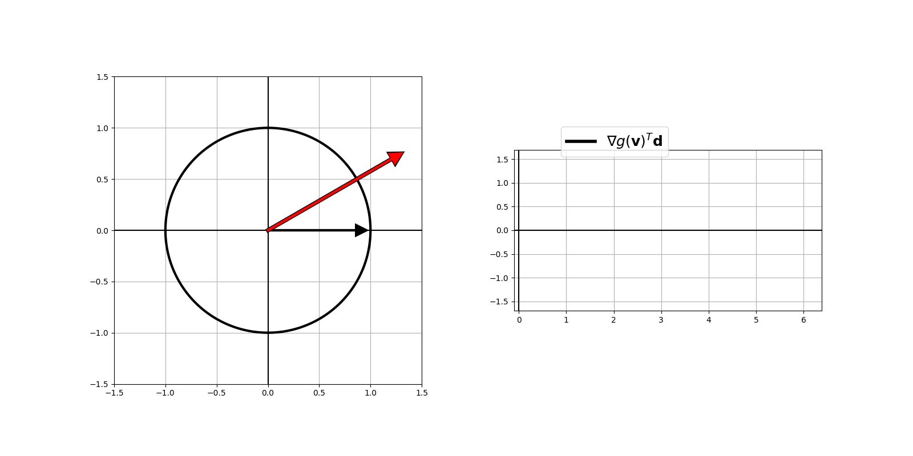
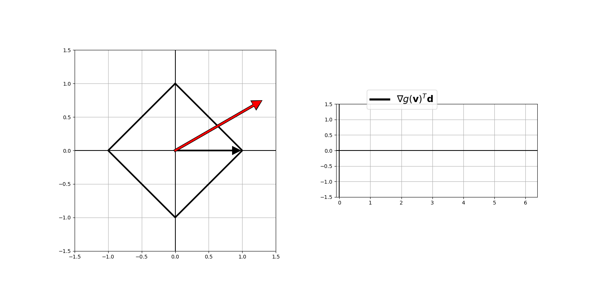
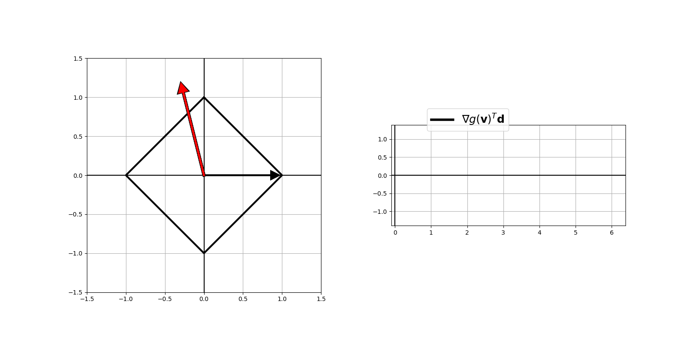
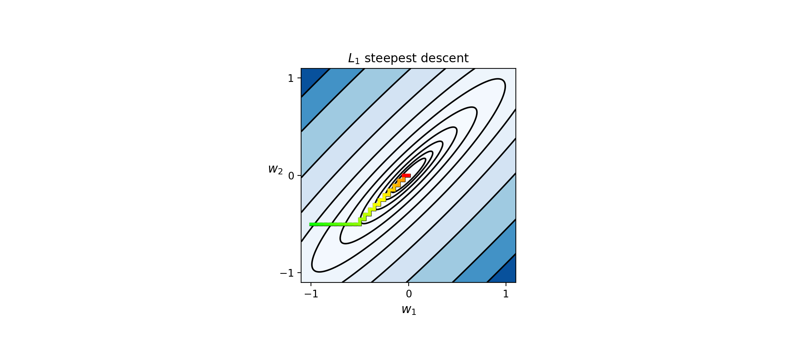
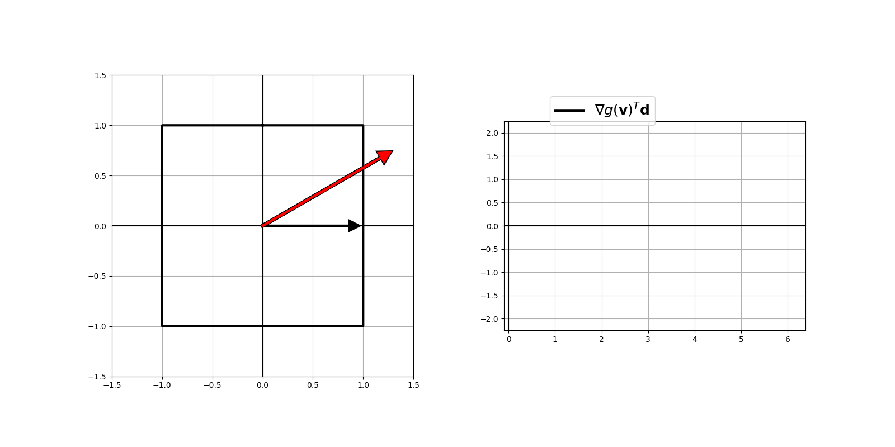
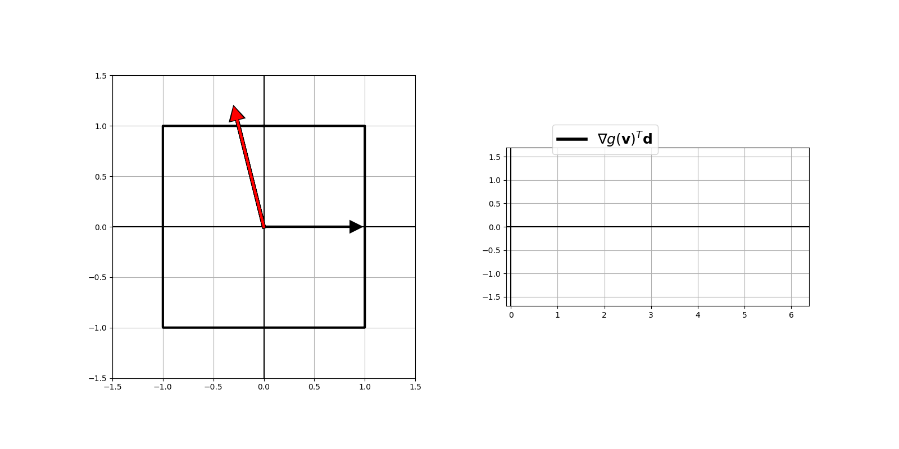
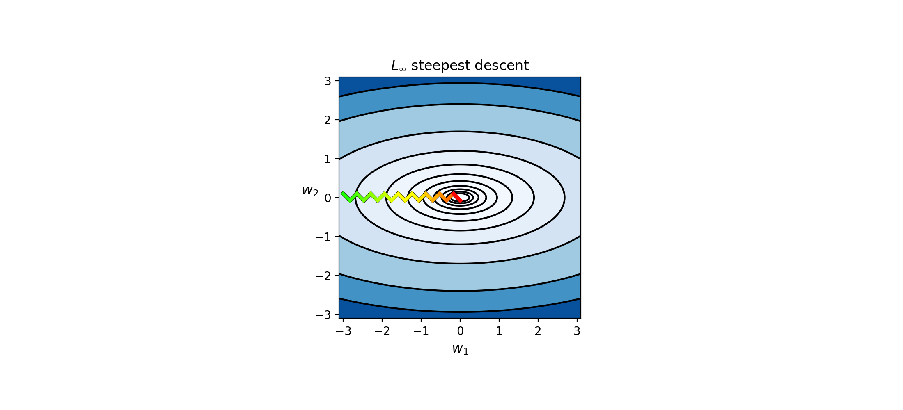

# 13.7 一般最速下降法 (General steepest descent)

來源：[ML Refined](https://kenndanielso.github.io/mlrefined/blog_posts/13_Multilayer_perceptrons/13_7_General_steepest_descent.html)

在本篇博文中，我們將介紹幾種歸一化（標準化）梯度下降法的變體，這些變體通常被稱為 *最速下降法* (steepest descent) 演算法。這些變體源於對梯度下降法設定所做的一個微小但根本性的改變，這個改變對下降方向的形式有著顯著影響，但重要的是，它不會影響方法的收斂性（最速下降法在與梯度下降法相同的一般條件下收斂，即步長最終會趨於零）。

## 13.7.1 廣義最速下降法 (Generalized Steepest descent)

在我們最初討論梯度下降法時，由負梯度給出的下降方向很自然地源於對超平面的幾何理解。在這裡，我們將透過重新檢視梯度下降法，並使用更嚴謹的數學框架來推導下降方向，以此開始我們對最速下降法演算法的討論。這個框架隨即啟發了一種在不同 *範數* (norms) 下推廣梯度下降法的方法，我們將在隨後對其進行探索。

### 13.7.1.1 $\ell_2$ 範數下的最速下降方向

當我們最初推導多輸入函數 $g(\mathbf{w})$ 在點 $\mathbf{v}$ 處的梯度下降方向時，我們首先檢視了 $g$ 在該點處的切超平面：

$\begin{equation}
h\left(\mathbf{w}\right)=g\left(\mathbf{v}\right)+\nabla g\left(\mathbf{v}\right)^{T}\left(\mathbf{w}-\mathbf{v}\right)
\end{equation}$
接著我們推論，既然我們通常知道超平面上的 *上升* 方向是由其一組「斜率」—— 儲存在 $\nabla g(\mathbf{v})$ 中 —— 所給出，因此直觀上，下降方向就是由負梯度給出，即 $-\nabla g(\mathbf{v})$，或者歸一化為單位長度 $-\frac{\nabla g(\mathbf{v})}{\left\Vert \nabla g(\mathbf{v}) \right\Vert_2 }$。我們經常使用後者（單位歸一化版本），因為畢竟我們只關心下降的 *方向*。

這個下降方向可以更正式地推導如下。請注意， $\mathbf{d} = \mathbf{w} - \mathbf{v}$ 是一個以點 $\mathbf{v}$ 為中心的一般搜尋方向。我們想要尋找一個單位長度的方向 $\mathbf{d}$，使其在超平面上產生最小的評估值，即能給出最小的 $g(\mathbf{v}) + \nabla g(\mathbf{v})^T(\mathbf{w} - \mathbf{v}) = g(\mathbf{v}) + \nabla g(\mathbf{v})^T\mathbf{d}$ 值。由於 $\mathbf{d}$ 僅存在於第二項中，我們只需關心尋找單位長度的方向 $\mathbf{d}$，使得 $\nabla g(\mathbf{v})^T\mathbf{d}$ 儘可能小（畢竟 $g(\mathbf{v})$ 是常數）。

形式上，這是一個簡單的受約束最小化問題：

$\begin{equation}
\begin{array}{cc}
\underset{\mathbf{d}}{\text{minimize}} & \nabla g(\mathbf{v})^{T}\mathbf{d}\\
\text{subject to} & \left\Vert \mathbf{d}\right\Vert _{2}=1\\
\end{array}
\end{equation}$

利用下一個 Python 單元格中的互動模型，我們在二維空間中針對特定的梯度向量選擇，探索此問題的可能解，從而獲得關於該解應該是什麼的寶貴幾何直覺。在圖中，我們將一個範例梯度向量 $\nabla g (\mathbf{v})$ 繪製為紅色箭頭，並繪出 $\ell_2$ 單位球。從左到右移動滑桿，您可以在此 $\ell_2$ 單位球上測試各種方向 $\mathbf{d}$（每個都顯示為黑色箭頭），並計算內積 $\nabla g(\mathbf{v})^{T}\mathbf{d}$，其值同時繪製在右側面板中。當您向右移動滑桿時，提供 *最小* 值的方向會在左側面板中顯示為綠色箭頭，並在右側面板的圖中以綠色突出顯示。

如圖所示， $\mathbf{d} = -\frac{\nabla g(\mathbf{v})}{\left\Vert \nabla g(\mathbf{v}) \right\Vert_2 }$ 似乎確實是產生最小內積的方向。

為了正式證明這一點，我們可以使用 *內積規則*，它幾乎能立刻告訴我們這個問題的解。根據內積規則， $\nabla g(\mathbf{v})^{T}\mathbf{d}$ 可以寫成：

$$\nabla g(\mathbf{v})^{T}\mathbf{d} = \left \Vert \nabla g(\mathbf{v}) \right \Vert_2 \left \Vert \mathbf{d} \right \Vert_2 \text{cos}(\theta)$$

其中 $\theta$ 是 $\nabla g(\mathbf{v})$ 與 $\mathbf{d}$ 之間的夾角。

注意到 $\left \Vert \nabla g(\mathbf{v}) \right \Vert_2$ 和 $\left \Vert \mathbf{d} \right \Vert_2$ 都是常數值（前者是 $\mathbf{v}$ 處的梯度長度，後者僅為 $1$），當 $\text{cos}(\theta)$ 最小（即 $\theta = \pi$）時， $\nabla g(\mathbf{v})^{T}\mathbf{d}$ 的值最小。換句話說， $\mathbf{d}$ 必須與 $-\nabla g(\mathbf{v})$ 指向相同方向，且長度為單位長度。因此我們得到 $\mathbf{d} = -\frac{\nabla g(\mathbf{v})}{\left \Vert \nabla g(\mathbf{v}) \right \Vert_2}$，這確實是歸一化後的梯度下降方向。在以此方式推導梯度下降方向時， $\mathbf{d}$ 更一般地被稱為 *最速下降方向* (steepest descent direction)。

### 13.7.1.2 $\ell_1$ 範數下的最速下降方向

在這種設定下，我們實際上可以在約束條件中選擇任何我們希望用來確定下降方向的範數。例如，將 $\ell_2$ 替換為 $\ell_1$ 範數，我們會得到一個外觀相似的問題：

$\begin{equation}
\begin{array}{cc}
\underset{\mathbf{d}}{\text{minimize}} & \nabla g(\mathbf{v})^{T}\mathbf{d}\\
\text{subject to} & \left\Vert \mathbf{d}\right\Vert _{1}=1\\
\end{array}
\end{equation}$

其解定義了關於 $\ell_1$ 範數的新最速下降方向。我們在這裡找到的方向肯定會與 $\ell_2$ 受約束版本有所不同。

利用下一個 Python 單元格中的互動模型，我們在二維空間中針對特定的梯度向量選擇，探索此問題的可能解，從而獲得關於該解應該是什麼的寶貴幾何直覺。在圖中，我們將一個範例梯度向量 $\nabla g (\mathbf{v})$ 繪製為紅色箭頭，並繪出 $\ell_1$ 單位球。從左到右移動滑桿，您可以在此 $\ell_1$ 單位球上測試各種方向 $\mathbf{d}$（每個都顯示為黑色箭頭），並計算內積 $\nabla g(\mathbf{v})^{T}\mathbf{d}$，其值同時繪製在右側面板中。當您向右移動滑桿時，提供 *最小* 值的方向會在左側面板中顯示為綠色箭頭，並在右側面板的圖中以綠色突出顯示。

讓我們嘗試另一個不同的梯度向量 $\nabla g (\mathbf{v})$，這次是在第二象限。

操作上方的滑桿，此處的下降方向似乎是沿著某個 *座標軸* 定義的，即僅由梯度中（絕對值）最大的偏導數的相反方向所決定。令 $j$ 代表 $\nabla g (\mathbf{v})$ 中（絕對值）最大分量的索引：

$$j=\underset{i}{\text{argmax}}\left | \frac{\partial}{\partial w_i}g(\mathbf{v}) \right |$$
下降方向 $\mathbf{d}$ 將沿著以下向量：

$$\begin{array}{cc}
\left[\begin{array}{c}
0\\
\vdots\\
0\\
-\frac{\partial}{\partial w_{j}}g(\mathbf{v})\\
0\\
\vdots\\
0
\end{array}\right] & \rightarrow \text{第 } j \text{ 個位置}\end{array}$$
使用標準基底表示法，這可以寫成 $ - \frac{\partial}{\partial w_j}g(\mathbf{v})\, \mathbf{e}_j$，其中 $\mathbf{e}_j$ 是一個標準基底向量，其第 $j$ 個位置為 $1$，其餘位置為零。將此向量除以其範數（使其成為單位長度），我們得到：

$$\mathbf{d}=\frac{-\frac{\partial}{\partial w_{j}}g(\mathbf{v})}{\left\Vert -\frac{\partial}{\partial w_{j}}g(\mathbf{v})\,\mathbf{e}_{j}\right\Vert _{2}}\mathbf{e}_{j}=\frac{-\frac{\partial}{\partial w_{j}}g(\mathbf{v})}{\left|\frac{\partial}{\partial w_{j}}g(\mathbf{v})\right|}\mathbf{e}_{j}=-\text{sign}\left(\frac{\partial}{\partial w_{j}}g(\mathbf{v})\right)\mathbf{e}_{j}$$

當然，有可能有多個偏導數同時達到最大值（就絕對值而言），例如在上述設定中當 $\nabla g (\mathbf{v})=\begin{bmatrix} 1 \\ 1 \end{bmatrix}$ 時。在這種情況下，不僅 $-\text{sign}\left(\frac{\partial}{\partial w_{1}}g(\mathbf{v})\right)\mathbf{e}_{1}$ 和 $-\text{sign}\left(\frac{\partial}{\partial w_{2}}g(\mathbf{v})\right)\mathbf{e}_{2}$ 都使內積最小化，它們經 $\ell_1$ 長度歸一化後的和 $-\frac{\text{sign}\left(\frac{\partial}{\partial w_{1}}g(\mathbf{v})\right)\mathbf{e}_{1} + \text{sign}\left(\frac{\partial}{\partial w_{2}}g(\mathbf{v})\right)\mathbf{e}_{2}}{2}$ 也是如此。

更一般地說，如果我們用 $\mathcal{S}$ 表示這些最大偏導數的索引集合，那麼結合了 $\mathcal{S}$ 中所有索引的下降方向由以下公式給出：

$\begin{equation}
\mathbf{d} = - \frac{1}{\left| \mathcal{S}\right|}\sum_{j \in \mathcal{S} } \,\,\text{sign}\left(\frac{\partial}{\partial w_j}g(\mathbf{v})\right)^{\,} \mathbf{e}_j^{\,}
\end{equation}$

這個公式可以被嚴謹地證明，我們將在本篇博文的附錄部分中展示。

在 $\mathbf{w}^{k-1}$ 處沿此方向的最速下降步驟如下：

$\begin{equation}
\mathbf{w}^{k} = \mathbf{w}^{k-1} - \alpha \sum_{j \in \mathcal{S} } \,\,\text{sign}\left(\frac{\partial}{\partial w_j}g(\mathbf{w}^{k-1})\right)^{\,} \mathbf{e}_j^{\,}
\end{equation}$
其中索引集合 $\mathcal{S}$ 在每一步都會根據完整梯度 $\nabla g\left(\mathbf{w}^{k-1} \right)$ 而改變，而常數 $\frac{1}{\left| \mathcal{S}\right|}$ 已經被併入到 $\alpha$ 中。考慮到每個方向的形成方式，這些步驟傾向於沿著座標方向進行，類似於 *座標下降法* (coordinate descent) 方式。一般而言，這種下降步驟看起來不如 $\ell_2$ 類似方法有用，因為我們仍然必須計算整個梯度才能使用它，然後我們「丟棄」了除了最大值以外的所有值。

#### 範例 1. 應用於最小化二次函數的 $\ell_1$ 最速下降法

在下一個 Python 單元格中，我們使用 $\ell_1$ 最速下降法來尋找位於原點的以下函數的極小值：

$\begin{equation}
g\left(w_1,w_2 \right) = 0.26\left(w_1^2 + w_2^2\right) - 0.48w_1w_2
\end{equation}$
我們將此方法所走過的路徑直接繪製在函數的等高線上 —— 這些等高線在方法開始時被著色為綠色，並在方法停止時逐漸變為紅色。

### 13.7.1.3 $\ell_{\infty}$ 範數下的最速下降方向

在我們最初的受約束優化問題中，將 $\ell_2$ 範數替換為 $\ell_{\infty}$ 範數，我們會得到一個外觀相似的問題，其解定義了一種新型的最速下降方向：

$\begin{equation}
\begin{array}{cc}
\underset{\mathbf{d}}{\text{minimize}} & \nabla g(\mathbf{v})^{T}\mathbf{d}\\
\text{subject to} & \left\Vert \mathbf{d}\right\Vert _{\infty}=1\\
\end{array}
\end{equation}$

利用下一個 Python 單元格中的互動模型，我們在二維空間中針對特定的梯度向量選擇，探索此問題的可能解，從而獲得關於該解應該是什麼的寶貴幾何直覺。在這裡，我們再次將一個範例梯度向量 $\nabla g (\mathbf{v})$ 繪製為紅色箭頭，並繪出 $\ell_{\infty}$ 單位球。從左到右移動滑桿，您可以在此 $\ell_{\infty}$ 單位球上測試各種方向 $\mathbf{d}$（每個都顯示為黑色箭頭），並計算內積 $\nabla g(\mathbf{v})^{T}\mathbf{d}$，其值同時繪製在右側面板中。當您再次向右移動滑桿時，提供 *最小* 值的方向會在左側面板中顯示為綠色箭頭，並在右側面板的圖中以綠色突出顯示。

基於上述範例，您現在可能對 $\mathbf{d}$ 應該是什麼有了一些直覺。但讓我們透過檢驗另一個不同的梯度向量 $\nabla g (\mathbf{v})$ 來確定這一點。

操作上方的滑桿，此處下降方向的 *每個* 分量似乎都是沿其對應座標的負單位長度偏導數。也就是說，第 $j$ 個分量為：

$$d_j = \frac{ \frac{\partial}{\partial w_j}g(\mathbf{v}) }{\left| \frac{\partial}{\partial w_j}g(\mathbf{v}) \right|} = \text{sign}\left(\frac{\partial}{\partial w_j}g(\mathbf{v})\right)$$
因此，整個下降方向可以簡單地寫為：

$\begin{equation}
\mathbf{d} = -\, \text{sign}\left(\nabla g(\mathbf{v}) \right)
\end{equation}$

這些方向往往大多被約束在單位正方形的角落，或者 —— 在更高維度中 —— 單位超立方體的角落（例外情況是當某個偏導數剛好等於零時）。

這個直覺推導出的公式實際上是正確的，並且可以更嚴謹地證明，如本篇博文的附錄部分所示。

在 $\mathbf{w}^{k-1}$ 處沿此方向的最速下降步驟如下：

$\begin{equation}
\mathbf{w}^{k} = \mathbf{w}^{k-1} - \alpha\, \text{sign}\left(\nabla g(\mathbf{w}^{k-1}) \right)
\end{equation}$

由於 $\text{sign} (\cdot)$ 函數的作用，這些步驟往往是「對角線」的，主要在由單位正方形角落所定義的方向上移動。因為方向的集合受到了限制，人們經常在此方法中看到使用逐座標的步長參數（例如 [Rprop](https://en.wikipedia.org/wiki/Rprop)）。

#### 範例 2. 應用於最小化二次函數的 $\ell_{\infty}$ 最速下降法

在下一個 Python 單元格中，我們使用 $\ell_{\infty}$ 最速下降法來尋找位於原點的以下函數的極小值：

$\begin{equation}
g\left(w_1,w_2 \right) = w_1^2 + 5w_2^2
\end{equation}$

我們將此方法所走過的路徑直接繪製在函數的等高線上 —— 這些等高線在方法開始時被著色為綠色，並在方法停止時逐漸變為紅色。

## 附錄

在此我們提供 $\ell_1$ 和 $\ell_\infty$ 下降方向的正式證明。請注意，為了便於閱讀，我們在全文中將負梯度表示為 $\mathbf{a} = -\nabla g(\mathbf{v})$。

### A.1 $\ell_1$ 下降方向的正式推導

在接下來的內容中，我們為以下問題尋求閉合形式解（解析解）：

$\begin{equation}
\begin{array}{cc}
\underset{\mathbf{d}}{\text{maximize}} & \mathbf{a}^{T}\mathbf{d}\\
\text{subject to} & \left\Vert \mathbf{d}\right\Vert _{1}=1\\
\end{array}
\end{equation}$
按分量展開寫為：

$\begin{equation}
\begin{array}{cc}
\underset{d_1,\,d_2,\,\ldots,\, d_n}{\text{maximize}} & a_1d_1+a_2d_2+\cdots+a_nd_n\\
\text{subject to} & \left\vert d_1\right\vert + \left\vert d_2\right\vert + \cdots + \left\vert d_n\right\vert = 1\\
\end{array}
\end{equation}$
首先注意到，如果 $d_i$ 的數學符號與 $a_i$ 不同，那麼將 $d_i$ 替換為 $-d_i$ 將會增加（或至少不減少）目標函數值，且不會違反等式約束條件。因此，透過將 $d_i$ 寫為：

$$d_i=\text{sign}(a_i)\,y_i$$
其中所有的 $y_i$ 現在都是非負數，我們原來的問題可以等價地重新表述為：

$\begin{equation}
\begin{array}{cc}
\underset{y_1,\,y_2,\,\ldots,\, y_n}{\text{maximize}} & a_1\,\text{sign}(a_1)\,y_1+a_2\,\text{sign}(a_2)\,y_2+\cdots+a_n\,\text{sign}(a_n)\,y_n\\
\text{subject to} &  \left\vert \text{sign}(a_1)\,y_1\right\vert + \left\vert \text{sign}(a_2)\,y_2\right\vert + \cdots + \left\vert \text{sign}(a_n)\,y_n\right\vert =1\\
& y_1, y_2, \ldots, y_n \geq 0\\
\end{array}
\end{equation}$
注意到我們有 $a_i\,\text{sign}(a_i)\,y_i=\left\vert a_i\right\vert \,y_i$（在目標函數中），且 $\left\vert \text{sign}(a_i)\,y_i\right\vert = \left\vert \text{sign}(a_i)\right\vert \left\vert y_i\right\vert = y_i$，我們可以將此優化問題重寫為：

$\begin{equation}
\begin{array}{cc}
\underset{y_1,\,y_2,\,\ldots,\, y_n}{\text{maximize}} & \left\vert a_1\right\vert y_1+\left\vert a_2\right\vert y_2+\cdots+\left\vert a_n\right\vert y_n\\
\text{subject to} &  y_1 +  y_2 + \cdots +  y_n =1\\
& y_1, y_2, \ldots, y_n \geq 0\\
\end{array}
\end{equation}$

最後，令 $j$ 代表 $\mathbf{a}$ 中（絕對值）最大分量的索引：

$$j=\underset{i=1,\,2,\,\ldots,\, n}{\text{argmax}}\left|a_{i}\right|$$
我們可以求得目標函數的上界：

$$\left|a_{1}\right|y_{1}+\left|a_{2}\right|y_{2}+\ldots+\left|a_{n}\right|y_{n}\leq\left|a_{j}\right|y_{1}+\left|a_{j}\right|y_{2}+\ldots+\left|a_{j}\right|y_{n}=\left|a_{j}\right|$$
請注意，第 $j$ 個標準基底向量（其第 $j$ 個位置為 $1$，其餘位置為零）給出了與此上界相同的值，因此 $\mathbf{y}=\mathbf{e}_{j}$ 是重構後優化問題的一個解。此外，如果 $\mathbf{a}$ 中有幾個分量的絕對值同樣最大，則上述結論對於其各自對應的每個索引均成立，我們將這些索引的集合表示為 $\mathcal{S}$。

綜上所述，解可以表示為：

$$
\mathbf{d}^{\star}= \frac{1}{\left| \mathcal{S}\right|}\sum_{j\in \mathcal{S}}\text{sgn}(a_j)\,\mathbf{e}_{j}
$$
其中 $\left| \mathcal{S}\right|$ 表示 $\mathcal{S}$ 中的元素數量。

### A.2 $\ell_\infty$ 下降方向的正式推導

在此我們為以下問題尋求閉合形式解（解析解）：

$\begin{equation}
\begin{array}{cc}
\underset{\mathbf{d}}{\text{maximize}} & \mathbf{a}^{T}\mathbf{d}\\
\text{subject to} & \left\Vert \mathbf{d}\right\Vert _{\infty}=1\\
\end{array}
\end{equation}$
按分量展開寫為：

$\begin{equation}
\begin{array}{cc}
\underset{d_1,\,d_2,\,\ldots,\, d_n}{\text{maximize}} & a_1d_1+a_2d_2+\cdots+a_nd_n\\
\text{subject to} & \text{max}\left\{ \left|d_{1}\right|,\,\left|d_{2}\right|,\,\ldots,\,\left|d_{n}\right|\right\} =1\\
\end{array}
\end{equation}$

請注意，約束集合：

$$\mathcal{S}=\left\{ \mathbf{d}\left|\text{ max}\left(\left|d_{1}\right|,\,\left|d_{2}\right|,\,\ldots,\,\left|d_{n}\right|\right)=1\right.\right\}$$
是以下集合的子集：

$$\mathcal{T}=\left\{ \mathbf{d}\left|\, -1\leq d_{1},\,d_{2},\,\ldots,\,d_{n}\leq1\right.\right\}$$

因此，在 $\mathbf{d}\in\mathcal{S}$ 的約束下目標函數的最大值，會以上限受限於在 $\mathbf{d}\in\mathcal{T}$ 的約束下目標函數的最大值。後一個問題可以寫成：

$\begin{equation}
\begin{array}{cc}
\underset{d_1,\,d_2,\,\ldots,\, d_n}{\text{maximize}} & a_1d_1+a_2d_2+\cdots+a_nd_n\\
\text{subject to} & -1\leq d_{i}\leq1,\;\forall i \\
\end{array}
\end{equation}$

現在請注意，該問題可以分解為 $n$ 個獨立的優化問題，形式如下：

$\begin{equation}
\begin{array}{cc}
\underset{d_i}{\text{maximize}} & a_id_i\\
\text{subject to} & -1\leq d_{i}\leq1 \\
\end{array}
\end{equation}$

其易於計算的解為 $d_i^{\star}=\text{sign}(a_i)$。綜上所述，

$$\mathbf{d}^{\star}=\text{sign}(\mathbf{a})$$
在 $\mathbf{d}\in\mathcal{T}$ 的約束下最大化了目標函數。鑑於我們同樣有 $\mathbf{d}^{\star}\in\mathcal{S}$，因此 $\mathbf{d}^{\star}$ 也在 $\mathbf{d}\in\mathcal{S}$ 的約束下最大化了目標函數。
