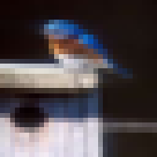
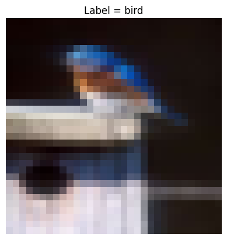

# 6_7960_Fall_2024_hw1_CIFAR10

**注意：** 對於本筆記本中的所有問題，請將您的答案包含在提交的 PDF 中。**請勿**提交 Colab 筆記本。

<h1>CIFAR-10</h1>

CIFAR-10 是一個影像分類數據集。
+ 每個數據樣本都是一張 RGB $32\times32$ 的真實影像。載入的原始影像 $\in \mathbb{R}^{3 \times 32 \times 32}$。
+ 每個影像都與一個標籤 $\in [0, 1, 2, 3, 4, 5, 6, 7, 8, 9]$ 相關聯。

<table>
    <tbody><tr>
        <td class="cifar-class-name">飛機 (airplane)</td>
        <td></td>
        <td></td>
        <td></td>
        <td></td>
        <td></td>
        <td></td>
        <td></td>
        <td></td>
        <td></td>
        <td></td>
    </tr>
    <tr>
        <td class="cifar-class-name">汽車 (automobile)</td>
        <td></td>
        <td></td>
        <td></td>
        <td></td>
        <td></td>
        <td></td>
        <td></td>
        <td></td>
        <td></td>
        <td></td>
    </tr>
    <tr>
        <td class="cifar-class-name">鳥類 (bird)</td>
        <td></td>
        <td></td>
        <td></td>
        <td></td>
        <td></td>
        <td></td>
        <td></td>
        <td></td>
        <td></td>
        <td></td>
    </tr>
    <tr>
        <td class="cifar-class-name">貓 (cat)</td>
        <td></td>
        <td></td>
        <td></td>
        <td></td>
        <td></td>
        <td></td>
        <td></td>
        <td></td>
        <td></td>
        <td></td>
    </tr>
    <tr>
        <td class="cifar-class-name">鹿 (deer)</td>
        <td></td>
        <td></td>
        <td></td>
        <td></td>
        <td></td>
        <td></td>
        <td></td>
        <td></td>
        <td></td>
        <td></td>
    </tr>
    <tr>
        <td class="cifar-class-name">狗 (dog)</td>
        <td></td>
        <td></td>
        <td></td>
        <td></td>
        <td></td>
        <td></td>
        <td></td>
        <td></td>
        <td></td>
        <td></td>
    </tr>
    <tr>
        <td class="cifar-class-name">青蛙 (frog)</td>
        <td></td>
        <td></td>
        <td></td>
        <td></td>
        <td></td>
        <td></td>
        <td></td>
        <td></td>
        <td></td>
        <td></td>
    </tr>
    <tr>
        <td class="cifar-class-name">馬 (horse)</td>
        <td></td>
        <td></td>
        <td></td>
        <td></td>
        <td></td>
        <td></td>
        <td></td>
        <td></td>
        <td></td>
        <td></td>
    </tr>
    <tr>
        <td class="cifar-class-name">船 (ship)</td>
        <td></td>
        <td></td>
        <td></td>
        <td></td>
        <td></td>
        <td></td>
        <td></td>
        <td></td>
        <td></td>
        <td></td>
    </tr>
    <tr>
        <td class="cifar-class-name">卡車 (truck)</td>
        <td></td>
        <td></td>
        <td></td>
        <td></td>
        <td></td>
        <td></td>
        <td></td>
        <td></td>
        <td></td>
        <td></td>
    </tr>
</tbody></table>
(表格來源：Alex Krizhevsky 的[網頁](https://www.cs.toronto.edu/~kriz/cifar.html)。)

我們的目標是訓練一個神經網路分類器，輸入此類 $3\times28\times28$ 的影像，並預測一個標籤 $\in \{0, 1, 2, \dots, 9\}$。

你將首先實現一個具有手動反向傳播（backpropagation）規則的神經網路，然後在 CIFAR-10 分類任務上對其進行訓練。

**注意：** 已經為你提供了大量的骨架程式碼（skeleton code）。請務必仔細閱讀並理解它們，因為隨著課程的深入以及對深度學習程式碼結構的熟悉，未來提供的這類輔助程式碼將會變少。**除非特別要求，請勿修改已提供的程式碼。**

```python
# 安裝依賴項

!pip install torch torchvision
```

<details>
<summary>顯示輸出</summary>

*標準輸出：*
```text
Requirement already satisfied: torch in /usr/local/lib/python3.10/dist-packages (2.4.0+cu121)
Requirement already satisfied: torchvision in /usr/local/lib/python3.10/dist-packages (0.19.0+cu121)
Requirement already satisfied: filelock in /usr/local/lib/python3.10/dist-packages (from torch) (3.15.4)
Requirement already satisfied: typing-extensions>=4.8.0 in /usr/local/lib/python3.10/dist-packages (from torch) (4.12.2)
Requirement already satisfied: sympy in /usr/local/lib/python3.10/dist-packages (from torch) (1.13.2)
Requirement already satisfied: networkx in /usr/local/lib/python3.10/dist-packages (from torch) (3.3)
Requirement already satisfied: jinja2 in /usr/local/lib/python3.10/dist-packages (from torch) (3.1.4)
Requirement already satisfied: fsspec in /usr/local/lib/python3.10/dist-packages (from torch) (2024.6.1)
Requirement already satisfied: numpy in /usr/local/lib/python3.10/dist-packages (from torchvision) (1.26.4)
Requirement already satisfied: pillow!=8.3.*,>=5.3.0 in /usr/local/lib/python3.10/dist-packages (from torchvision) (9.4.0)
Requirement already satisfied: MarkupSafe>=2.0 in /usr/local/lib/python3.10/dist-packages (from jinja2->torch) (2.1.5)
Requirement already satisfied: mpmath<1.4,>=1.1.0 in /usr/local/lib/python3.10/dist-packages (from sympy->torch) (1.3.0)
```

</details>

您應該在啟用了 GPU 的 Colab 伺服器上運行（這應是此筆記本的預設設置）。

```python
import torch

assert torch.cuda.is_available(), "Should use GPU-enabled colab"

device = torch.device('cuda:0')  # 我們將使用 CUDA 進行訓練！
```

## 模組 (Modules)

在此筆記本中，我們將使用自己定義的 `Module` 類別，它具有與 PyTorch 的 `nn.Module` 類似的 API，不同的是我們將手動實現自己的反向傳播操作（`module.backward`），而不是使用 PyTorch 的 `autograd`。

閱讀 `Module` 類別上的方法定義。

```python
from typing import *
import abc


# 這是我們的 Module API
class Module(abc.ABC):
    device: Optional[torch.device]  # 參數應該存在於此設備上！
    inputs: Tuple[torch.Tensor, ...]

    def __init__(self, device=None):
        self.device = device

    @abc.abstractmethod
    def parameters(self) -> Iterator[torch.Tensor]:
        r'''
        返回此模組*參數*的迭代器。

        子類別需要實現此方法。
        '''

    @abc.abstractmethod
    def forward(self, *inputs: torch.Tensor) -> torch.Tensor:
        r'''
        返回將此模組應用於張量 `inputs` 後的輸出，每個輸入都是一個*批次（batched）*張量。

        在大多數情況下，模組只接收單個輸入張量（例如：線性層和 ReLU 層）。然而，當模組計算預測值與真實目標（groundtruth target）之間的損失（loss）時，多個輸入是非常有用的。

        子類別需要實現此方法。
        '''

    def __call__(self, *inputs: torch.Tensor) -> torch.Tensor:
        r'''
        簡單地呼叫 forward，並將輸入儲存於 `self.inputs` 中，這在 `backward` 中計算梯度時可能很有用。
        '''
        self.inputs = inputs
        return self.forward(*inputs)

    @abc.abstractmethod
    def backward(self, dLdout: torch.Tensor) -> torch.Tensor:
        r'''
        這是我們的手動反向傳播。

        給定表示為 $dL / d output$ 的 `dLdOut`（對於某個損失 `L`），我們計算：
        1. 對於此模組的每個參數 `p`，計算 $d L / d p$，儲存於 `p.grad`。
        2. $dL / d self.inputs[0]$，將其傳遞給前一層。只需計算第一個輸入的導數。

        請注意，$dL / d *$ 應始終是與 * 具有相同形狀的張量。例如，$d L / d p$（即 `p.grad`）應始終與 `p` 具有相同的形狀。

        子類別需要實現此方法。
        '''

    def zero_grad(self):
        r'''
        清除先前計算的所有梯度。
        '''
        for p in self.parameters():
            p.grad = None
```

我們將使用三種模組來構建我們的網路：
+ 線性層 (Linear layer，也稱為全連接層)
+ ReLU 激活函數 (我們的非線性激活)
+ 交叉熵損失 (Cross entropy loss，我們的分類損失)

**問題 1**：完成以下模組類別中未完成的 `forward` 和 `backward` 定義，每個定義的程式碼不超過 5 行。它們被標記為 `FIXME`。請將您的程式碼添加到要提交的 PDF 中。

```python
class Linear(Module):
    def __init__(self, in_features: int, out_features: int, device=None):
        super().__init__(device)
        self.in_features = in_features
        self.out_features = out_features
        self.weight = torch.randn(out_features, in_features, device=device) / in_features  # 權重矩陣
        self.bias = torch.zeros(out_features, device=device)  # 偏置向量

    def parameters(self) -> Iterator[torch.Tensor]:
        return [self.weight, self.bias]

    def forward(self, x: torch.Tensor) -> torch.Tensor:
        # x           形狀：[b, in_features]
        # self.weight 形狀：[out_features, in_features]
        # self.bias   形狀：[out_features]
        #
        # 輸出形狀應為：[b, out_features]
        #
        # FIXME
        pass

    def backward(self, dLdout: torch.Tensor) -> torch.Tensor:
        # self.inputs[0] 形狀：[b, in_features]
        # dLdout         形狀：[b, out_features]
        # self.weight    形狀：[out_features, in_features]
        # self.bias      形狀：[out_features]
        #
        # FIXME
        # 請注意，你不應該就地（inplace）修改 `dLdout` 或 `self.inputs`。
        pass

    def __repr__(self) -> str:
        return f"Linear(in={self.in_features}, out={self.out_features})"


class ReLU(Module):
    def parameters(self) -> Iterator[torch.Tensor]:
        return []

    def forward(self, x: torch.Tensor) -> torch.Tensor:
        return x.clamp(min=0)

    def backward(self, dLdout: torch.Tensor) -> torch.Tensor:
        # self.inputs[0]  形狀：[b, d]
        # dLdout          形狀：[b, d]
        #
        # FIXME
        # 請注意，你不應該就地（inplace）修改 `dLdout` 或 `self.inputs`。
        pass

    def __repr__(self) -> str:
        return "ReLU()"


class CrossEntropyLoss(Module):
    def parameters(self) -> Iterator[torch.Tensor]:
        return []

    def forward(self, logits: torch.Tensor, target: torch.Tensor) -> torch.Tensor:
        # logits    形狀：[b, num_classes]
        # target    形狀：[b]，包含 [0, 1, ..., num_classes - 1] 中的*整數*
        #
        # 對於批次中的每個對數機率（logits）
        #   p = softmax(logits)
        #   loss = -log(p[target])
        # 總損失是整個批次的平均值。
        b = logits.shape[0]
        return -logits.softmax(dim=-1).log()[torch.arange(b, device=self.device), target].mean()  # 純量，形狀：[]

    def backward(self, dLdout: torch.Tensor) -> torch.Tensor:
        logits, target = self.inputs
        # logits    形狀：[b, num_classes]
        # target    形狀：[b]，包含 [0, 1, ..., num_classes - 1] 中的*整數*
        # dLdout    形狀：[]
        #
        # FIXME
        # 請注意，你不應該就地（inplace）修改 `dLdout` 或 `self.inputs`。
        # 計算 dL / d logits
        pass

    def __repr__(self) -> str:
        return "CrossEntropyLoss()"
```

現在，建立我們的網路！

它接收 `input_dim` 維度的輸入，並輸出 $10$ 維的輸出，代表預測機率的對數機率（logits）。

我們使用一個寬度為 8192 的 3 層 ReLU 網路。

```python
class Network(Module):
    layers: List[Module]

    def __init__(self, input_dim, device=None):
        super().__init__(device)
        self.layers = [
            Linear(input_dim, 8192, device=device),
            ReLU(device=device),
            Linear(8192, 8192, device=device),
            ReLU(device=device),
            Linear(8192, 10, device=device),
        ]

    def parameters(self):
        r'''
        參數來自各個網路層。
        '''
        for layer in self.layers:
            yield from layer.parameters()

    def forward(self, x: torch.Tensor) -> torch.Tensor:
        r'''
        依序激活所有網路層。
        '''
        y = x
        for layer in self.layers:
            y = layer(y)
        return y

    def backward(self, dLdout: torch.Tensor) -> torch.Tensor:
        r'''
        反向傳播：按相反順序對每一層進行反向傳播。
        '''
        for layer in self.layers[::-1]:
            dLdout = layer.backward(dLdout)
        return dLdout

    def __repr__(self) -> str:
        repr_str = "Network(\n"
        for layer in self.layers:
            repr_str += "    " + repr(layer) + "\n"
        repr_str += ')'
        return repr_str
```

執行以下程式碼來測試你的實現！

```python
model = Network(input_dim=64, device=device)
input = torch.randn(2, 64, device=device)
print(model)
print('output=\n', model(input))
assert model.backward(torch.randn(2, 10, device=device)).shape == input.shape
print('backward works!')
```

<details>
<summary>顯示輸出</summary>

*標準輸出：*
```text
Network(
    Linear(in=64, out=8192)
    ReLU()
    Linear(in=8192, out=8192)
    ReLU()
    Linear(in=8192, out=10)
)
output=
 tensor([[ 1.3309e-06,  4.7905e-07,  2.2728e-06,  1.2235e-05,  1.5776e-06,
           4.0384e-06, -7.9353e-06,  3.5784e-06,  4.7225e-07, -1.1110e-05],
        [ 1.6635e-06,  3.4861e-06,  3.4986e-07,  8.9300e-06, -1.4952e-06,
         -2.3495e-07,  1.0695e-06,  2.6006e-06,  3.1107e-07,  7.8211e-07]],
       device='cuda:0')
backward works!
```

</details>

您也可以透過有限差分（finite difference）驗證計算出的梯度。例如：

```python
# 計算 first_linear.weight[845, 34] 相對於 model(input).sum() 的梯度。

model.zero_grad()  # 清除先前計算的梯度
input = torch.randn(10, 64, device=device) * 10
model.backward(torch.ones_like(model(input)))  # 對於求和，dLdout 全部為 1。
backprop_grad = model.layers[0].weight.grad[845, 34]

print('Our manual backprop grad is ', backprop_grad.item())

eps = 1e-5
# -eps
model.layers[0].weight[845, 34] -= eps
output_0 = model(input).sum()
# +eps
model.layers[0].weight[845, 34] += 2 * eps
output_1 = model(input).sum()
# 數值梯度
numerical_grad = (output_1 - output_0) / (2 * eps)

print('Numerical backprop grad is ', numerical_grad.item())
print('Any difference on the order of 1e-5 is fine.')
```

<details>
<summary>顯示輸出</summary>

*標準輸出：*
```text
Our manual backprop grad is  5.312048233463429e-05
Numerical backprop grad is  5.529727786779404e-05
Any difference on the order of 1e-5 is fine.
```

</details>

## 資料準備 (Data Preparation)

我們將使用 `torchvision.datasets.CIFAR10` 類別來載入 CIFAR10 數據集。

預設情況下，載入的數據為 `PIL.Image` 格式，這非常適合進行視覺化。讓我們來看看！

```python
%matplotlib inline

import torchvision
import numpy as np
import matplotlib.pyplot as plt
from PIL import Image


def get_datasets(train_transforms=(), val_transforms=()):
    r"""
    返回 CIFAR-10 訓練集 and 驗證集以及相應的轉換操作（transforms）。

    `*_transforms` 代表可選的轉換操作，例如：轉換為 PyTorch 張量、預處理等。
    """
    train_set = torchvision.datasets.CIFAR10(
        './data', train=True, download=True,
        transform=torchvision.transforms.Compose(train_transforms))
    val_set = torchvision.datasets.CIFAR10(
        './data', train=False, download=True,
        transform=torchvision.transforms.Compose(val_transforms))
    return train_set, val_set


train_set, val_set = get_datasets()

print(f"Training set size: {len(train_set)}")
print(f"Validation set size: {len(val_set)}")

class_names = train_set.classes

print(f'CIFAR-10 classes: {class_names}')
```

<details>
<summary>顯示輸出</summary>

*標準輸出：*
```text
Downloading https://www.cs.toronto.edu/~kriz/cifar-10-python.tar.gz to ./data/cifar-10-python.tar.gz
```

*標準錯誤：*
```text
100%|██████████| 170498071/170498071 [00:04<00:00, 34675118.27it/s]
```

*標準輸出：*
```text
Extracting ./data/cifar-10-python.tar.gz to ./data
Files already downloaded and verified
Training set size: 50000
Validation set size: 10000
CIFAR-10 classes: ['airplane', 'automobile', 'bird', 'cat', 'deer', 'dog', 'frog', 'horse', 'ship', 'truck']
```

</details>

### 視覺化 (Visualization)

```python
# 挑選一個訓練樣本

data, label = train_set[13]
print('data has type:', type(data))
print('data has label:', class_names[label])
data.resize((200, 200), resample=Image.NEAREST)
```

<details>
<summary>顯示輸出</summary>

*標準輸出：*
```text
data has type: <class 'PIL.Image.Image'>
data has label: bird
```

*執行結果：*
```text
<PIL.Image.Image image mode=RGB size=200x200>
```



</details>

### 張量轉換與標準化 (Tensor Conversion and Normalization)

對於實際訓練，我們將使用一系列轉換操作（transforms）將其轉換為 PyTorch 張量。

```python
data_transforms = [
    # 將 PIL 影像轉換為數值在 [0, 1] 之間的張量。
    # 對於 RGB 影像，輸出形狀將為 [3, width, height]，其中 `3`
    # 代表三個通道。
    torchvision.transforms.ToTensor(),
    # 標準化三個通道中的每一個，使其具有 0 均值和 1 標準差。
    # 標準化通常是一個好主意，尤其是在輸入的不同部分具有非常不同的統計數據時非常有用。
    torchvision.transforms.Normalize(mean=[0.4914, 0.4822, 0.4465], std=[0.2470, 0.2435, 0.2616]),
]

train_set, val_set = get_datasets(train_transforms=data_transforms, val_transforms=data_transforms)
```

<details>
<summary>顯示輸出</summary>

*標準輸出：*
```text
Files already downloaded and verified
Files already downloaded and verified
```

</details>

```python
# 現在，樣本是張量了！
data, label = train_set[13]
print('data has type:', type(data))
print('data has shape:', data.shape)
```

<details>
<summary>顯示輸出</summary>

*標準輸出：*
```text
data has type: <class 'torch.Tensor'>
data has shape: torch.Size([3, 32, 32])
```

</details>

只要我們正確地對調軸（permute axes）並解除標準化（un-normalize），我們仍然可以視覺化張量格式的影像！

```python
def visualize_tensor_data(data: torch.Tensor, label: int):
    # Data 是一個形狀為 [C, W, H] 的張量（C 是通道維度，RGB 為 3）
    # 將通道放到最後面
    data = data.permute(1, 2, 0)
    # 解除標準化
    data = data * torch.as_tensor([0.2470, 0.2435, 0.2616]) + torch.as_tensor([0.4914, 0.4822, 0.4465])
    plt.imshow(data)
    plt.axis('off')
    plt.title(f'Label = {class_names[label]}')

visualize_tensor_data(data, label)
```

<details>
<summary>顯示輸出</summary>

*執行結果：*
```text
<Figure size 640x480 with 1 Axes>
```



</details>

記住，永遠要進行資料視覺化與分析！

### 數據載入器 (Data Loaders)
在訓練中，我們對*批次化（batched）*的資料進行操作。為了輕鬆載入批次樣本和目標，我們使用 `torch.utils.data.DataLoader` 並指定所需的批次大小和順序。例如：

```python
loader = torch.utils.data.DataLoader(
    train_set,       # 要載入的數據集
    batch_size=512,  # 所需的批次大小
    shuffle=True,    # 批次是數據集的隨機抽樣（無放回），還是順序分段
    num_workers=2,
)

print('number of batches =', len(loader))

# 您可以輕鬆地對其進行迭代以獲取數據
for data, target in loader:
    print('*batched* data shape =', data.shape, '  *batched* target shape =', target.shape)
    break
```

<details>
<summary>顯示輸出</summary>

*標準輸出：*
```text
number of batches = 98
*batched* data shape = torch.Size([512, 3, 32, 32])   *batched* target shape = torch.Size([512])
```

</details>

## 訓練神經網路 (Training a Neural Network)

**問題 2**：現在，編寫我們的訓練和評估函數。理解以下函數。遵循註釋並填寫未完成的部分（由 `FIXME` 指示），每個部分使用的程式碼少於或等於 5 行。將您的程式碼添加到提交的 PDF 中。

```python
import dataclasses
from tqdm.auto import tqdm


def train_epoch(epoch: int, model, train_loader, lr: float):
    r"""
    在 `train_loader` 上以學習率 `lr` 訓練 `model` 一個 epoch（訓練週期）。

    返回每次迭代計算出的損失值。
    """
    # 用於訓練分類器的損失函數
    loss_fn = CrossEntropyLoss()

    loss_values: List[float] = []

    # 透過 `train_loader` 迭代訓練數據集
    for data, target in tqdm(train_loader, desc=f'Training @ epoch {epoch}'):
        # 這裡的 `data` 和 `target` 是 **批次化 (batched)** 的張量！
        # 將數據和目標轉換為適當的設備進行訓練
        data = data.to(device).flatten(1)  # 將影像數據扁平化為批次向量
        target = target.to(device)
        # 清除先前計算的所有梯度
        model.zero_grad()

        # 前向傳播模型
        output = model(data)

        # 計算損失
        loss = loss_fn(output, target)
        loss_values.append(loss.item())

        # 反向傳播
        dLdout = loss_fn.backward(torch.ones((), device=device))  # 傳遞一個明確的 ones 張量，編寫相對於損失本身的導數
        model.backward(dLdout)

        # 隨機梯度下降 (SGD)
        # FIXME
        # 在這裡，對於需要優化的每個參數 `p`，您需要使用 `p.grad`（即計算出的 `dL/dp`）來更新它
        pass

    return loss_values


def evaluate(model, loader):
    r"""
    我們不計算損失，而是追蹤真實的分類準確度。
    當模型預測標籤的分佈時，預測標籤將被取為機率最高的那一個。
    """
    correct_predictions = 0
    for data, target in loader:
        data = data.to(device).flatten(1)  # 將影像數據扁平化為批次向量
        target = target.to(device)
        # 更新 `correct_predictions`。
        # 確保您添加的是一個 *Python 數值*，而不是 *PyTorch 純量*。
        # 請記住，您可以使用 `pytorch_scalar.item()` 來將其內容轉換為 Python 數值。
        # FIXME
        pass
```

```python
@dataclasses.dataclass
class TrainResult:
    r"""
    包含我們需要了解的關於訓練結果的所有內容的集合
    """

    num_epochs: int
    lr: float

    # 訓練好的模型
    model: Network

    # 訓練損失（在 `train_epoch` 中的每次迭代中保存）
    train_losses: List[float]

    # 訓練準確度，訓練前以及每個 epoch 之後
    train_accs: List[float]

    # 驗證準確度，訓練前以及每個 epoch 之後
    val_accs: List[float]


def train(train_set, val_set, *, num_epochs=30, lr=0.2):
    # 數據載入器
    train_loader = torch.utils.data.DataLoader(train_set, batch_size=256, shuffle=True)  # 訓練時使用隨機順序（即 SGD 中的 "隨機"）
    val_loader = torch.utils.data.DataLoader(val_set, batch_size=1024, shuffle=False)

    # 我們的分類器
    image_tensor_size = train_set[0][0].numel()
    model = Network(input_dim=image_tensor_size, device=device)
    print('Model =', model)

    result: TrainResult = TrainResult(num_epochs, lr, model, train_losses=[], train_accs=[], val_accs=[])
    result.train_accs.append(evaluate(model, train_loader))
    result.val_accs.append(evaluate(model, val_loader))

    # 迭代整個訓練數據集 `num_epochs` 次
    for epoch in range(num_epochs):
        # 使用我們的 `train_epoch` 函數在整個 `train_set` 上進行訓練（即一個 epoch）
        result.train_losses.extend(train_epoch(epoch, model, train_loader, lr=lr))
        # 使用我們的 `evaluate` 函數進行評估
        result.train_accs.append(evaluate(model, train_loader))
        result.val_accs.append(evaluate(model, val_loader))
        print(f"Epoch = {epoch:> 2d}    Train loss = {result.train_losses[-1]:.4f}    Train acc = {result.train_accs[-1]:.2%}    Val acc = {result.val_accs[-1]:.2%}")

    return result
```

現在讓我們開始進行訓練！在前幾個 epoch 中，損失似乎沒有下降太多，但稍後會下降得更快。

> **注意：** 我們將進行 30 個 epoch 的訓練，這可能需要長達 15~20 分鐘（包括評估時間）。通常情況下，不需要在每個訓練 epoch 之後對完整的驗證集進行評估。但對於本任務，我們仍會這樣做，以便更好地觀察訓練與驗證準確度的趨勢。

```python
# 這需要一段時間
result = train(train_set, val_set, num_epochs=30, lr=0.15)
```

<details>
<summary>顯示輸出</summary>

*標準輸出：*
```text
Model = Network(
    Linear(in=3072, out=8192)
    ReLU()
    Linear(in=8192, out=8192)
    ReLU()
    Linear(in=8192, out=10)
)
```

*執行結果：*
```text
Training @ epoch 0:   0%|          | 0/196 [00:00<?, ?it/s]
```

*標準輸出：*
```text
Epoch =  0    Train loss = 2.3024    Train acc = 10.00%    Val acc = 10.03%
```

*執行結果：*
```text
Training @ epoch 1:   0%|          | 0/196 [00:00<?, ?it/s]
```

*標準輸出：*
```text
Epoch =  1    Train loss = 2.0847    Train acc = 18.09%    Val acc = 18.09%
```

*執行結果：*
```text
Training @ epoch 2:   0%|          | 0/196 [00:00<?, ?it/s]
```

*標準輸出：*
```text
Epoch =  2    Train loss = 1.7981    Train acc = 31.93%    Val acc = 31.98%
```

*執行結果：*
```text
Training @ epoch 3:   0%|          | 0/196 [00:00<?, ?it/s]
```

</details>

### 視覺化學習曲線 (Visualize Learning Curves)

```python
def learning_curve(result: TrainResult, *, title: str = 'Learning Curve'):
    r"""
    繪製訓練損失、訓練準確率和驗證準確率與 epoch 數量的關係圖。
    """
    fig, ax_loss = plt.subplots(figsize=(8, 5))
    ax_loss.set_title(title, fontsize=16)
    ax_loss.set_xlabel('Epoch', fontsize=12)

    l_trloss = ax_loss.plot(
        torch.arange(len(result.train_losses)) / len(result.train_losses) * result.num_epochs,
        result.train_losses,
        label='Train loss',
        color='C0',
    )
    ax_loss.set_ylim(0, 3)
    ax_loss.set_ylabel('Train loss', color='C0', fontsize=12)
    ax_loss.tick_params(axis='y', labelcolor='C0')

    ax_acc = ax_loss.twinx()
    l_tracc = ax_acc.plot(result.train_accs, label='Train acc', color='C1', linestyle='--')
    if len(result.val_accs):
        l_valacc = ax_acc.plot(result.val_accs, label='Val acc', color='C1')
    else:
        l_valacc = []
    ax_acc.set_ylim(0, 1)
    ax_acc.set_ylabel('Accuracies', color='C1', fontsize=12)
    ax_acc.tick_params(axis='y', labelcolor='C1')

    lines = l_trloss + l_tracc + l_valacc
    ax_loss.legend(lines, [l.get_label() for l in lines], loc='upper left', fontsize=13)
```

```python
learning_curve(result)
```

**問題 3**：將上述訓練曲線圖放入提交的 PDF 中。對任何有趣的觀察發表評論。

----

**問題 4**：神經網路是通用逼近器（universal approximators），這意味著我們總是能找到一個擬合訓練集的網路。您認為我們為什麼沒有獲得完美的訓練準確率？寫下一些提高訓練準確率的想法。完美的訓練準確率是我們唯一需要的嗎？

----

## 資料增強 (Data Augmentation)

減少過擬合（overfitting）最簡單的方法是收集更多的訓練數據。事實上，即使訓練集是固定的，我們也可以添加隨機增強每個訓練影像的資料增強（data augmentations）操作，從而在某種程度上增加了有效的訓練數據集大小。

還有其他方法：
+ 增加訓練集大小
+ 使用更受限制的模型類別（函數類別），代價是可能找不到那麼好的模型
+ 正則化模型（例如：平滑分類邊界、更平滑的函數）。

在這裡，讓我們嘗試資料增強！

上面我們使用了以下函數來建立數據集：
```py
def get_datasets(train_transforms=(), val_transforms=()) -> Tuple[Dataset, Dataset]:
    r"""
    返回 CIFAR-10 訓練集和驗證集以及相應的轉換操作（transforms）。
    """
```

僅使用轉換和標準化操作：
```py
data_transforms = [
    torchvision.transforms.ToTensor(),
    torchvision.transforms.Normalize(mean=[0.4914, 0.4822, 0.4465], std=[0.2470, 0.2435, 0.2616]),
]
```

**問題 5**：參考 [`torchvision.transforms`](https://pytorch.org/vision/0.13/transforms.html) 文件頁面，建立訓練集和驗證集，其中**僅有訓練集**包含：
1. 隨機裁剪增強（Random cropping augmentation）。在將影像以反射（reflected）邊界填充大小為 `3`（即每邊 `3` 像素）之後，裁剪仍應產生 `32x32` 的影像。
2. 隨機水平翻轉（Random horizontal flipping，機率為 $0.5$）。

請：
+ 將您的程式碼添加到提交的 PDF 中。
+ 視覺化添加的增強效果。使用我們上面使用的 `visualize_tensor_data` 函數**多次**繪製 `aug_train_set[13]`。將影像附加到 PDF 中。

您應該能夠使用兩個 `torchvision.transforms.*` 物件來添加增強。

```python
# FIXME
aug_train_set, val_set = '????' # get_datasets(?, ?)
```

```python
assert tuple(aug_train_set[13][0].shape) == (3, 32, 32)
visualize_tensor_data(*aug_train_set[13])
```

```python
# 一個新的*隨機*增強樣本。多做幾次。它們看起來應該與上面的樣本不同。
visualize_tensor_data(*aug_train_set[13])
```

```python
visualize_tensor_data(*aug_train_set[13])
```

```python
visualize_tensor_data(*aug_train_set[13])
```

```python
visualize_tensor_data(*aug_train_set[13])
```

**問題 6**：在增強後的訓練集上訓練一個新模型。附上其學習曲線，並對與先前訓練相比所觀察到的差異發表評論。

```python
# 同樣，這需要一段時間
aug_result = train(aug_train_set, val_set, num_epochs=30, lr=0.15)
```

```python
learning_curve(aug_result)
```

---

## 選做 (0 分)：擬合隨機標籤 (Optional (0 points): Fitting Random Labels)

在真實影像數據集上訓練了分類器後，讓我們做一些起初看起來有點奇怪的事情。

我們仍然會在 CIFAR-10 上訓練分類器，只不過不是使用真實標籤，而是隨機為每個訓練影像分配一個標籤（從 $[0, \dots, 9]$ 中均勻抽樣），並嘗試擬合這些隨機標籤。

您期望模型擬合該數據集的程度如何？

這裡我們的重點是**逼近（approximation）**，即尋找一個擬合 `image[i] -> random_label[i]` 映射的網路。通用逼近理論告訴我們，這樣的網路是存在的（只要有足夠的寬度和深度）。（想一想這個命題對泛化（generalization）能力的影響。）

我們能透過 SGD 訓練找到一個嗎？

### 具有隨機標籤的數據集 (Dataset with random labels)

```python
# 建立我們將要使用的 `get_train_dataset_with_random_labels` 和 `train_without_validation` 函數！

class RandomLabelWrapper:
    def __init__(self, inner_dataset, random_labels):
        self.inner_dataset = inner_dataset
        self.random_labels = random_labels
        assert len(random_labels) == len(inner_dataset)

    def __getitem__(self, idx):
        return self.inner_dataset[idx][0], self.random_labels[idx]

    def __len__(self):
        return len(self.inner_dataset)


# 下載預先產生的隨機標籤列表
!gdown 1_jTloNN_ZBxRoRTN7DCSU9JHr3ZFoEtX
random_labels = torch.load('cifar10_random_label.pth')


def get_train_dataset_with_random_labels(train_transforms=()):
    r"""
    返回具有*隨機標籤*的 CIFAR-10 訓練數據集以及相應的轉換操作（transforms）。

    `*_transforms` 代表可選的轉換操作，例如：轉換為 PyTorch 張量、預處理等。
    """
    return RandomLabelWrapper(
        torchvision.datasets.CIFAR10(
            './data', train=True, download=True,
            transform=torchvision.transforms.Compose(train_transforms)),
        random_labels,
    )
```

永遠要進行資料視覺化 :)

```python
dataset = get_train_dataset_with_random_labels(data_transforms)
```

```python
data, label = dataset[13]
visualize_tensor_data(data, label)  # 一個隨機分配的標籤！
```

**問題 7**：訓練一個模型以擬合所提供的隨機標籤 CIFAR-10 變體。仔細閱讀並**理解**以下 `train_without_validation` 函數。

如果您願意，可以對訓練進行任何修改（但不要更改數據集）。您能做到多好？為什麼與以前的設置相比，我們在這裡省略了驗證？添加增強會有幫助嗎？列出您所做的所有更改，繪製學習曲線並對結果發表評論。

對於此問題，請不要太擔心您獲得的結果。如果您獲得了好的結果，請思考對泛化（generalization）的啟示，並對您所做的任何更改發表評論（如果有的話）。如果您沒有獲得好的結果，請思考是什麼讓這項任務變得困難，以及通用逼近與我們訓練過程之間的關係。

```python
def train_without_validation(train_set, *, num_epochs=30, lr=0.2):
    # 數據載入器
    train_loader = torch.utils.data.DataLoader(train_set, batch_size=256, shuffle=True)  # 訓練時使用隨機順序（即 SGD 中的 "隨機"）

    # 我們的分類器
    model = Network(input_dim=train_set[0][0].numel(), device=device)
    print('Model =', model)

    result: TrainResult = TrainResult(num_epochs, lr, model, train_losses=[], train_accs=[], val_accs=[])
    result.train_accs.append(evaluate(model, train_loader))

    # 迭代整個訓練數據集 `num_epochs` 次
    for epoch in range(num_epochs):
        # 使用我們的 `train_epoch` 函數在整個 `train_set` 上進行訓練（即一個 epoch）
        result.train_losses.extend(train_epoch(epoch, model, train_loader, lr=lr))
        # 使用我們的 `evaluate` 函數進行評估
        result.train_accs.append(evaluate(model, train_loader))
        print(f"Epoch = {epoch:> 2d}    Train loss = {result.train_losses[-1]:.4f}    Train acc = {result.train_accs[-1]:.2%}")

    return result
```

```python
# FIXME: 訓練並繪製曲線

rand_label_result = '???'
```

```python
learning_curve(rand_label_result)
```
