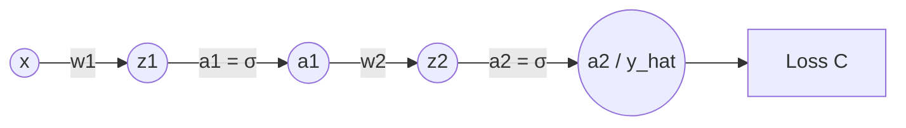

# 反向傳播算法 (Backpropagation) 數學推導

反向傳播（Backpropagation）是訓練深度神經網路的核心算法。它的本質是**微積分中的鏈式法則（Chain Rule）**與**動態規劃（Dynamic Programming）**的結合。透過將計算出的中間梯度保存下來並向後傳遞，反向傳播避免了重複計算，使得我們能以 $O(N)$ 的複雜度計算出損失函數對所有參數的梯度。

本篇將以兩種方式進行推導：
1. **標量形式（Scalar Form）**：建立直覺。
2. **矩陣與向量形式（Matrix & Vector Form）**：對齊現代深度學習框架（如 PyTorch）的實際運算，並採用與 MIT 6.7960 Lecture 2 一致的**分子佈局（Numerator Layout）**標記法。

---

## 1. 數學基礎與標記約定

為了確保推導的嚴謹性，我們先約定矩陣與向量微積分的維度關係（採用分子佈局）：

1. **標量對向量的導數**：
   設 $y$ 為標量，$\mathbf{x} \in \mathbb{R}^{n \times 1}$ 為列向量，則其導數 $\frac{\partial y}{\partial \mathbf{x}}$ 為**行向量（Row Vector）**：
   $$\frac{\partial y}{\partial \mathbf{x}} = \begin{bmatrix} \frac{\partial y}{\partial x_1} & \frac{\partial y}{\partial x_2} & \cdots & \frac{\partial y}{\partial x_n} \end{bmatrix} \in \mathbb{R}^{1 \times n}$$

2. **向量對向量的導數（雅可比矩陣 Jacobian Matrix）**：
   設 $\mathbf{y} \in \mathbb{R}^{m \times 1}$，$\mathbf{x} \in \mathbb{R}^{n \times 1}$，則導數 $\frac{\partial \mathbf{y}}{\partial \mathbf{x}}$ 為 $m \times n$ 的矩陣：
   $$\frac{\partial \mathbf{y}}{\partial \mathbf{x}} = \begin{bmatrix}
   \frac{\partial y_1}{\partial x_1} & \cdots & \frac{\partial y_1}{\partial x_n} \\
   \vdots & \ddots & \vdots \\
   \frac{\partial y_m}{\partial x_1} & \cdots & \frac{\partial y_m}{\partial x_n}
   \end{bmatrix} \in \mathbb{R}^{m \times n}$$

3. **多元鏈式法則**：
   若 $\mathbf{z} = f(\mathbf{u})$ 且 $\mathbf{u} = g(\mathbf{x})$，則：
   $$\frac{\partial \mathbf{z}}{\partial \mathbf{x}} = \frac{\partial \mathbf{z}}{\partial \mathbf{u}} \frac{\partial \mathbf{u}}{\partial \mathbf{x}}$$
   此時，矩陣相乘的維度完全契合：$(m \times n) = (m \times p) \times (p \times n)$，其中 $p$ 是向量 $\mathbf{u}$ 的維度。

---

## 2. 標量形式推導 (Scalar Form)

我們首先考慮一條最簡單的單向鏈條神經網路：

### 前向傳播 (Forward Pass)
對於一個輸入 $x$：
1. 第一層線性輸出：$z_1 = w_1 x + b_1$
2. 第一層激活輸出：$a_1 = \sigma(z_1)$
3. 第二層線性輸出：$z_2 = w_2 a_1 + b_2$
4. 第二層激活輸出（預測值）：$\hat{y} = a_2 = \sigma(z_2)$
5. 損失函數（以均方誤差為例）：$C = \frac{1}{2} (y - a_2)^2$

### 反向傳播 (Backward Pass)
我們希望計算損失 $C$ 對所有權重 $w_1, w_2$ 和偏置 $b_1, b_2$ 的偏導數。

#### 步驟 1：計算對第二層參數的梯度
利用鏈式法則，計算 $\frac{\partial C}{\partial w_2}$：
$$\frac{\partial C}{\partial w_2} = \frac{\partial C}{\partial a_2} \cdot \frac{\partial a_2}{\partial z_2} \cdot \frac{\partial z_2}{\partial w_2}$$

* 第一項：$\frac{\partial C}{\partial a_2} = -(y - a_2)$
* 第二項：$\frac{\partial a_2}{\partial z_2} = \sigma'(z_2)$
* 第三項：因為 $z_2 = w_2 a_1 + b_2$，所以 $\frac{\partial z_2}{\partial w_2} = a_1$

定義**誤差敏感度（Error Sensitivity）** $\delta_2 \equiv \frac{\partial C}{\partial z_2}$，則：
$$\delta_2 = \frac{\partial C}{\partial a_2} \cdot \frac{\partial a_2}{\partial z_2} = -(y - a_2) \sigma'(z_2)$$
因此：
$$\frac{\partial C}{\partial w_2} = \delta_2 a_1$$
同理，對偏置 $b_2$ 的導數為：
$$\frac{\partial C}{\partial b_2} = \frac{\partial C}{\partial z_2} \cdot \frac{\partial z_2}{\partial b_2} = \delta_2 \cdot 1 = \delta_2$$

#### 步驟 2：計算對第一層參數的梯度
繼續向後傳播，計算 $\frac{\partial C}{\partial w_1}$：
$$\frac{\partial C}{\partial w_1} = \frac{\partial C}{\partial z_2} \cdot \frac{\partial z_2}{\partial a_1} \cdot \frac{\partial a_1}{\partial z_1} \cdot \frac{\partial z_1}{\partial w_1}$$

注意，最前面兩項正好是我們剛才定義並保存下來的 $\delta_2$！
$$\frac{\partial C}{\partial z_2} = \delta_2$$
其他各項為：
* $\frac{\partial z_2}{\partial a_1} = w_2$
* $\frac{\partial a_1}{\partial z_1} = \sigma'(z_1)$
* $\frac{\partial z_1}{\partial w_1} = x$

我們定義第一層的誤差敏感度 $\delta_1 \equiv \frac{\partial C}{\partial z_1}$，利用鏈式法則：
$$\delta_1 = \frac{\partial C}{\partial z_2} \cdot \frac{\partial z_2}{\partial a_1} \cdot \frac{\partial a_1}{\partial z_1} = \delta_2 \cdot w_2 \cdot \sigma'(z_1)$$
所以：
$$\frac{\partial C}{\partial w_1} = \delta_1 x$$
$$\frac{\partial C}{\partial b_1} = \delta_1$$

> [!NOTE]
> **動態規劃的直覺**：
> 在計算 $\delta_1$ 時，我們**重用了** $\delta_2$ 的計算結果。這就是反向傳播能將計算複雜度維持在 $O(N)$ 的關鍵所在。

---

## 3. 矩陣與向量形式推導 (Matrix & Vector Form)

現在我們將其推廣到一般的**多層感知器 (MLP)**。設神經網路共有 $L$ 層。

### 前向傳播公式
對於第 $l$ 層 ($l = 1, 2, \dots, L$)：
$$\mathbf{z}^{[l]} = \mathbf{W}^{[l]} \mathbf{a}^{[l-1]} + \mathbf{b}^{[l]}$$
$$\mathbf{a}^{[l]} = \sigma(\mathbf{z}^{[l]})$$

其中：
* $\mathbf{a}^{[l-1]} \in \mathbb{R}^{n_{l-1} \times 1}$ 是前一層的激活輸出（輸入層 $\mathbf{a}^{[0]} = \mathbf{x}$）。
* $\mathbf{W}^{[l]} \in \mathbb{R}^{n_l \times n_{l-1}}$ 是第 $l$ 層的權重矩陣。
* $\mathbf{b}^{[l]} \in \mathbb{R}^{n_l \times 1}$ 是第 $l$ 層的偏置向量。
* $\mathbf{z}^{[l]} \in \mathbb{R}^{n_l \times 1}$ 是第 $l$ 層未激活的淨輸入。
* $\sigma(\cdot)$ 是逐元素（Element-wise）應用的激活函數。
* $\mathcal{L}$ 是標量損失函數。

---

### 反向傳播的四個核心公式推導

我們定義第 $l$ 層的誤差敏感度向量為 $\boldsymbol{\delta}^{[l]}$（採用分子佈局，這是一個**行向量**）：
$$\boldsymbol{\delta}^{[l]} \equiv \frac{\partial \mathcal{L}}{\partial \mathbf{z}^{[l]}} \in \mathbb{R}^{1 \times n_l}$$

#### 【公式一】輸出層的誤差敏感度 $\boldsymbol{\delta}^{[L]}$
利用多元鏈式法則，將損失 $\mathcal{L}$ 對輸出層淨輸入 $\mathbf{z}^{[L]}$ 求導：
$$\boldsymbol{\delta}^{[L]} = \frac{\partial \mathcal{L}}{\partial \mathbf{z}^{[L]}} = \frac{\partial \mathcal{L}}{\partial \mathbf{a}^{[L]}} \frac{\partial \mathbf{a}^{[L]}}{\partial \mathbf{z}^{[L]}}$$

* 第一項 $\frac{\partial \mathcal{L}}{\partial \mathbf{a}^{[L]}} \in \mathbb{R}^{1 \times n_L}$ 是損失函數對網路輸出的偏導數。
* 第二項 $\frac{\partial \mathbf{a}^{[L]}}{\partial \mathbf{z}^{[L]}}$ 是激活輸出對淨輸入的導數。由於激活函數是逐元素應用的，$\mathbf{a}_i^{[L]} = \sigma(\mathbf{z}_i^{[L]})$ 只依賴於相同的 $i$，因此這是一個對角矩陣（Diagonal Matrix）：
  $$\frac{\partial \mathbf{a}^{[L]}}{\partial \mathbf{z}^{[L]}} = \text{diag}(\sigma'(\mathbf{z}^{[L]})) \in \mathbb{R}^{n_L \times n_L}$$

將兩項相乘（一個行向量乘以一個對角矩陣），這等價於兩者的**哈達瑪積（Hadamard Product，即逐元素相乘 $\odot$）**：
$$\boldsymbol{\delta}^{[L]} = \frac{\partial \mathcal{L}}{\partial \mathbf{a}^{[L]}} \odot \sigma'(\mathbf{z}^{[L]})^T$$

---

#### 【公式二】誤差敏感度遞推公式（從 $l+1$ 層傳回 $l$ 層）
我們希望利用下一層的誤差 $\boldsymbol{\delta}^{[l+1]}$ 來表示當前層的誤差 $\boldsymbol{\delta}^{[l]}$：
$$\boldsymbol{\delta}^{[l]} = \frac{\partial \mathcal{L}}{\partial \mathbf{z}^{[l]}} = \frac{\partial \mathcal{L}}{\partial \mathbf{z}^{[l+1]}} \frac{\partial \mathbf{z}^{[l+1]}}{\partial \mathbf{z}^{[l]}}$$

依據定義，第一項為 $\boldsymbol{\delta}^{[l+1]} \in \mathbb{R}^{1 \times n_{l+1}}$。
為了計算第二項 $\frac{\partial \mathbf{z}^{[l+1]}}{\partial \mathbf{z}^{[l]}}$，我們展開 $\mathbf{z}^{[l+1]}$：
$$\mathbf{z}^{[l+1]} = \mathbf{W}^{[l+1]} \mathbf{a}^{[l]} + \mathbf{b}^{[l+1]} = \mathbf{W}^{[l+1]} \sigma(\mathbf{z}^{[l]}) + \mathbf{b}^{[l+1]}$$

利用鏈式法則求偏導：
$$\frac{\partial \mathbf{z}^{[l+1]}}{\partial \mathbf{z}^{[l]}} = \frac{\partial \mathbf{z}^{[l+1]}}{\partial \mathbf{a}^{[l]}} \frac{\partial \mathbf{a}^{[l]}}{\partial \mathbf{z}^{[l]}} = \mathbf{W}^{[l+1]} \text{diag}(\sigma'(\mathbf{z}^{[l]})) \in \mathbb{R}^{n_{l+1} \times n_l}$$

將這兩部分帶入遞推式中：
$$\boldsymbol{\delta}^{[l]} = \boldsymbol{\delta}^{[l+1]} \mathbf{W}^{[l+1]} \text{diag}(\sigma'(\mathbf{z}^{[l]}))$$

同樣地，乘以對角矩陣可以寫成逐元素相乘（Hadamard Product）：
$$\boldsymbol{\delta}^{[l]} = \left( \boldsymbol{\delta}^{[l+1]} \mathbf{W}^{[l+1]} \right) \odot \sigma'(\mathbf{z}^{[l]})^T$$

> [!TIP]
> **PyTorch 中的轉置寫法**：
> 如果我們習慣將所有梯度都表示為與原變數同維度的**列向量**（即對 $\boldsymbol{\delta}$ 進行轉置），公式二可以寫成：
> $$\boldsymbol{\delta}^{[l]\text{col}} = \left( (\mathbf{W}^{[l+1]})^T \boldsymbol{\delta}^{[l+1]\text{col}} \right) \odot \sigma'(\mathbf{z}^{[l]})$$
> 這正是 MIT 6.7960 投影片中提到的：「反向傳播在線性層本質上就是前向傳播，只是乘以轉置權重矩陣 $(\mathbf{W}^{[l+1]})^T$」。

---

#### 【公式三】損失函數對偏置 $\mathbf{b}^{[l]}$ 的梯度
偏置項 $\mathbf{b}^{[l]}$ 直接影響淨輸入 $\mathbf{z}^{[l]}$：
$$\frac{\partial \mathcal{L}}{\partial \mathbf{b}^{[l]}} = \frac{\partial \mathcal{L}}{\partial \mathbf{z}^{[l]}} \frac{\partial \mathbf{z}^{[l]}}{\partial \mathbf{b}^{[l]}}$$

因為 $\mathbf{z}^{[l]} = \mathbf{W}^{[l]} \mathbf{a}^{[l-1]} + \mathbf{b}^{[l]}$，所以 $\frac{\partial \mathbf{z}^{[l]}}{\partial \mathbf{b}^{[l]}}$ 是一個單位矩陣 $\mathbf{I} \in \mathbb{R}^{n_l \times n_l}$。
因此：
$$\frac{\partial \mathcal{L}}{\partial \mathbf{b}^{[l]}} = \boldsymbol{\delta}^{[l]} \mathbf{I} = \boldsymbol{\delta}^{[l]} \in \mathbb{R}^{1 \times n_l}$$
（即對偏置的梯度行向量，數值上完全等於該層的誤差敏感度行向量）。

---

#### 【公式四】損失函數對權重 $\mathbf{W}^{[l]}$ 的梯度
權重矩陣 $\mathbf{W}^{[l]}$ 中的每個元素 $W_{ij}^{[l]}$ 只會影響 $\mathbf{z}_i^{[l]}$。
利用鏈式法則，計算損失對單個權重元件的偏導數：
$$\frac{\partial \mathcal{L}}{\partial W_{ij}^{[l]}} = \frac{\partial \mathcal{L}}{\partial z_i^{[l]}} \frac{\partial z_i^{[l]}}{\partial W_{ij}^{[l]}}$$

由前向傳播公式知，$z_i^{[l]} = \sum_{k} W_{ik}^{[l]} a_k^{[l-1]} + b_i^{[l]}$，因此：
$$\frac{\partial z_i^{[l]}}{\partial W_{ij}^{[l]}} = a_j^{[l-1]}$$

代入上式得到：
$$\frac{\partial \mathcal{L}}{\partial W_{ij}^{[l]}} = \delta_i^{[l]} a_j^{[l-1]}$$

這代表整個權重梯度矩陣 $\frac{\partial \mathcal{L}}{\partial \mathbf{W}^{[l]}}$ 是誤差敏感度行向量 $\boldsymbol{\delta}^{[l]}$ 與前一層激活輸出列向量 $\mathbf{a}^{[l-1]}$ 的**外積（Outer Product）**：
$$\frac{\partial \mathcal{L}}{\partial \mathbf{W}^{[l]}} = (\boldsymbol{\delta}^{[l]})^T (\mathbf{a}^{[l-1]})^T \in \mathbb{R}^{n_l \times n_{l-1}}$$

---

## 4. 反向傳播四大核心公式總結

| 公式 | 數學表達式 (行向量標記法) | 物理意義 |
| :--- | :--- | :--- |
| **【公式一】輸出層誤差** | $\boldsymbol{\delta}^{[L]} = \frac{\partial \mathcal{L}}{\partial \mathbf{a}^{[L]}} \odot \sigma'(\mathbf{z}^{[L]})^T$ | 計算最終預測與真實標籤之間的初始誤差信號。 |
| **【公式二】誤差反向傳遞** | $\boldsymbol{\delta}^{[l]} = \left( \boldsymbol{\delta}^{[l+1]} \mathbf{W}^{[l+1]} \right) \odot \sigma'(\mathbf{z}^{[l]})^T$ | 將下一層的誤差通過轉置的權重矩陣反向投影回當前層。 |
| **【公式三】偏置梯度** | $\frac{\partial \mathcal{L}}{\partial \mathbf{b}^{[l]}} = \boldsymbol{\delta}^{[l]}$ | 偏置的梯度就是該層的誤差敏感度。 |
| **【公式四】權重梯度** | $\frac{\partial \mathcal{L}}{\partial \mathbf{W}^{[l]}} = (\boldsymbol{\delta}^{[l]})^T (\mathbf{a}^{[l-1]})^T$ | 權重梯度由「當前層的誤差」與「前一層的輸入信號」共同決定。 |

---

## 5. 直覺性解釋：為什麼是這四個公式？

我們可以從物理與直覺的角度去理解這四個公式的優雅之處：

1. **誤差敏感度 $\delta$ 的本質**：
   $\delta_i^{[l]}$ 代表的是「如果我們微調第 $l$ 層第 $i$ 個神經元的未激活淨輸入 $z_i^{[l]}$，最終損失 $\mathcal{L}$ 會改變多少」。它是整個反向傳播中流動的「水流（誤差流）」。
   
2. **反向投影（公式二）**：
   為什麼是 $\boldsymbol{\delta}^{[l+1]} \mathbf{W}^{[l+1]}$？因為在前向傳播中，第 $l$ 層的神經元輸出是通過權重矩陣 $\mathbf{W}^{[l+1]}$ 傳遞給第 $l+1$ 層的。所以在反向傳播時，誤差流也必須沿著這條路徑，乘上對應的權重（即路徑強度）流回去。

3. **權重更新（公式四）**：
   為什麼權重梯度是誤差與輸入的外積？
   * 如果前一層的輸入 $\mathbf{a}^{[l-1]}$ 很小（甚至為 0），那麼不論權重 $\mathbf{W}$ 怎麼變，對下一層的影響都很微弱，因此梯度也很小（這就是 **He Hebbian 學習律** 中 "cells that fire together, wire together" 的數學體現）。
   * 如果當前層的誤差敏感度 $\boldsymbol{\delta}^{[l]}$ 很小，說明這一層的狀態已經非常完美，不需要再對權重做太多調整。
