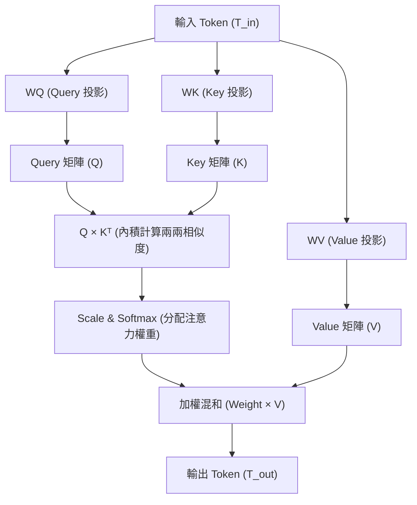

# MIT 6.7960 Deep Learning: Lecture 08. Architectures: Transformers
*本文件整理自 MIT 6.7960 (Fall 2024) Lecture 8 課程逐字稿及會話討論問答。*

---

## 課程基本資訊
* **主講人**：Phillip Isola
* **課程主題**：Architectures: Transformers
* **原始逐字稿檔案**：[.books/mit-deep-learning/transcripts/08_Lec_08._Architectures_Transformers.md](file:///home/awe/disk/deep_learning/.books/mit-deep-learning/transcripts/08_Lec_08._Architectures_Transformers.md)

---

## 1. Transformer 的三大核心概念

### ① 標記化 (Tokens)
* **定義**：將輸入資料切分為一組向量（而非單一純量），每個向量代表一個局部資訊單元。
* **特色**：
  * 在影像中，通常切分為互不重疊的局部影像塊（Patches）。
  * 在文本中，通常切分為字根或子字元（Byte Pairs）。
  * 這種表示法解耦了特定領域的細節，讓 Transformer 能夠作為**領域無關（Domain Agnostic）**的通用運算引擎。

### ② 注意力機制 (Attention)
* **機制**：相較於一般全連接層的靜態權重，注意力機制的權重是根據輸入資料**動態計算**出的。
* **公式**：
  $$\text{Attention}(Q, K, V) = \text{softmax}\left(\frac{QK^T}{\sqrt{d_k}}\right)V$$
  * 透過計算 Query 與 Key 向量的相似度（內積），來決定如何加權混合 Value 向量。

### ③ 位置編碼 (Positional Encodings)
* **問題**：Transformer 本質上是一個**置換等變（Permutation Equivariant）**的架構，意即對輸入序列進行重新排列，輸出也會以相同方式排列。這意味著架構本身對「順序」或「空間位置」是無感的。
* **解法**：在 Token 向量中加上額外的位置特徵（如傅立葉基底、正弦/餘弦函數、或 Graph Laplacian 特徵向量），將「局部性」或「順序性」的先驗知識重新引入模型。

---

## 2. Tokenize（標記化）的具體做法與優勢

### 具體做法
* **影像（Images）**：
  1. 將 $H \times W$ 的影像切成多個 $P \times P$ 不重疊的 Patches。
  2. 將每個 Patch 展平（Flatten）為長度為 $P^2 \times C$ 的一維向量。
  3. 經由一個投影矩陣 $W_{\text{tokenize}}$ 線性對齊到隱藏維度 $d$，生成 Token。
* **文本（Language）**：
  1. 使用 **Byte Pair Encoding (BPE)** 等演算法將文字分割成子字元（Subwords）。
  2. 通過可學習的詞嵌入表（Embedding Lookup Table）將子字元 ID 轉化為實數向量。
* **音訊（Sounds）**：
  1. 將音訊訊號（如聲譜圖）切分為一小段一小段的音訊區塊（Chunks）並投影。

### 採用 Tokenize 的優勢
1. **架構一體化**：所有不同模態的資料都能包裝成 $N \times d$ 的矩陣形式，使得同一個 Transformer 架構可以處理各種跨領域任務（如影像、文字、語音）。
2. **局部性偏置（Locality Bias）**：將局部空間或時間上的相鄰資訊在 Tokenize 階段進行整合，使後續的 Transformer 層可以更專注於全局長距離依賴的建立。
3. **GPU 友善**：規整的矩陣非常契合 GPU 的矩陣乘法（Matmuls）架構，優化硬體利用率。
4. **降低參數量（低秩轉換）**：在 Token 層次上進行計算，大幅縮減了純量神經元之間的權重矩陣自由度。

---

## 3. 低秩轉換（Low-rank Transformation）與參數量縮減

### 為什麼可以降低參數量？
假設輸入有 $N = 3$ 個 Token，每個 Token 的維度 $D = 4$（總計 $12$ 個輸入神經元）：

1. **神經元層級的 Fully Connected**：
   如果像一般 MLP 一樣，允許每一個輸出神經元與 12 個輸入神經元都有獨立的連接，需要 $12$ 個權重。若輸出也是 $M \times D$ 維，則需要 $M \cdot N \cdot D^2$ 個參數。

2. **Token 層級的線性組合（低秩轉換）**：
   運算被限制在對 Token 向量做加權組合（意即同一組權重被共享在同一個 Token 內部不同的維度通道上）：
   $$T_{\text{out}} = w_1 T_1 + w_2 T_2 + w_3 T_3$$
   此時，我們只需要 $3$ 個可學習參數（$w_1, w_2, w_3$）。
   
* **數學本質**：在神經元層次上，這等同於將大權重矩陣限制為克羅內克積（Kronecker Product）的稀疏結構：
  $$\mathbf{M}_{\text{token}} = W \otimes I_D$$
  限制了矩陣的秩，把參數量從 $M \cdot N \cdot D^2$ 驟降為 $M \cdot N$，消除了對特徵維度 $D$ 的二次方依賴。

---

## 4. 注意力機制中的 Q、K、V 及投影矩陣

### Query、Key、Value 的定義與比對（資料庫類比）
* **Query (Q)**：「**我（發問的 Token）在找什麼？**」——主動發起檢索的條件向量。
* **Key (K)**：「**我（被查詢的 Token）是誰？**」——被動提供匹配的標籤特徵向量。
* **Value (V)**：「**我實際包含的內容是什麼？**」——若被選中後，真正傳遞給下一層的實質特徵向量。

### 可學習的投影矩陣：$W_Q, W_K, W_V$
為使 Token 在不同角色下發揮其對應作用，輸入的原始 Token 矩陣 $T_{\text{in}}$ 會分別乘以三個可學習的矩陣：
* **$W_Q$**：定義如何從 Token 中提取出用來尋找其他 Token 的查詢表徵 ($Q = T_{\text{in}} W_Q$)。
* **$W_K$**：定義如何從 Token 中提取出描述自己特徵的鍵值表徵 ($K = T_{\text{in}} W_K$)。
* **$W_V$**：定義如何從 Token 中提取出用於傳遞的內容表徵 ($V = T_{\text{in}} W_V$)。

這三個矩陣是 Transformer 注意力層中最核心的可學習參數，允許模型自適應地調整資訊流動方式。

---

## 5. 自注意力機制 (Self-Attention)

### 定義
* 當 **Query（查詢）**、**Key（鍵值）**與 **Value（數值）** 均來自**同一個輸入序列**時，稱為自注意力機制。
* 與 Cross-Attention（交叉注意力，例如用語音或文字的 Query 去查詢影像的 Key/Value）不同，自注意力是自己對自己內部做比對，用來挖掘自身序列內部元素之間的關聯性。

### 圖解自注意力（以 Horse Segmentation 為例）
當模型需要判斷一個 Patch 的屬性時，自注意力會使代表「馬的部分身體」的 Token 自動去關注影像中其他「馬的身體」的 Token。

透過此機制，每個 Token 都能在上下文中融合最相關的其他 Token 的資訊，實現強大的全域脈絡理解能力。
