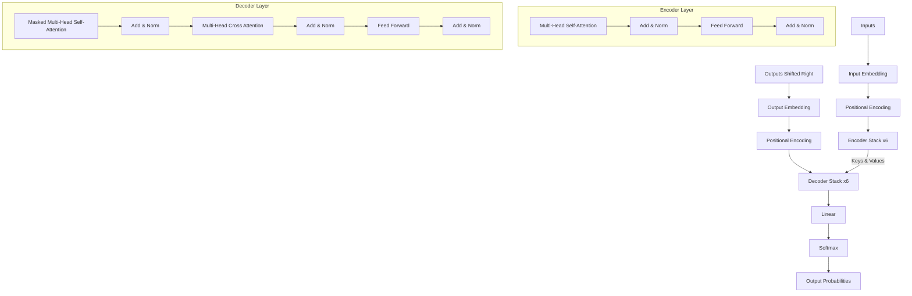

# Session Transcript: Transformer Paper Discussion (2026-06-13)

## Context
Discussion on the architecture and key concepts of the Attention Is All You Need paper.

---

### Round 1: Reading PDF
**User:**
讀取 /home/awe/disk/deep_learning/vaswani-et-al-2017-attention-is-all-you-need.pdf

**Gemini:**
我已成功讀取並載入 PDF 檔案：[vaswani-et-al-2017-attention-is-all-you-need.pdf](file:///home/awe/disk/deep_learning/vaswani-et-al-2017-attention-is-all-you-need.pdf)。

這是著名的 Transformer 架構論文 **"Attention Is All You Need"** (Vaswani et al., 2017)，共 15 頁，包含：
1. **Introduction & Background** (第 1-2 頁)
2. **Model Architecture** (第 2-5 頁)：詳細說明了 Encoder/Decoder 堆疊、Scaled Dot-Product Attention、Multi-Head Attention 以及 Positional Encoding。
3. **Why Self-Attention** (第 6-7 頁)：比較 Self-Attention、Recurrent 與 Convolutional Layer 的複雜度與路徑長度。
4. **Training & Results** (第 7-10 頁)：包含機器翻譯 (WMT 2014) 與句法分析 (Constituency Parsing) 的實驗結果。
5. **Attention Visualizations** (第 13-15 頁)：呈現 dynamic attention heads 的注意力機制視覺化圖表。

請告訴我您接下來需要進行什麼操作？例如：
* 針對特定章節進行翻譯或詳細解釋
* 摘要論文的核心貢獻與公式
* 協助實作/調整相關的 Transformer 程式碼

---

### Round 2: Role of Attention
**User:**
注意力機制在 transformer 中扮演麼角色

**Gemini:**
在 [vaswani-et-al-2017-attention-is-all-you-need.pdf](file:///home/awe/disk/deep_learning/vaswani-et-al-2017-attention-is-all-you-need.pdf) 中，**注意力機制（Attention Mechanism）**是整個 Transformer 架構的核心。它徹底取代了傳統循環神經網路（RNN）與卷積神經網路（CNN），扮演了以下關鍵角色：

### 1. 建立全局依賴關係（捕捉長距離關聯）
傳統 RNN 必須一步步依序處理序列，導致距離較遠的字詞資訊難以傳遞。Transformer 利用**自注意力機制（Self-Attention）**，讓序列中的任意兩個字詞可以直接進行計算。其最大路徑長度為 $O(1)$，大幅提升了捕捉長距離語意關聯的能力。

### 2. 三種不同的應用場景
論文的第 3.2.3 節指出，Attention 在 Transformer 中以三種形式存在：
* **Encoder 自注意力（Encoder Self-Attention）**：Query、Key、Value 皆來自前一層的 Encoder。這讓輸入序列中的每個 token 都能與同序列的其他 token 互動，建構出富含上下文語意的表示。
* **Masked Decoder 自注意力（Masked Decoder Self-Attention）**：用於 Decoder。透過 Masking 機制（將未來的 token 權重設為 $-\infty$），防止 Decoder 在預測當前字詞時「提前偷看」後續的字詞，以確保自迴歸（Auto-regressive）生成的正確性。
* **Encoder-Decoder 交叉注意力（Encoder-Decoder Attention）**：Query 來自 Decoder，而 Key 和 Value 來自 Encoder 的輸出。這讓 Decoder 在生成目標字詞時，能夠動態關注輸入序列中最重要的部分（類似傳統 seq2seq 的對齊機制）。

### 3. 多頭注意力（Multi-Head Attention）
Transformer 並非只計算一次 Attention，而是將 Query、Key、Value 線性投影到多個不同的子空間（論文中 $h=8$），並並行計算注意力。這允許模型**同時從不同的維度與角度去理解字詞之間的關係**（例如：一組 Head 關注動詞與受詞的語意關係，另一組 Head 關注代名詞的指代關係）。

### 4. 實現高度並行化計算
因為自注意力機制在計算序列中每個位置的關聯時，彼此之間沒有前後依賴關係（不像 RNN 需要等待上一步的隱藏狀態 $h_{t-1}$），所有位置的注意力權重可以透過矩陣運算一次完成，這極大地提高了 GPU 的訓練與推理效率。

---

### Round 3: Transformer Architecture
**User:**
trensformer 架構是什麼

**Gemini:**
在 [vaswani-et-al-2017-attention-is-all-you-need.pdf](file:///home/awe/disk/deep_learning/vaswani-et-al-2017-attention-is-all-you-need.pdf) 中提出的 **Transformer 架構**，是一種基於**編碼器-解碼器（Encoder-Decoder）**的順序轉導（Sequence Transduction）模型。

其整體結構如下圖（對應論文中的 **Figure 1**）：

以下是 Transformer 架構的四大核心模組：

### 1. 位置編碼（Positional Encoding）
由於 Transformer 捨棄了 RNN 與 CNN，模型本身無法得知字詞在序列中的相對或絕對位置。因此，在輸入 Embedding 之後，會直接加上一個**位置編碼（Positional Encoding）**。論文中使用的是正弦和餘弦函數：
$$PE_{(pos, 2i)} = \sin(pos/10000^{2i/d_{\text{model}}})$$
$$PE_{(pos, 2i+1)} = \cos(pos/10000^{2i/d_{\text{model}}})$$

---

### 2. 編碼器堆疊（Encoder Stacks, $N=6$）
Encoder 由 6 個完全相同的層（Layers）堆疊而成。每一層包含兩個子層：
1. **多頭自注意力機制（Multi-Head Self-Attention）**：計算輸入序列內部的關聯。
2. **前饋神經網路（Position-wise Feed-Forward Networks, FFN）**：對每個位置的向量進行獨立的非線性變換，公式為：
   $$\text{FFN}(x) = \max(0, xW_1 + b_1)W_2 + b_2$$
* 每個子層周圍都使用了**殘差連接（Residual Connection）**與**層標準化（Layer Normalization）**，即：$\text{LayerNorm}(x + \text{Sublayer}(x))$。所有子層輸出的維度皆為 $d_{\text{model}} = 512$。

---

### 3. 解碼器堆疊（Decoder Stacks, $N=6$）
Decoder 同樣由 6 個相同的層堆疊而成。除了與 Encoder 類似的結構外，每一層多出了一個子層：
1. **遮罩多頭自注意力（Masked Multi-Head Self-Attention）**：防止當前位置關注到未來的資訊。
2. **編碼器-解碼器注意力（Encoder-Decoder Attention）**：將 Encoder 的輸出作為 Key 和 Value，與 Decoder 前一層的 Output（作為 Query）進行注意力計算，達到翻譯/對齊效果。
3. **前饋神經網路（FFN）**。
* 同樣在每個子層周圍套用了殘差連接與 Layer Normalization。

---

### 4. 輸出預測（Linear & Softmax Layer）
Decoder 最上層的輸出會通過一個線性層（Linear Layer）投影回詞彙表大小的空間，再透過 **Softmax** 函數計算出下一個目標字詞的機率分佈。

---
